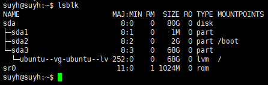
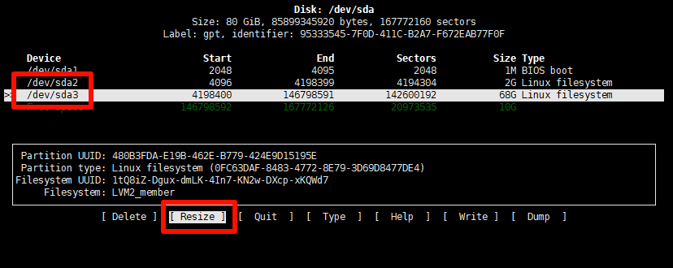
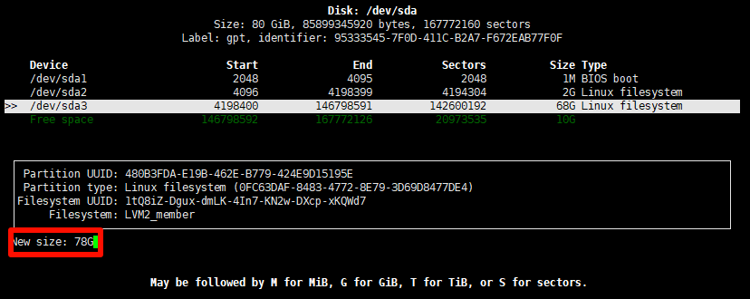
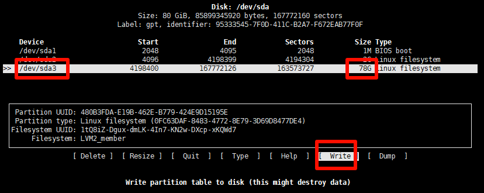
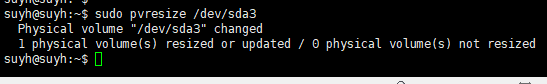
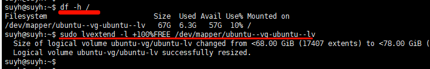
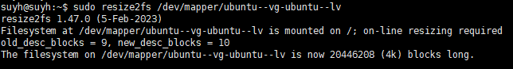
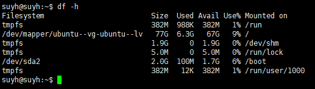

## 查看磁盘信息



```shell
suyh@suyh:~$ lsblk
NAME                      MAJ:MIN RM  SIZE RO TYPE MOUNTPOINTS
sda                         8:0    0   80G  0 disk 
├─sda1                      8:1    0    1M  0 part 
├─sda2                      8:2    0    2G  0 part /boot
└─sda3                      8:3    0   68G  0 part 
  └─ubuntu--vg-ubuntu--lv 252:0    0   68G  0 lvm  /
sr0                        11:0    1 1024M  0 rom  
suyh@suyh:~$ 

```

```txt
从输出来看，sda 显示为80G，表示 总磁盘为80G
sda1 1M
sda2 2G
sda3 68G

所以还有10G未分配
```


## 调整磁盘大小

```shell
sudo cfdisk
```

1. 选择 /dev/sd3 然后resize

   

2. New size

   

   这里默认就会显示所有剩余空间，一般不用动，直接回车，记得确认，输入："==yes=="

3. Write

   

   这时候可以看到sd3 的磁盘已经调整为78G了，然后选择下面的 ==Write== ，之后再 ==Quit==。

4. 继续

   

   ```shell
   sudo pvresize /dev/sda3
   ```

5. 继续

   

   ```shell
   sudo lvextend -l +100%FREE /dev/mapper/ubuntu--vg-ubuntu--lv
   ```

   这里的 `/dev/mapper/ubuntu--vg-ubuntu--lv` 是通过 ==df -h /== 得出的

6. 继续

   

   ```shell
   sudo resize2fs /dev/mapper/ubuntu--vg-ubuntu--lv
   ```

7. 查看（`df -h`）

   

8. 其他


