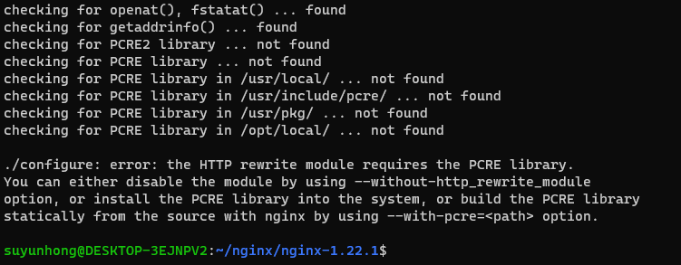
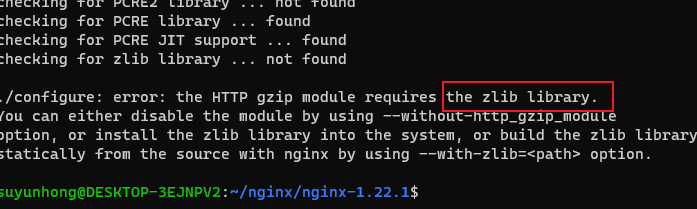
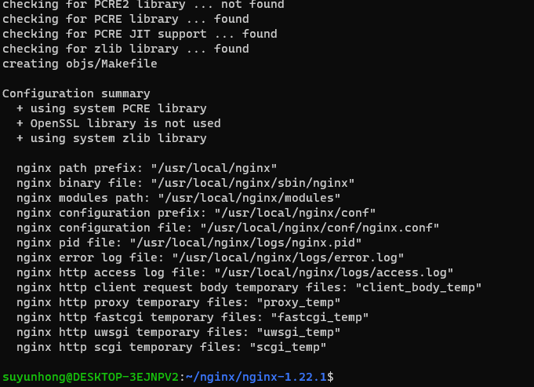
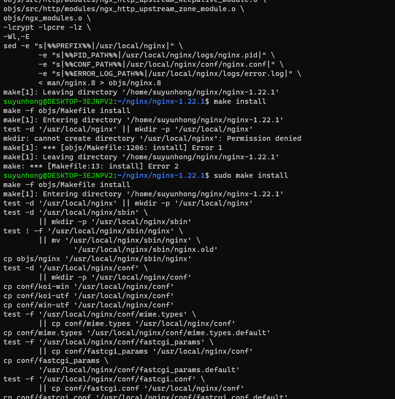

## 下载


```properties
# 解压
tar zxvf nginx-1.22.1.tar.gz
```


### 编译安装

```properties
# 运行 ./configure 时会提示没有 C语言的编译器
# suyunhong@DESKTOP-3EJNPV2:~/nginx/nginx-1.22.1$ ./configure --prefix=/usr/local/nginx
# 这里添加指定--with-http_ssl_module 参数是需要使用https 
suyunhong@DESKTOP-3EJNPV2:~/nginx/nginx-1.22.1$ ./configure --prefix=/usr/local/nginx --with-http_ssl_module
checking for OS
 + Linux 5.15.90.1-microsoft-standard-WSL2 x86_64
checking for C compiler ... not found

./configure: error: C compiler cc is not found

```

> 安装gcc 编译器

```properties
# 这是yum 安装，但是我这边没有用这个安装，主要当前系统也还没有yum 呢
# yum install -y gcc

# 直接在网上搜索的，ubuntu 安装 gcc
sudo apt update
sudo apt install build-essential

# 这个命令将gcc 和g++ 都安装上了。
# 查看安装结果
gcc --version
g++ --version
```


> 报错

```txt

./configure: error: SSL modules require the OpenSSL library.
You can either do not enable the modules, or install the OpenSSL library
into the system, or build the OpenSSL library statically from the source
with nginx by using --with-openssl=<path> option.
```

> 安装openssl

```properties
# CentoS
# yum -y install openssl openssl-devel

# Ubuntu
# sudo apt -y install openssl openssl-devel
```

> 正常情况下，系统都安装过opensll，所以只需要指定一下openssl 的路径即可，如下：

```properties
./configure --prefix=/usr/local/nginx --with-http_ssl_module --with-openssl=/usr/bin/openssl
```

### 继续 安装nginx

>  再次执行命令来安装到指定目录下面

```properties
./configure --prefix=/usr/local/nginx --with-http_ssl_module --with-openssl=/usr/bin/openssl
```

这个时候还有报错




### 安装`pcre` 库

```properties
sudo apt install libpcre3 libpcre3-dev

# 如果是yum 的话，centos 系统
# yum install -y pcre pcre-devel 
```


### 再次执行

报错，还需要zlib 库




### 安装zlib 库

```properties
 sudo apt-get install zlib1g-dev
 # yum install -y zlib-devel
```


### 安装成功




### 编译安装

```properties
make
sudo make install 
```




### 启动

```properties
# 进入到目录
cd /usr/local/nginx/sbin
sudo ./nginx

# 快速停止
sudo ./nginx -s stop 
# 优雅关闭，在即出前完成已经接受的连接请求
sudo ./nginx -s quit
# 重新加载配置
sudo ./nginx -s reload 
```

### 访问

```properties
# 在浏览器中输入  localhost
# 如果 访问不了，可以把防火墙关闭，可能 是防火墙的原因
```


