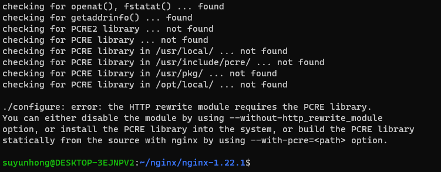
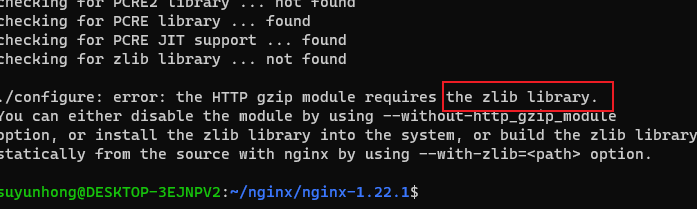
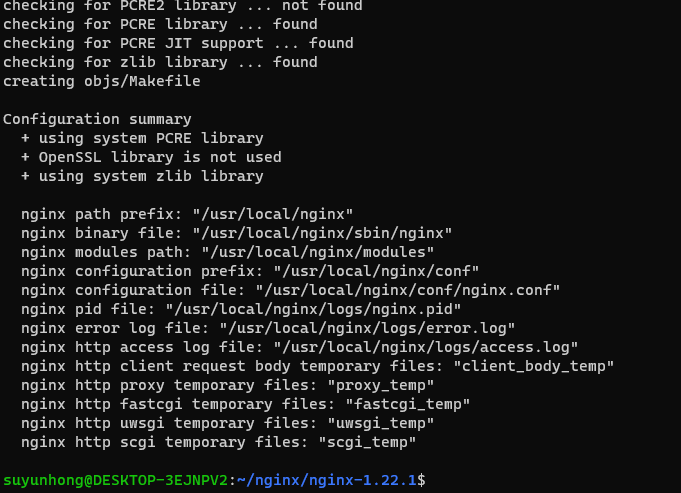
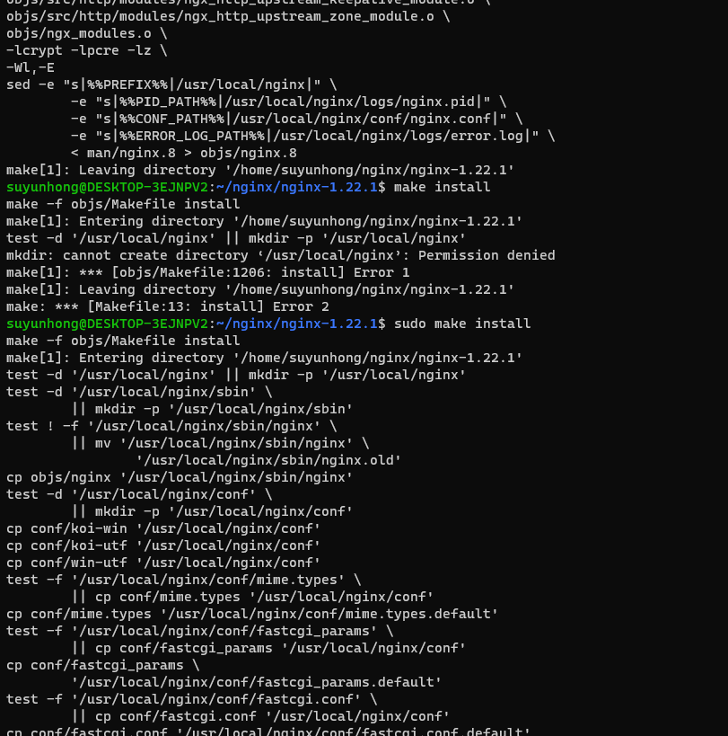

## 下载


```properties
# 解压
tar zxvf nginx-1.22.1.tar.gz
```


### 编译安装

```properties
# 运行 ./configure 时会提示没有 C语言的编译器
suyunhong@DESKTOP-3EJNPV2:~/nginx/nginx-1.22.1$ ./configure
checking for OS
 + Linux 5.15.90.1-microsoft-standard-WSL2 x86_64
checking for C compiler ... not found

./configure: error: C compiler cc is not found

```

> 安装gcc 编译器

```properties
# 这是yum 安装，但是我这边没有用这个安装，主要当前系统也还没有yum 呢
# yum install -y gcc

# 直接在网上搜索的，ubuntu 安装 gcc
sudo apt update
sudo apt install build-essential

# 这个命令将gcc 和g++ 都安装上了。
# 查看安装结果
gcc --version
g++ --version
```


### 继续 安装nginx

>  再次执行`./configure --prefix=/usr/local/nginx` 来安装到指定目录下面

```properties
./configure --prefix=/usr/local/nginx
```

这个时候还有报错




### 安装`pcre` 库

```properties
sudo apt install libpcre3 libpcre3-dev

# 如果是yum 的话，centos 系统
# yum install -y pcre pcre-devel 
```


### 再次执行

报错，还需要zlib 库




### 安装zlib 库

```properties
 sudo apt-get install zlib1g-dev
```


### 安装成功




### 编译安装

```properties
make
sudo make install 
```




### 启动

```properties
# 进入到目录
cd /usr/local/nginx/sbin
sudo ./nginx

# 快速停止
sudo ./nginx -s stop 
# 优雅关闭，在即出前完成已经接受的连接请求
sudo ./nginx -s quit
# 重新加载配置
sudo ./nginx -s reload 
```

### 访问

```properties
# 在浏览器中输入  localhost
# 如果 访问不了，可以把防火墙关闭，可能 是防火墙的原因
```


