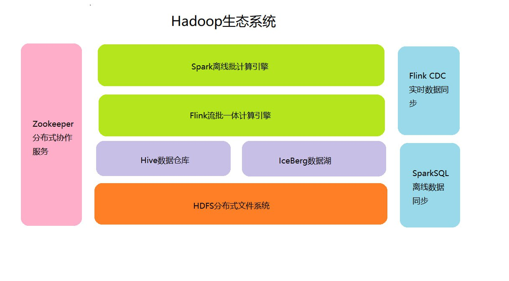

## Ubuntu24使用Apache Ambari部署Hadoop3高可用3+3集群

## 1. 节点角色分配与硬件建议
| 节点类型 |   数量   |                                           部署组件                                           |             硬件配置             |
|:--------:|:--------:|:--------------------------------------------------------------------------------------------:|:--------------------------------:|
| 主控节点 |     3    | <p style="text-align: left;">- Hadoop: NameNode (Active/Standby/Observer) <p style="text-align: left;">- Hadoop: ResourceManager (Active/Standby/Observer)<p style="text-align: left;">- Hadoop: JournalNode<br>- Zookeeper <br><p style="text-align: left;">- Hive Metastore <br><p style="text-align: left;">- Flink JobManager | 16核/64GB RAM/2TB SSD (RAID1)    |
| 工作节点 |     5    | <p style="text-align: left;">- Hadoop: DataNode + NodeManager <br><p style="text-align: left;">- Flink TaskManager <br><p style="text-align: left;">- Hive Server2 (可选)                   | 16核/128GB RAM/8TB HDD x6 (JBOD) |
| 边缘节点 | 1  | <p style="text-align: left;">- Flink Client <br><p style="text-align: left;">- Hue/Zeppelin <br><p style="text-align: left;">- Spark History Server                                         |       8核/32GB RAM/1TB NVMe      |

## 2. 核心架构设计


## 3. 关键组件版本
|    组件   |  版本  |         兼容性说明        |
|:---------:|:------:|:-------------------------:|
|   Hadoop  |  3.3.6 | 需支持Flink的HDFS 3.x协议 |
|    Hive   |  4.0.1 |     需与Hadoop 3.x兼容    |
|   Spark   |  3.5.6 |     需与Hadoop 3.x兼容    |
|   Flink   | 1.19.3 |        要求Java 8+       |
|   Iceberg | 1.5.2 |        要求Java 8+       |
| Zookeeper |  3.8.3 |        建议奇数节点       |

## 4. 分步部署指南
### 4.1 基础环境准备(所有节点)

#### 4.1.1 必备软件
```bash
# 所有节点执行：
sudo apt update && sudo apt install -y \
    openjdk-8-jdk \
    python3-pip \
    pdsh \
    net-tools

# 如果有多个版本，如下切换维护
# 切换java 11
update-alternatives --list java
sudo update-alternatives --config java
sudo update-alternatives --remove java /usr/lib/jvm/java-11-openjdk-amd64/bin/java # 手动删除已经卸载的版本
# 将python3映射成python
sudo update-alternatives --install /usr/bin/python python /usr/bin/python3 1
sudo update-alternatives --config python
```

#### 4.1.2 设置主机名
```bash
# 各个机器上执行
sudo hostnamectl set-hostname master1
sudo hostnamectl set-hostname master2
sudo hostnamectl set-hostname master3
sudo hostnamectl set-hostname worker1
sudo hostnamectl set-hostname worker2
sudo hostnamectl set-hostname worker3
sudo hostnamectl set-hostname worker4
sudo hostnamectl set-hostname worker5

# 查看当前生效的主机名
hostnamectl status
# 检查配置文件
cat /etc/hostname
```

#### 4.1.3 主机名解析
所有节点执行
```bash
sudo bash -c "echo '
192.168.8.53    master1
192.168.8.57    master2
192.168.8.160   master3
192.168.8.28    worker1
192.168.8.162   worker2
192.168.8.163   worker3
192.168.8.224   worker4
192.168.8.237   worker5
' >> /etc/hosts" 
tail -n 50 /etc/hosts
```

#### 4.1.4 配置SSH免密登录
```bash
# 生成密钥对, 注：-m 指定 PEM 很重要，不然Hadoop自然故障转移不生效
ssh-keygen -t rsa -b 4096 -m PEM -N "" -f ~/.ssh/id_rsa
# 分发公钥到所有节点（包括自身）
sudo apt update && sudo apt install -y sshpass
for node in master{1..3} worker{1..5}; do
    sshpass -p "user" ssh-copy-id -i ~/.ssh/id_rsa.pub -o StrictHostKeyChecking=no $node
done
# 验证是否成功
ssh master2
# 退出
exit
```

#### 4.1.5 修改时区
```bash
# 查看当前时区
timedatectl
# 列出所有可用时区
timedatectl list-timezones
# 设置时区
sudo timedatectl set-timezone Asia/Shanghai
```

#### 4.1.6 创建目录
```bash
cd /opt
sudo mkdir -p bigdata/{hadoop,zookeeper,hive,spark,flink,iceberg}
sudo chown -R user:user bigdata
```

### 4.2 ZooKeeper部署

#### 4.2.1 下载解压
```bash
# 在master1节点上
cd /opt/bigdata/zookeeper
wget https://downloads.apache.org/zookeeper/zookeeper-3.8.4/apache-zookeeper-3.8.4-bin.tar.gz
tar zxvf apache-zookeeper-3.8.4-bin.tar.gz
mv apache-zookeeper-3.8.4-bin zookeeper-3.8.4
for node in master{2..3}; do
    scp -rq zookeeper-3.8.4 user@${node}:/opt/bigdata/zookeeper
done
cd zookeeper-3.8.4
```

#### 4.2.2 配置ZooKeeper

##### 4.2.2.1 创建数据目录和日志目录
```bash
# 数据目录（存储 ZooKeeper 快照和事务日志），master{1..3}都创建
sudo mkdir -p /data/zookeeper/data
sudo mkdir -p /data/zookeeper/logs
sudo chown -R $USER:$USER /data/zookeeper
```

##### 4.2.2.2 配置 myid 文件（每个节点唯一）
```bash
# 在master1节点上
id=0
for node in master{1..3}; do
    ((id++))
    ssh ${node} "echo '$id' > /data/zookeeper/data/myid"
done
```

##### 4.2.2.3 修改配置文件 zoo.cfg
```bash
# 在master1节点上
for node in master{1..3}; do
ssh ${node} "echo '
# 心跳间隔（毫秒）
tickTime=2000
# 初始化同步阶段允许的最大心跳数
initLimit=10
# 发送请求和获取确认之间允许的最大心跳数
syncLimit=5
# 数据目录（对应上面创建的目录）
dataDir=/data/zookeeper/data
# 日志目录
dataLogDir=/data/zookeeper/logs
# 客户端连接地址
clientPortAddress=${node}
# 客户端连接端口
clientPort=2181
# 最大客户端连接数（0 表示无限制）
maxClientCnxns=60
# 自动清理快照和日志的时间间隔（小时），默认 0 表示不自动清理
autopurge.purgeInterval=36
# 保留的快照文件数量，默认 3
autopurge.snapRetainCount=3

# 集群节点配置（格式：server.\${myid}=\${主机名}:通信端口:选举端口）
server.1=master1:2888:3888
server.2=master2:2888:3888
server.3=master3:2888:3888
' | tee /opt/bigdata/zookeeper/zookeeper-3.8.4/conf/zoo.cfg"
done
```
端口说明：
* 2181：客户端连接端口。
* 2888：节点间通信端口（ follower 与 leader 同步数据）。
* 3888：选举端口（节点选举 leader 时使用）。

#### 4.2.3 配置ZooKeeper环境变量
```bash
# 在master1节点上
for node in master{1..3}; do
    ssh ${node} "ln -s /opt/bigdata/zookeeper/zookeeper-3.8.4 /opt/bigdata/zookeeper/zookeeper"
    ssh ${node} "sed -i '119,\$d' ~/.bashrc"
    ssh ${node} "sed -i '1,\$d' ~/.bigdata_env"
    ssh ${node} "echo '# ZooKeeper 环境变量
export ZOOKEEPER_HOME=/opt/bigdata/zookeeper/zookeeper
export PATH=\$PATH:\$ZOOKEEPER_HOME/bin
' | tee -a ~/.bashrc ~/.bigdata_env"
done
source ~/.bashrc
```

#### 4.2.4 启动ZooKeeper集群
```bash
# 启动各节点 ZooKeeper
for node in master{1..3}; do
    ssh ${node} "source ~/.bigdata_env && zkServer.sh start"
done
# 验证启动状态，正常情况是1个leader，多个follower
for node in master{1..3}; do
    ssh ${node} "source ~/.bigdata_env && zkServer.sh status"
done
# 停止ZooKeeper集群（如需）
for node in master{1..3}; do
    ssh ${node} "source ~/.bigdata_env && zkServer.sh stop"
done
```

#### 4.2.5 客户端连接测试
```bash
# 连接到任意节点（如 master1）
source ~/.bashrc && zkCli.sh -server master1:2181
# 连接到集群
zkCli.sh -server master1:2181,master2:2181,master3:2181

# 测试命令（在客户端交互界面执行）
create /test "hello zookeeper"  # 创建节点
get /test                       # 获取节点数据
ls /                            # 列出根节点
quit                            # 退出客户端
```


### 4.3 Hadoop HA部署

#### 4.3.1 下载解压
```bash
# 在master1节点上
cd /opt/bigdata/hadoop
wget https://downloads.apache.org/hadoop/common/hadoop-3.3.6/hadoop-3.3.6.tar.gz
tar zxvf hadoop-3.3.6.tar.gz
for node in master{2..3} worker{1..5}; do
    scp -rq hadoop-3.3.6 user@${node}:/opt/bigdata/hadoop
done
cd hadoop-3.3.6
```

#### 4.3.2 配置Hadoop集群环境变量
```bash
# 在master1节点上
for node in master{1..3} worker{1..5}; do
    ssh ${node} "ln -s /opt/bigdata/hadoop/hadoop-3.3.6 /opt/bigdata/hadoop/hadoop"
    ssh ${node} "echo '
# Hadoop 环境变量
export HADOOP_HOME=/opt/bigdata/hadoop/hadoop
export HADOOP_CONF_DIR=\$HADOOP_HOME/etc/hadoop
export PATH=\$PATH:\$HADOOP_HOME/bin:\$HADOOP_HOME/sbin
export HADOOP_CLASSPATH=\`hadoop classpath\`
' | tee -a ~/.bashrc ~/.bigdata_env"
done
source ~/.bashrc
```

#### 4.3.3 配置Hadoop

##### 4.3.3.1 hdfs-site.xml (HDFS HA配置)​
```bash
# HDFS配置
echo '<?xml version="1.0" encoding="UTF-8"?>
<?xml-stylesheet type="text/xsl" href="configuration.xsl"?>

<configuration>
    
    <property>
        <name>dfs.replication</name>
        <value>3</value>
        <description>DataNode副本数</description>
    </property>

    <property>
        <name>dfs.nameservices</name>
        <value>bigdata-hdfs</value>
        <description>HDFS 集群的逻辑服务名称，即：HDFS集群ID</description>
    </property>

    <property>
        <name>dfs.ha.namenodes.bigdata-hdfs</name>
        <value>nn1,nn2,nn3</value>
        <description>每个NameNode的集群中ID</description>
    </property>

    <!-- 每个NameNode的RPC地址（用于客户端通信） -->
    <property>
        <name>dfs.namenode.rpc-address.bigdata-hdfs.nn1</name>
        <value>master1:8020</value>
        <description>NameNode1的RPC通信地址</description>
    </property>
    <property>
        <name>dfs.namenode.rpc-address.bigdata-hdfs.nn2</name>
        <value>master2:8020</value>
        <description>NameNode2的RPC通信地址</description>
    </property>
    <property>
        <name>dfs.namenode.rpc-address.bigdata-hdfs.nn3</name>
        <value>master3:8020</value>
        <description>NameNode3的RPC通信地址</description>
    </property>
    
    <!-- 每个NameNode的HTTP地址（Web界面） -->
    <property>
        <name>dfs.namenode.http-address.bigdata-hdfs.nn1</name>
        <value>master1:9870</value>
        <description>NameNode1的Web UI地址</description>
    </property>
    <property>
        <name>dfs.namenode.http-address.bigdata-hdfs.nn2</name>
        <value>master2:9870</value>
        <description>NameNode2的Web UI地址</description>
    </property>
    <property>
        <name>dfs.namenode.http-address.bigdata-hdfs.nn3</name>
        <value>master3:9870</value>
        <description>NameNode3的Web UI地址</description>
    </property>

    <!-- JournalNode地址 -->
    <property>
        <name>dfs.namenode.shared.edits.dir</name>
        <value>qjournal://master1:8485;master2:8485;master3:8485/bigdata-hdfs</value>
        <description>Active NameNode写入edits log的共享存储路径</description>
    </property>
    <property>
        <name>dfs.journalnode.edits.dir</name>
        <value>/opt/bigdata/hadoop/hadoop-3.3.6/journal</value>
        <description>JournalNode存储edits log的本地目录</description>
    </property>

    <!-- 启用自动故障转移 -->
    <property>
        <name>dfs.ha.automatic-failover.enabled</name>
        <value>true</value>
        <description>是否启用自动故障转移</description>
    </property>
    <property>
        <name>ha.zookeeper.quorum</name>
        <value>master1:2181,master2:2181,master3:2181</value>
        <description>ZooKeeper集群RPC地址</description>
    </property>

    <!-- 客户端故障转移代理提供器 -->
    <property>
        <name>dfs.client.failover.proxy.provider.bigdata-hdfs</name>
        <value>org.apache.hadoop.hdfs.server.namenode.ha.ConfiguredFailoverProxyProvider</value>
        <description>指定客户端故障转移代理提供器的实现类</description>
    </property>
    <property>
        <name>dfs.ha.health-check.enabled</name>
        <value>true</value>
        <description>是否启用NameNode健康检查（用于自动故障转移）</description>
    </property>

    <!-- 配置隔离机制（防止双Active，使用sshfence） -->
    <property>
        <name>dfs.ha.fencing.methods</name>
        <value>sshfence</value>
        <description>隔离机制方式选择</description>
    </property>
    <property>
        <name>dfs.ha.fencing.ssh.private-key-files</name>
        <value>/home/user/.ssh/id_rsa</value>
        <description>免密登录的私钥路径</description>
    </property>

    <property>
        <name>dfs.namenode.name.dir</name>
        <value>
            file:///opt/bigdata/hadoop/hadoop-3.3.6/hdfs/namenode,
            file:///mnt/data1/hdfs/namenode
        </value>
        <description>HDFS namenode数据存储目录</description>
    </property>
    <property>
        <name>dfs.datanode.data.dir</name>
        <value>
            file:///opt/bigdata/hadoop/hadoop-3.3.6/hdfs/datanode,
            file:///mnt/data1/hdfs/datanode
        </value>
        <description>HDFS数据存储目录</description>
    </property>

</configuration>
' | tee $HADOOP_HOME/etc/hadoop/hdfs-site.xml
```

##### 4.3.3.2 core-site.xml (全局配置)​
```bash
# 全局配置
echo '<?xml version="1.0" encoding="UTF-8"?>
<?xml-stylesheet type="text/xsl" href="configuration.xsl"?>

<configuration>

    <property>
        <name>fs.defaultFS</name>
        <value>hdfs://bigdata-hdfs</value>
        <description>HDFS默认文件系统（指向NameNode集群）</description>
    </property>

    <property>
        <name>hadoop.tmp.dir</name>
        <value>/opt/bigdata/hadoop/hadoop-3.3.6/tmp</value>
        <description>Hadoop运行数据临时目录</description>
    </property>
</configuration>
' | tee $HADOOP_HOME/etc/hadoop/core-site.xml
```

##### 4.3.3.3 yarn-site.xml (YARN HA配置)​
```bash
# YARN配置
echo '<?xml version="1.0"?>

<configuration>

    <property>
        <name>yarn.resourcemanager.ha.enabled</name>
        <value>true</value>
        <description>启用YARN高可用</description>
    </property>

    <property>
        <name>yarn.resourcemanager.cluster-id</name>
        <value>bigdata-yarn</value>
        <description>YARN集群ID</description>
    </property>

    <property>
        <name>yarn.resourcemanager.ha.rm-ids</name>
        <value>rm1,rm2,rm3</value>
        <description>集群中ResourceManager的ID列表</description>
    </property>

    <!-- 每个ResourceManager的主机名 -->
    <property>
        <name>yarn.resourcemanager.hostname.rm1</name>
        <value>master1</value>
        <description>ResourceManager1的主机名或IP</description>
    </property>
    <property>
        <name>yarn.resourcemanager.hostname.rm2</name>
        <value>master2</value>
        <description>ResourceManager2的主机名或IP</description>
    </property>
    <property>
        <name>yarn.resourcemanager.hostname.rm3</name>
        <value>master3</value>
        <description>ResourceManager2的主机名或IP</description>
    </property>

    <property>
        <name>yarn.resourcemanager.webapp.address.rm1</name>
        <value>master1:8088</value>
    </property>
    <property>
        <name>yarn.resourcemanager.webapp.address.rm2</name>
        <value>master2:8088</value>
    </property>
    <property>
        <name>yarn.resourcemanager.webapp.address.rm3</name>
        <value>master3:8088</value>
    </property>

    <property>
        <name>hadoop.zk.address</name>
        <value>master1:2181,master2:2181,master3:2181</value>
        <description>ZooKeeper地址</description>
    </property>

    <property>
        <name>yarn.resourcemanager.ha.automatic-failover.enabled</name>
        <value>true</value>
        <description>启用自动故障转移</description>
    </property>

    <!-- NodeManager 运行时环境 -->
    <property>
        <name>yarn.nodemanager.aux-services</name>
        <value>mapreduce_shuffle</value>
        <description>声明NodeManager需要启动的辅助服务</description>
    </property>
    <property>
        <name>yarn.nodemanager.aux-services.mapreduce_shuffle.class</name>
        <value>org.apache.hadoop.mapred.ShuffleHandler</value>
        <description>指定mapreduce_shuffle辅助服务的具体实现类</description>
    </property>
    <property>
        <name>yarn.nodemanager.local-dirs</name>
        <value>
            file:///opt/bigdata/hadoop/hadoop-tmp,
            file:///mnt/data1/yarn/local
        </value>
        <description>yarn运行时本地临时目录，用于存储shuffle溢出到磁盘文件等</description>
    </property>
    <property>
        <name>yarn.nodemanager.log-dirs</name>
        <value>
            file:///opt/bigdata/hadoop/hadoop/logs/userlogs,
            file:///mnt/data1/yarn/logs
        </value>
        <description>yarn运行时本地临时目录，用于存储shuffle溢出到磁盘文件等</description>
    </property>

    <property>
        <name>yarn.nodemanager.env-whitelist</name>
        <value>JAVA_HOME,HADOOP_COMMON_HOME,HADOOP_HDFS_HOME,HADOOP_CONF_DIR,CLASSPATH_PREPEND_DISTCACHE,HADOOP_YARN_HOME,HADOOP_MAPRED_HOME</value>
    </property>

    <!-- 集群级单容器最大内存（MB） -->
    <property>
        <name>yarn.scheduler.maximum-allocation-mb</name>
        <value>8192</value>
    </property>

    <!-- 集群级单容器最大虚拟核（vCores） -->
    <property>
        <name>yarn.scheduler.maximum-allocation-vcores</name>
        <value>8</value>
    </property>

    <property>
        <name>yarn.resourcemanager.scheduler.class</name>
        <value>org.apache.hadoop.yarn.server.resourcemanager.scheduler.capacity.CapacityScheduler</value>
        <description>使用容量调度器</description>
    </property>

</configuration>
' | tee $HADOOP_HOME/etc/hadoop/yarn-site.xml
```

##### 4.3.3.4 mapred-site.xml
```bash
# MapReduce配置
echo '<?xml version="1.0"?>
<?xml-stylesheet type="text/xsl" href="configuration.xsl"?>

<configuration>

    <property>
        <name>mapreduce.framework.name</name>
        <value>yarn</value>
        <description>启用 MapReduce ON YARN</description>
    </property>

</configuration>
' | tee $HADOOP_HOME/etc/hadoop/mapred-site.xml
```

##### 4.3.3.5 workers
```bash
# 工作节点列表
echo '
worker1
worker2
worker3
worker4
worker5
' | tee $HADOOP_HOME/etc/hadoop/workers
```

##### 4.3.3.6 capacity-scheduler.xml
```bash
# 容量调度配置
echo '<!--
  Licensed under the Apache License, Version 2.0 (the "License");
  you may not use this file except in compliance with the License.
  You may obtain a copy of the License at

    http://www.apache.org/licenses/LICENSE-2.0

  Unless required by applicable law or agreed to in writing, software
  distributed under the License is distributed on an "AS IS" BASIS,
  WITHOUT WARRANTIES OR CONDITIONS OF ANY KIND, either express or implied.
  See the License for the specific language governing permissions and
  limitations under the License. See accompanying LICENSE file.
-->
<configuration>

    <!-- 集群总资源配置 -->
    <property>
        <name>yarn.scheduler.capacity.total-capacity</name>
        <value>100</value>
        <description>总容量占比（100%）</description>
    </property>

    <property>
        <name>yarn.scheduler.capacity.maximum-am-resource-percent</name>
        <value>0.1</value>
        <description>允许分配给ApplicationMaster的最大资源比例（10%）</description>
    </property>

    <!-- 默认队列配置（root.default） -->
    <property>
        <name>yarn.scheduler.capacity.root.default.capacity</name>
        <value>20</value>
        <description>默认队列容量占比20%</description>
    </property>

    <property>
        <name>yarn.scheduler.capacity.root.default.maximum-capacity</name>
        <value>40</value>
        <description>默认队列最多可使用40%的集群资源</description>
    </property>

    <property>
        <name>yarn.scheduler.capacity.root.default.user-limit-factor</name>
        <value>1.0</value>
        <description>单个用户最多可使用队列资源的比例（100%）</description>
    </property>

    <!-- 业务队列（root.prod，生产环境） -->
    <property>
        <name>yarn.scheduler.capacity.root.queues</name>
        <value>prod,default</value>
        <description>定义root下的子队列</description>
    </property>

    <property>
        <name>yarn.scheduler.capacity.root.prod.capacity</name>
        <value>80</value>
        <description>生产队列容量80%</description>
    </property>

    <property>
        <name>yarn.scheduler.capacity.root.prod.maximum-capacity</name>
        <value>90</value>
        <description>生产队列最多可使用80%资源</description>
    </property>

    <property>
        <name>yarn.scheduler.capacity.root.prod.state</name>
        <value>RUNNING</value>
        <description>队列状态（RUNNING/STOPPED）</description>
    </property>

    <!-- 资源限制（内存和CPU） -->
    <property>
        <name>yarn.scheduler.capacity.root.prod.resource-calculator</name>
        <value>org.apache.hadoop.yarn.util.resource.DefaultResourceCalculator</value>
        <description>资源计算方式（默认仅内存，带CPU需用DominantResourceCalculator）</description>
    </property>

    <property>
        <name>yarn.scheduler.capacity.root.prod.minimum-allocation-mb</name>
        <value>1024</value>
        <description>单个容器最小内存（MB）</description>
    </property>

    <property>
        <name>yarn.scheduler.capacity.root.prod.maximum-allocation-mb</name>
        <value>8192</value>
        <description>单个容器最大内存（MB）</description>
    </property>

    <property>
        <name>yarn.scheduler.capacity.root.prod.minimum-allocation-vcores</name>
        <value>1</value>
        <description>单个容器最小虚拟核</description>
    </property>

    <property>
        <name>yarn.scheduler.capacity.root.prod.maximum-allocation-vcores</name>
        <value>8</value>
        <description>单个容器最大虚拟核</description>
    </property>

</configuration>

' | tee $HADOOP_HOME/etc/hadoop/capacity-scheduler.xml
```

##### 4.3.3.7 hadoop-env.sh
```bash
# 环境变量配置
echo 'export HADOOP_OS_TYPE=${HADOOP_OS_TYPE:-$(uname -s)}

# 配置 JAVA_HOME
export JAVA_HOME=/usr/lib/jvm/java-8-openjdk-amd64
' | tee $HADOOP_HOME/etc/hadoop/hadoop-env.sh
```

##### 4.3.2.8 分发配置
```bash
# 在master1节点上
for node in master{2..3} worker{1..5}; do
    scp -r /opt/bigdata/hadoop/hadoop-3.3.6/etc/hadoop/{hadoop-env.sh,core-site.xml,hdfs-site.xml,yarn-site.xml,mapred-site.xml,workers,capacity-scheduler.xml} user@${node}:/opt/bigdata/hadoop/hadoop-3.3.6/etc/hadoop/
done

# 创建目录
for node in master{1..3} worker{1..5}; do
    ssh ${node} "mkdir -p /opt/bigdata/hadoop/hadoop-tmp"
done
```

#### 4.3.3 启动Hadoop集群

##### 4.3.3.1 启动 JournalNode
```bash
# 前提是ZooKeeper集群已正常启动
# 启动 JournalNode，成功后jps查看会显示JournalNode
for node in master{1..3}; do
    ssh ${node} "source ~/.bigdata_env && hdfs --daemon start journalnode"
done

# 初始化 ZooKeeper 故障转移状态
for node in master{1..3}; do
    ssh ${node} "source ~/.bigdata_env && hdfs zkfc -formatZK"
done

# 启动 ZKFC 进程
for node in master{1..3}; do
    ssh ${node} "source ~/.bigdata_env && hdfs --daemon start zkfc"
done
```

##### 4.3.3.4 格式化 HDFS 并初始化HA
```bash
# 在 master1 上格式化 NameNode
source ~/.bashrc
hdfs namenode -format

# 启动 master1 的 NameNode
hdfs --daemon start namenode
hdfs haadmin -getServiceState nn1 # 应该输出Active

# 在 master2 上同步元数据（Standby初始化）
source ~/.bashrc
hdfs namenode -bootstrapStandby # Standby初始化
hdfs --daemon start namenode
hdfs haadmin -getServiceState nn2 # 应该输出Standby

# 在 master3 上同步元数据（Standby初始化）
source ~/.bashrc
hdfs namenode -bootstrapStandby # Standby初始化
hdfs --daemon start namenode
hdfs haadmin -getServiceState nn3 # 应该输出Standby

# 在worker{1..5}启动datanode
for node in worker{1..5}; do
    ssh ${node} "rm -rf /opt/bigdata/hadoop/hadoop-3.3.6/hdfs/datanode/*" # 重新格式化集群之后执行
    ssh ${node} "source ~/.bigdata_env && hdfs --daemon start datanode"
done

# 将一个Standby节点转换成Observer节点
hdfs haadmin -transitionToObserver nn2 --forcemanual
# 查看全部节点状态
hdfs haadmin -getAllServiceState
```

##### 4.3.3.5 启动 HDFS 集群
```bash
# 在 master1 上执行，会自动启动所有节点的 DataNode、NameNode、ZKFC 等
start-dfs.sh
# 关闭HDFS
stop-dfs.sh
```

##### 4.3.3.6 启动 YARN 集群
```bash
# 在 master1 上执行，启动所有节点的 ResourceManager、NodeManager
start-yarn.sh
# 关闭YARN
stop-yarn.sh
```

##### 4.3.3.7 启动 Hadoop 集群
```bash
# 在 master1 上执行，启动所有节点的 ResourceManager、NodeManager
start-all.sh
# 关闭Hadoop集群
stop-all.sh
```

#### 4.3.4 验证Hadoop集群状态

##### 4.3.4.1 HDFS 状态
* 访问 Web 界面：http://master1:9870（Active NameNode）、http://master2:9870（Standby）、http://master3:9870（Observer）。
* 执行命令检查：
```bash
hdfs haadmin -getAllServiceState   # 查看全部节点状态
```

##### 4.3.4.2 YARN 状态
* 访问 Web 界面：http://master1:8088（Active RM）、http://master2:8088（Standby）、http://master3:8088（Observer）。
* 执行命令检查：
```bash
yarn rmadmin -getAllServiceState   # 查看全部节点状态
yarn rmadmin -getServiceState rm1  # 应输出 active
yarn rmadmin -getServiceState rm2  # 应输出 standby
yarn rmadmin -getServiceState rm3  # 应输出 standby
```

##### 4.3.4.3 节点状态
```bash
hdfs dfsadmin -report  # 检查 DataNode 是否正常加入
yarn node -list        # 检查 NodeManager 是否正常加入
```

##### 4.3.4.4 MapReduce测试
```bash
# 在本地创建测试文件
echo "hello hadoop" > test.txt
echo "hello mapreduce" >> test.txt
echo "hadoop mapreduce test" >> test.txt

# 在 HDFS 上创建输入目录
hdfs dfs -mkdir -p /input 

# 将本地文件上传到 HDFS 输入目录
hdfs dfs -put test.txt /input/

# 运行 WordCount 示例
hadoop jar $HADOOP_HOME/share/hadoop/mapreduce/hadoop-mapreduce-examples-3.3.6.jar wordcount /input /output_mr
```

##### 4.3.4.5 故障转移测试(不通过，需要重新配置)
1. NameNode手动故障转移
```bash
# 查看全部节点状态，预计有1个active状态
hdfs haadmin -getAllServiceState
# 触发手动故障转移
hdfs haadmin -failover nn2 nn1 # 将 Active NameNode（nn2）切换到 Standby，并使 nn1 成为 Active
# 验证结果：
# • 再次检查 NameNode 状态，确认 nn3 已变为 Active，nn1 为 Standby。
# • 运行 HDFS 客户端命令（如 hdfs dfs -ls /），确保 HDFS 服务正常。
# • 检查 JournalNode 日志（$HADOOP_HOME/logs）和 ZooKeeper 日志，确认没有错误。
# • 访问 HDFS Web UI（http://<active-namenode>:9870），验证元数据一致性
```
2. NameNode自动故障转移测试
```bash
# 查看全部节点状态，预计有1个active状态
hdfs haadmin -getAllServiceState
# 找到该节点，强制终止进程，假设是nn1
sudo kill -9 $(jps | grep NameNode | awk '{print $1}') 
# 或
hdfs --daemon stop namenode

# 检查ZKFC日志，确认是否检测到故障并启动切换。
tail -F $HADOOP_HOME/logs/hadoop-*-zkfc-*.log

# 等待 30 秒～1 分钟（故障检测和切换需要时间），验证故障转移结果
hdfs haadmin -getAllServiceState # 查看全部节点状态, 预计有1个已经切换成active状态了

# 使用 ZooKeeper CLI 检查锁状态
zkCli.sh -server master1:2181,master2:2181,master3:2181
ls /hadoop-ha/bigdata-hdfs

# 验证客户端操作, 确保客户端无感知切换
hdfs dfs -mkdir /failover-test
# 上传文件
echo "test failover" > test.txt
hdfs dfs -put test.txt /failover-test/
# 查看文件
hdfs dfs -ls /failover-test/
hdfs dfs -cat /failover-test/test.txt  
# 预期输出：test failover（操作成功，说明 HDFS 可用）

# 恢复 NameNode
hdfs --daemon start
# 确认 nn1 恢复为 Standby 状态
hdfs haadmin -getServiceState nn1
```

##### 4.3.5 Hadoop常用命令
```bash
# 查看配置参数值
hdfs getconf -confKey dfs.ha.health-check.enabled

# 查看执行任务日志
yarn logs -applicationId application_1755069255234_0002

# 手动杀死任务
yarn application -kill application_1755074003333_0004

# 负载均衡
hdfs balancer -threshold 5

# 新配置队列后，动态更新队列配置
yarn rmadmin -refreshQueues
```

### 4.4 Hive安装

#### 4.4.1 安装与配置 PostgreSQL(安装在worker2)
```bash
# 选取1个节点安装，这里选择了worker2
sudo apt install postgresql postgresql-contrib -y
# 查看具体的 PostgreSQL 实例服务
sudo systemctl list-units | grep postgresql
# 应该看到类似（版本号可能不同）：
# postgresql@16-main.service
# 先确定已安装的 PostgreSQL 版本
ls /etc/postgresql/
# 启动对应版本的服务（假设是16）
sudo systemctl start postgresql@16-main
sudo systemctl enable postgresql@16-main
# 验证状态，正常状态应显示 active (running) 并有监听端口
sudo systemctl status postgresql@16-main

# 查看版本
psql --version
# 切换到PostgreSQL默认用户
sudo -i -u postgres
# 登录数据库
psql
# 退出 psql
\q
# 退出postgres客户端
exit;

# 配置 PostgreSQL 数据库
sudo -u postgres psql # 登录数据库
CREATE DATABASE hive_metastore;
CREATE USER hive WITH PASSWORD 'hive123456';
GRANT ALL PRIVILEGES ON DATABASE hive_metastore TO hive;
ALTER ROLE hive CREATEDB;  # 赋予创建数据库权限（初始化需要）
\c hive_metastore; # 切换到 hive_metastore 数据库（使用当前用户）
GRANT ALL PRIVILEGES ON SCHEMA public TO hive;
GRANT ALL PRIVILEGES ON ALL TABLES IN SCHEMA public TO hive;
ALTER DEFAULT PRIVILEGES IN SCHEMA public GRANT ALL PRIVILEGES ON TABLES TO hive;
GRANT ALL PRIVILEGES ON ALL SEQUENCES IN SCHEMA public TO hive;
\q
exit;

#  配置 PostgreSQL 远程访问
# 修改 pg_hba.conf（信任 Hive 节点的连接）
sudo vim /etc/postgresql/16/main/pg_hba.conf
# 添加2行（替换为 Hive 节点的网段，如 192.168.1.0/24），一个集群内网，一个是客户端内网
host    all             all             192.168.8.0/24          md5
host    all             all             192.168.5.0/24          md5

# 修改 postgresql.conf（监听所有网络接口）
sudo vim /etc/postgresql/16/main/postgresql.conf
# 改为：listen_addresses = '*'

# 重启 PostgreSQL
sudo systemctl restart postgresql@16-main
```

#### 4.4.2 安装与配置MySQL(安装在master3)
```bash
# 更新系统并安装依赖
sudo apt update && sudo apt upgrade -y
sudo apt install -y wget curl gnupg  # 安装必要工具
# 下载并安装 MySQL 仓库配置包
wget https://dev.mysql.com/get/mysql-apt-config_0.8.34-1_all.deb
# 安装仓库配置包
sudo dpkg -i mysql-apt-config_0.8.34-1_all.deb
# 更新 APT 索引
sudo apt update
# 安装 MySQL 8.0 服务器
sudo apt install -y mysql-server
# 验证 MySQL 服务状态
sudo systemctl status mysql
# 设置开机自启
sudo systemctl start mysql # 开启MySQL服务
sudo systemctl enable mysql  # 开机自启
# 加强 MySQL 安全性（重要），这里是测试环境，不运行了
sudo mysql_secure_installation
# 登录 MySQL 验证安装
mysql -u root -p # 密码是：root123456
mysql> SELECT VERSION();  -- 输出应显示 8.0.x
mysql> exit;  -- 退出控制台
# 配置远程访问
# 编辑 MySQL 配置文件，注释掉 bind-address 或改为 0.0.0.0（允许所有 IP 访问）
echo "bind-address = 0.0.0.0" | sudo tee -a /etc/mysql/mysql.conf.d/mysqld.cnf
# 重启 MySQL 服务
sudo systemctl restart mysql
# 创建Hive元数据库
mysql -u root -p # 密码是：root123456
mysql> CREATE DATABASE hive; -- 创建hive库，用于存储元数据
mysql> CREATE USER 'hive'@'%' IDENTIFIED BY 'hive123456'; -- 创建hive用户
mysql> GRANT ALL PRIVILEGES ON hive.* TO 'hive'@'%'; -- 赋予hive用户hive库权限
mysql> FLUSH PRIVILEGES; -- 刷新权限
mysql> SHOW GRANTS FOR 'hive'@'%';
mysql> exit;
```

#### 4.4.3 下载解压
```bash
# 在master1上执行
cd /opt/bigdata/hive
wget https://archive.apache.org/dist/hive/hive-4.0.1/apache-hive-4.0.1-bin.tar.gz
tar zxvf apache-hive-4.0.1-bin.tar.gz
mv  apache-hive-4.0.1-bin hive-4.0.1
for node in master{2..3}; do
    scp -rq hive-4.0.1 user@${node}:/opt/bigdata/hive
done

# 进入HIVE_HOME 目录
cd hive-4.0.1
```

#### 4.4.4 配置环境变量
```bash
# 在master1节点上
for node in master{1..3}; do
    ssh ${node} "ln -s /opt/bigdata/hive/hive-4.0.1 /opt/bigdata/hive/hive"
    ssh ${node} "echo '
# HIVE 环境变量
export HIVE_HOME=/opt/bigdata/hive/hive
export PATH=\$PATH:\$HIVE_HOME/bin
' | tee -a ~/.bashrc ~/.bigdata_env"
done
source ~/.bashrc
```

#### 4.4.5 配置JDBC驱动

##### 4.4.5.1 PostgreSQL驱动
```bash
# 在master1节点上，下载PostgreSQL JDBC 驱动
wget https://jdbc.postgresql.org/download/postgresql-42.7.7.jar -P $HIVE_HOME/lib/

# 验证驱动存在
ls $HIVE_HOME/lib/postgresql-42.7.7.jar

# 复制驱动到Hive
for node in master{2..3}; do
    scp -r $HIVE_HOME/lib/postgresql-42.7.7.jar user@${node}:$HIVE_HOME/lib
done
```

##### 4.4.5.2 MySQL驱动
```bash
# 在master3节点上，安装MySQL JDBC驱动
sudo apt-get install mysql-connector-java
# 复制驱动jar包到Hive
for node in master{1..3}; do
    scp -r /usr/share/java/mysql-connector-j-9.4.0.jar user@${node}:/opt/bigdata/hive/hive/lib
done

# 在master1上查看是否复制成功
ls $HIVE_HOME/lib/mysql-connector-j-9.4.0.jar
```

#### 4.4.6 配置Hive

#### 4.4.6.1 hive-env.sh
```bash
# 在master1上执行
echo '
# 自动包含 Hadoop 配置文件（core-site.xml、hdfs-site.xml 等）
export HIVE_CLASSPATH=$HIVE_HOME/lib/*
' | tee $HIVE_HOME/conf/hive-env.sh

# 复制配置文件到master{2..3}
for node in master{2..3}; do
    scp -r $HIVE_HOME/conf/hive-env.sh user@${node}:$HIVE_HOME/conf
done
```

#### 4.4.6.2 hive-site.xml
```bash
# 在master1上执行
echo '<configuration>

    <!-- 1. MySQL 元数据连接配置 -->
    <property>
        <name>javax.jdo.option.ConnectionURL</name>
        <value>jdbc:mysql://master3:3306/hive?useSSL=false&amp;createDatabaseIfNotExist=true&amp;serverTimezone=UTC&amp;allowPublicKeyRetrieval=true</value>
        <description>MySQL JDBC链接</description>
    </property>
    <property>
        <name>javax.jdo.option.ConnectionDriverName</name>
        <value>com.mysql.cj.jdbc.Driver</value>
        <description>MySQL驱动</description>
    </property>
    <property>
        <name>javax.jdo.option.ConnectionUserName</name>
        <value>hive</value>
        <description>MySQL Hive用户名</description>
    </property>
    <property>
        <name>javax.jdo.option.ConnectionPassword</name>
        <value>hive123456</value>
        <description>MySQL密码</description>
    </property>

    <!-- 2. Metastore 高可用配置 -->
    <property>
        <name>hive.metastore.uris</name>
        <value>thrift://master1:9083,thrift://master2:9083</value>
        <description>Hive元数据服务，包括主备Metastore地址</description>
    </property>

    <!-- 3. HiveServer2 负载均衡（ZooKeeper集成） -->
    <property>
        <name>hive.server2.support.dynamic.service.discovery</name>
        <value>true</value>
        <description>HiveServer2动态服务发现，默认关闭。启用后，HiveServer2会将自身信息注册到ZooKeeper</description>
    </property>
    <property>
        <name>hive.server2.zookeeper.namespace</name>
        <value>hiveserver2_ha</value>
        <description>ZooKeeper注册命名空间</description>
    </property>
    <property>
        <name>hive.zookeeper.quorum</name>
        <value>master1:2181,master2:2181,master3:2181</value>
        <description>ZooKeeper集群地址</description>
    </property>
    <property>
        <name>hive.server2.thrift.port</name>
        <value>10000</value>
        <description>HiveServer2服务默认端口</description>
    </property>

    <!-- 4. HDFS仓库配置（适配Hadoop HA集群名） -->
    <property>
        <name>hive.metastore.warehouse.dir</name>
        <value>hdfs://bigdata-hdfs/user/hive/warehouse</value>
        <description>Hive仓库存储的HDFS目录</description>
    </property>
    <property>
            <name>hive.exec.scratchdir</name>
            <value>hdfs://bigdata-hdfs/user/hive/tmp</value>
            <description>Hive仓库HDFS临时工作目录</description>
    </property>

    <!-- 5. 权限与安全配置 -->
    <property>
        <name>hive.metastore.event.db.notification.api.auth</name>
        <value>false</value>
        <description>禁用元数据通知事件</description>
    </property>
    <property>
        <name>hive.server2.enable.doAs</name>
        <value>false</value>
        <description>关闭代理用户，减少权限相关问题</description>
    </property>

    <!-- 6. 执行引擎配置，Hive 4.0.1不支持Spark -->
    <property>
        <name>hive.execution.engine</name>
        <value>mr</value>
        <description>指定执行引擎为MapReduce</description>
    </property>

    <!-- 7. 数据存储配置 -->
    <property>
        <name>hive.default.fileformat</name>
        <value>Parquet</value>
        <description>默认的文件存储格式，可选值：TextFile、Parquet、ORC 等</description>
    </property>
    <property>
        <name>parquet.compression</name>
        <value>SNAPPY</value>
        <description>Parquet文件的默认压缩算法，支持SNAPPY、GZIP、LZO 等</description>
    </property>
    <property>
        <name>hive.exec.compress.output</name>
        <value>true</value>
        <description>启用输出压缩</description>
    </property>
    <property>
        <name>mapreduce.output.fileoutputformat.compress</name>
        <value>true</value>
        <description>MapReduce输出压缩开关</description>
    </property>
    <property>
        <name>mapreduce.output.fileoutputformat.compress.codec</name>
        <value>org.apache.hadoop.io.compress.SnappyCodec</value>
        <description>默认压缩编码器（SNAPPY）</description>
    </property>

    <!-- 8. 其他配置 -->
    <property>
        <name>hive.resultset.use.unique.column.names</name>
        <value>false</value>
        <description>Beeline输出禁用列名自动加表名前缀</description>
    </property>

</configuration>
' | tee $HIVE_HOME/conf/hive-site.xml

# 复制配置文件到master{2..3}
for node in master{2..3}; do
    scp -r $HIVE_HOME/conf/hive-site.xml user@${node}:$HIVE_HOME/conf
done
```

#### 4.4.7 初始化 Metastore 元数据
```bash
# 在 master1 执行初始化MySQL中的元数据schema
schematool -initSchema -dbType mysql -verbose
# 成功标志：输出 schemaTool completed，无报错。
# 验证数据库是否可以连接
schematool -dbType mysql -validate
# 查看hive连接MySQL信息
schematool -dbType mysql -info
# 在 master1 执行升级MySQL中的Hive元数据schema
schematool -upgradeSchema -dbType mysql -verbose
```

#### 4.4.8 启动 Hive 服务
```bash
# 创建日志目录
for node in master{1..3}; do
    ssh ${node} 'source ~/.bigdata_env && mkdir $HIVE_HOME/logs/'
done

# 在 master1 启动主 Metastore
nohup hive --service metastore > $HIVE_HOME/logs/metastore-master1.log 2>&1 &
# 在 master2 启动主 Metastore
nohup hive --service metastore > $HIVE_HOME/logs/metastore-master2.log 2>&1 &

# master1 启动 HiveServer2
nohup hive --service hiveserver2 > $HIVE_HOME/logs/hiveserver2-master1.log 2>&1 &
# master2 启动 HiveServer2
nohup hive --service hiveserver2 > $HIVE_HOME/logs/hiveserver2-master2.log 2>&1 &
# master3 启动 HiveServer2
nohup hive --service hiveserver2 > $HIVE_HOME/logs/hiveserver2-master3.log 2>&1 &

# 查看进程（3个节点均执行）
jps | grep RunJar  # Hive服务以RunJar进程运行

# 验证 ZooKeeper 注册
zkCli.sh -server master1:2181,master2:2181,master3:2181
[zk: zk-node1:2181(CONNECTED) 0] ls /hiveserver2_ha  # 这里的路径对应你的 namespace 配置

# 停止所有Hive服务（3个节点）
pkill -f metastore
pkill -f hiveserver2

# hive启动日志
/tmp/user/hive.log
```

##### 4.4.9 基础功能验证
```bash
# beeline启动
# 通过ZooKeeper自动发现HiveServer2节点
rlwrap beeline --color=false -u "jdbc:hive2://master1:2181,master2:2181,master3:2181/;serviceDiscoveryMode=zooKeeper;zooKeeperNamespace=hiveserver2_ha" -n user

-- 创建测试库表
create database if not exists test;
use test;
create table hive_test(id int, name string);

-- 写入数据
INSERT INTO test.hive_test VALUES (1, 'test1');
INSERT INTO test.hive_test VALUES (2, 'test2');

-- 查询数据
select * from test.hive_test;  -- 预期输出：1	test1

# 问题排查
# 查看 Hive 日志
tail -f /tmp/user/hive.log
```

##### 4.4.10 修复beeline回退乱码
```bash
# 在 master{1..3} 上安装
sudo apt-get install rlwrap -y

# 配置环境变量，在master1节点上执行
for node in master{1..3}; do
    ssh ${node} "echo \"# Beeline 命令简化，且修复上下键和回退键乱码bug
export TERM=xterm-256color
export export LANG=en_US.UTF-8
alias beeline=\\\"rlwrap --always-readline --no-children beeline --color=true --showHeader=true --outputformat=table --headerInterval=0 -u 'jdbc:hive2://master1:2181,master2:2181,master3:2181/;serviceDiscoveryMode=zooKeeper;zooKeeperNamespace=hiveserver2_ha' -n user\\\"
\" | tee -a ~/.bashrc ~/.bigdata_env"
done
source ~/.bashrc
```

### 4.5 Spark安装

#### 4.5.1 下载解压
```bash
# 在master1上执行
cd /opt/bigdata/spark
wget https://archive.apache.org/dist/spark/spark-3.5.6/spark-3.5.6-bin-hadoop3.tgz
tar zxvf spark-3.5.6-bin-hadoop3.tgz
mv  spark-3.5.6-bin-hadoop3 spark-3.5.6
for node in master{2..3} worker{1..5}; do
    scp -rq spark-3.5.6 user@${node}:/opt/bigdata/spark
done
cd spark-3.5.6/
```

#### 4.5.2 配置环境变量
```bash
# 在master1节点上
for node in master{1..3} worker{1..5}; do
    ssh ${node} "ln -s /opt/bigdata/spark/spark-3.5.6 /opt/bigdata/spark/spark"
    ssh ${node} "echo '
# Spark 环境变量
export SPARK_HOME=/opt/bigdata/spark/spark
export PATH=\$PATH:\$SPARK_HOME/bin
' | tee -a ~/.bashrc ~/.bigdata_env"
done
source ~/.bashrc
```

#### 4.5.3 配置Spark

##### 4.5.3.1 spark-env.sh 
```bash
# 在master1上执行
echo 'export JAVA_HOME=/usr/lib/jvm/java-8-openjdk-amd64

# Hadoop 配置文件路径（关键：让 Spark 识别 Hadoop HA 配置）
export HADOOP_HOME=/opt/bigdata/hadoop/hadoop
export HADOOP_CONF_DIR=$HADOOP_HOME/etc/hadoop
export YARN_CONF_DIR=$HADOOP_CONF_DIR
export SPARK_DIST_CLASSPATH=$($HADOOP_HOME/bin/hadoop classpath)
export LD_LIBRARY_PATH=$HADOOP_HOME/lib/native:$LD_LIBRARY_PATH

# Spark 历史服务器地址（可选，用于查看任务历史）
export SPARK_HISTORY_OPTS="-Dspark.history.ui.port=18080 -Dspark.history.fs.logDirectory=hdfs://bigdata-hdfs/user/spark/history"
' | tee $SPARK_HOME/conf/spark-env.sh
```

##### 4.5.3.2 spark-defaults.conf
```bash
echo '# 指定默认运行模式为 YARN
spark.master=yarn
# 部署模式（cluster 或 client，默认client，spark-sql只能client模式）
spark.submit.deployMode=client
spark.yarn.jars=hdfs://bigdata-hdfs/user/spark/jars/*.jar

# 测试环境，不启用外部Shuffle服务
spark.shuffle.service.enabled=false
# 指定外部Shuffle服务的端口（默认7337，与YARN配置一致）
spark.shuffle.service.port=7337

# 历史服务器配置（与 spark-env.sh 对应）
spark.eventLog.enabled=true
spark.eventLog.dir=hdfs://bigdata-hdfs/user/spark/history
spark.history.provider=org.apache.spark.deploy.history.FsHistoryProvider

# 配置 Spark on Hive, 指向Hive的metastore地址
spark.sql.hive.metastore.uris=thrift://master1:9083,thrift://master2:9083
# 启用Hive支持（Spark默认已启用，确保配置）
spark.sql.catalogImplementation=hive
# 指定 Hive Metastore 版本，注：Spark 3.5.6 内核支持hive 2.3.9，支持最高版本3.1.3
spark.sql.hive.metastore.version=3.1.3
spark.sql.hive.metastore.jars=path
spark.sql.hive.metastore.jars.path=file:///opt/bigdata/hive/hive-3.1.3/lib/*.jar

# 输出文件压缩配置（与 Hive 压缩格式一致）
# Parquet 格式默认压缩
spark.sql.parquet.compression.codec=snappy
# 若使用 ORC，同步压缩方式
spark.sql.orc.compression.codec=snappy
# 启用 MapReduce 输出压缩
spark.hadoop.mapreduce.output.fileoutputformat.compress=true
# 压缩编码器
spark.hadoop.mapreduce.output.fileoutputformat.compress.codec=org.apache.hadoop.io.compress.SnappyCodec

# 序列化压缩（优化 Spark 内部数据传输）
# Spark 内部 Shuffle 数据压缩
spark.io.compression.codec=snappy
# 启用 Shuffle 输出压缩
spark.shuffle.compress=true
# 启用 Shuffle 溢写压缩 
spark.shuffle.spill.compress=true

# 输入格式适配（确保 Spark 正确解析 Hive 表格式）
# 启用 Parquet 格式自动转换（默认开启）
spark.sql.hive.convertMetastoreParquet=true
# 若使用 ORC，开启自动转换
spark.sql.hive.convertMetastoreOrc=true  
' | tee $SPARK_HOME/conf/spark-defaults.conf
```

##### 4.5.3.3 workers 配置
```bash
# 配置工作节点
echo 'worker1
worker2
worker3
worker4
worker5
' | tee $SPARK_HOME/conf/workers
``` 

##### 4.5.3.4 上传 Spark JARs 到 HDFS
```bash
# 复制Hive元数据驱动jar包到Spark
for node in master{1..3} worker{1..5}; do
    scp -r $HIVE_HOME/lib/mysql-connector-j-9.4.0.jar user@${node}:$SPARK_HOME/jars
done
# 验证是否复制成功
ls $SPARK_HOME/jars/mysql-connector-j-9.4.0.jar

# 创建历史记录目录
hdfs dfs -mkdir -p /user/spark/history
hdfs dfs -mkdir -p /user/spark/jars
hdfs dfs -rm /user/spark/jars/*
hdfs dfs -put $SPARK_HOME/jars/* /user/spark/jars/

# 部署 Spark Shuffle服务到YARN（测试环境，先不部署）
for node in master{1..3} worker{1..5}; do
    scp -r $SPARK_HOME/yarn/*.jar user@${node}:$HADOOP_HOME/share/hadoop/yarn/lib/
done
# 重启yarn
stop-yarn.sh
start-yarn.sh
```

##### 4.5.3.5 分发配置
```bash
# 在master1节点上
for node in master{2..3} worker{1..5}; do
    scp -r $SPARK_HOME/conf/{spark-env.sh,spark-defaults.conf,workers} user@${node}:$SPARK_HOME/conf/
done
```

##### 4.5.3.6 验证 Spark (YARN 模式)
```bash
# 在master1节点上，无需单独启动 Spark 集群，直接提交作业到 YARN 即可（YARN 会管理资源）
spark-submit --class org.apache.spark.examples.SparkPi --master yarn --deploy-mode cluster $SPARK_HOME/examples/jars/spark-examples_2.12-3.5.6.jar 3
# 日志查看：yarn logs -applicationId application_1755072133637_0001

# spark-sql测试，最高兼容到3.1.3
cd /opt/bigdata/hive
wget https://archive.apache.org/dist/hive/hive-3.1.3/apache-hive-3.1.3-bin.tar.gz
tar zxvf apache-hive-3.1.3-bin.tar.gz
mv  apache-hive-3.1.3-bin hive-3.1.3
for node in master{2..3}; do
    scp -rq hive-3.1.3 user@${node}:/opt/bigdata/hive
done
# 使用兼容的hive版本
spark-sql --deploy-mode client

-- 创建测试库表
use test;
create table spark_test(id int, name string) using hive;

-- 写入数据
INSERT INTO test.spark_test VALUES (1, 'test1');
INSERT INTO test.spark_test VALUES (2, 'test2');

-- 查询数据
select * from test.spark_test;  -- 预期输出：1	test1
```

##### 4.5.3.7 启动Spark集群(独立模式（Spark 自身 HA 集群）)
```bash
# 在 master1 节点启动 Spark 集群
$SPARK_HOME/sbin/start-all.sh

# 在 master2 和 master2 节点启动备用 Master（实现 Spark Master HA）
$SPARK_HOME/sbin/start-master.sh

# 关闭Spark集群
$SPARK_HOME/sbin/stop-all.sh
# 关闭Master
$SPARK_HOME/sbin/stop-master.sh
```

##### 4.5.3.8 启动 Spark 历史服务器
```bash
# 启动历史服务器，通过浏览器访问：http://master1:18080。
${SPARK_HOME}/sbin/start-history-server.sh
# 查看状态（默认端口 18080）
jps | grep HistoryServer  # 输出：xxxx HistoryServer
# 关闭历史服务器
${SPARK_HOME}/sbin/stop-history-server.sh
```

### 4.6 Flink安装

#### 4.6.1 下载解压
```bash
# 在master1上执行
cd /opt/bigdata/flink
wget https://archive.apache.org/dist/flink/flink-1.19.3/flink-1.19.3-bin-scala_2.12.tgz
tar zxvf flink-1.19.3-bin-scala_2.12.tgz
for node in master{2..3} worker{1..5}; do
    scp -rq flink-1.19.3 user@${node}:/opt/bigdata/flink
done
cd flink-1.19.3/
```

#### 4.6.2 配置环境变量
```bash
# 在master1节点上
for node in master{1..3} worker{1..5}; do
    ssh ${node} "ln -s /opt/bigdata/flink/flink-1.19.3 /opt/bigdata/flink/flink"
    ssh ${node} "echo '
# flink 环境变量
export FLINK_HOME=/opt/bigdata/flink/flink
export PATH=\$PATH:\$FLINK_HOME/bin
' | tee -a ~/.bashrc ~/.bigdata_env"
done
source ~/.bashrc
```

#### 4.6.3 配置Flink

##### 4.6.3.1 config.yaml
```bash
# 在master1上执行
echo '#==============================================================================
# Common
#==============================================================================

jobmanager:
  # 可访问JobManager的主机端口，yarn模式默认0.0.0.0
  bind-host: 0.0.0.0
  rpc:
    # 单节点模式localhost有效，yarn模式会默认为主机名
    address: localhost
    # JobManager可访问的RPC端口
    port: 6123
  memory:
    process:
      # JobManager进程内存
      size: 2048m
  execution:
    # 任务失败恢复策略：full（全量重启策略）、region（区域重启策略，推荐）和 none（无自动恢复策略）
    failover-strategy: region
  archive:
    fs:
      # 指定已完成作业的元数据归档路径（包括作业配置、统计信息、Checkpoint摘要等）。
      dir: hdfs://bigdata-hdfs/user/flink/completed-jobs/

taskmanager:
  # 可访问TaskManager的主机端口，yarn模式默认0.0.0.0
  bind-host: 0.0.0.0
  # JobManager和其他TaskManager访问的主机地址，如果不配置，自动区分
  host: localhost
  # 每个TaskManager分配的任务槽数
  numberOfTaskSlots: 4
  memory:
    process:
      # TaskManager进程内存
      size: 4096m
    network:
      # 指定网络内存占TaskManager总内存的比例（默认0.1，即10%）
      fraction: 0.1
      # 设置网络内存的最小阈值（默认64MB）
      min: 64mb
      # 设置网络内存的最大阈值（默认1GB）
      max: 1gb

parallelism:
  # 默认任务并行度
  default: 2

fs:
  hdfs:
    # 指定Hadoop配置目录（推荐）
    hadoopconf: /opt/bigdata/hadoop/hadoop/etc/hadoop

yarn:
  # 失败重试次数
  application-attempts: 3
  application:
    # 指定YARN默认队列
    queue: prod
    # YARN 应用名称（便于在YARN UI识别）
    name: Flink-On-YARN
  # 将Flink依赖上传到HDFS共享（避免每个节点重复分发）
  provided:
    lib:
      dirs: hdfs://bigdata-hdfs/user/flink/lib

#==============================================================================
# High Availability
#==============================================================================

high-availability:
  # 高可用类型
  type: zookeeper
  # 高可用存储路径
  storageDir: hdfs://bigdata-hdfs/user/flink/
  zookeeper:
    # 高可用ZooKeeper地址
    quorum: master1:2181,master2:2181,master3:2181
    client:
      # ACL选项：creator(ZOO_CREATE_ALL_ACL) 或 open(ZOO_OPEN_ACL_UNSAFE)
      acl: open

#==============================================================================
# Fault tolerance and checkpointing
#==============================================================================

execution:
  checkpointing:
    # Checkpoint 的触发频率
    interval: 10min
    # 控制外部化Checkpoint（持久化到外部存储的快照）在作业取消后的保留策略：
    # DELETE_ON_CANCELLATION：作业主动取消时，删除外部化Checkpoint；作业失败终止时，保留Checkpoint
    # RETAIN_ON_CANCELLATION：无论作业是主动取消还是失败终止，始终保留外部化 Checkpoint
    externalized-checkpoint-retention: DELETE_ON_CANCELLATION
    # 限制同时运行的 Checkpoint 数量
    max-concurrent-checkpoints: 1
    # 定义两个连续Checkpoint之间的最小间隔时间，与interval配合控制Checkpoint频率
    min-pause: 0
    # 定义Checkpoint的一致性语义：EXACTLY_ONCE（精确一次）, AT_LEAST_ONCE（至少一次）
    mode: EXACTLY_ONCE
    # 定义一个Checkpoint的超时时间
    timeout: 20min
    # 允许连续失败的Checkpoint次数
    tolerable-failed-checkpoints: 3
    # 控制是否启用非对齐Checkpoint（Unaligned Checkpoint），解决大状态作业中Checkpoint阻塞业务的问题。
    # 对齐Checkpoint（默认false）：必须等待所有输入数据处理完成后，才能生成快照（大状态场景下，Checkpoint耗时久，易导致业务延迟）。
    # 非对齐Checkpoint（true）：快照生成与业务数据处理并行进行，仅需暂停极短时间（毫秒级），大幅减少Checkpoint对业务的影响。
    unaligned: true

state:
  backend:
    # 指定Flink用于存储运行时状态的后端类型（内存/磁盘存储策略）
    # hashmap（默认）：基于Java哈希表的内存状态后端，状态完全存储在JVM堆内存中。
    # rocksdb：基于RocksDB（嵌入式嵌入式key-value数据库）的状态后端，状态存储在磁盘（本地磁盘或SSD）。
    type: hashmap
    # 控制是否启用增量Checkpoint（仅对rocksdb后端有效，hashmap不支持）。
    incremental: false
  checkpoints:
      # 指定Checkpoint快照的持久化存储路径（外部化Checkpoint的存储位置）
      dir: hdfs://bigdata-hdfs/user/flink/checkpoints/${env.job.name}
  savepoints:
      # 指定Savepoint（手动快照）的默认存储路径（用户执行flink savepoint命令时，若未指定路径，将使用此默认路径）。
      dir: hdfs://bigdata-hdfs/user/flink/savepoints

#==============================================================================
# Rest & web frontend
#==============================================================================

rest:
  # REST客户端连接地址
  address: 0.0.0.0
  # 可访问Web服务的IP地址
  bind-address: 0.0.0.0
  # REST客户端连接端口
  port: 8081
  # REST和Web服务绑定端口范围
  bind-port: 8080-8090

web:
  submit:
    # 是否允许Web界面提交任务
    enable: true
  cancel:
    # 是否允许Web界面取消任务
    enable: true

#==============================================================================
# Advanced
#==============================================================================

io:
  tmp:
    # Flink IO临时目录
    dirs: /mnt/data1/flink/tmp

classloader:
  resolve:
    # JAVA类加载顺序，分child-first和parent-first，前者用于用户任务，后者调试
    order: child-first

#==============================================================================
# Flink Cluster Security Configuration
#==============================================================================

#==============================================================================
# ZK Security Configuration
#==============================================================================

zookeeper:
  sasl:
    # login-context-name: Client
    # 禁用ZooKeeper SASL认证
    disable: true

#==============================================================================
# HistoryServer
#==============================================================================

# 启动命令：bin/historyserver.sh (start|stop)
historyserver:
  web:
    # 指定Flink HistoryServer的Web服务绑定地址（默认0.0.0.0，表示监听所有网络接口）
    address: 0.0.0.0
    # 指定HistoryServer的Web访问端口（默认8082，需与JobManager Web UI端口8081区分）
    port: 8082
  archive:
    fs:
      # 指定HistoryServer监控的归档目录（需与jobmanager.archive.fs.dir保持一致）。
      dir: hdfs://bigdata-hdfs/user/flink/completed-jobs/
      # 指定HistoryServer扫描归档目录的间隔时间（毫秒）
      fs.refresh-interval: 10000

' | tee $FLINK_HOME/conf/config.yaml
```

##### 4.6.3.2 masters
```bash
echo 'master1:8081
master2:8081
master3:8081
' | tee $FLINK_HOME/conf/masters
```

##### 4.6.3.3 workers 配置
```bash
# 配置工作节点
echo 'worker1
worker2
worker3
worker4
worker5
' | tee $FLINK_HOME/conf/workers
``` 

##### 4.6.3.4 分发配置
```bash
# 在master1节点上
for node in master{2..3} worker{1..5}; do
    scp -r $FLINK_HOME/conf/{config.yaml,masters,workers} user@${node}:$FLINK_HOME/conf/
done

# 在master1节点上，复制Hive元数据驱动jar包到Flink
for node in master{1..3} worker{1..5}; do
    scp -r $HIVE_HOME/lib/mysql-connector-j-9.4.0.jar user@${node}:$FLINK_HOME/lib/
done
# 验证是否复制成功
ls $FLINK_HOME/lib/mysql-connector-j-9.4.0.jar

# 创建Flink相关的HDFS目录
hdfs dfs -mkdir -p /user/flink/completed-jobs
hdfs dfs -mkdir -p /user/flink/checkpoints
hdfs dfs -mkdir -p /user/flink/savepoints
hdfs dfs -mkdir -p /user/flink/tmp
hdfs dfs -mkdir -p /user/flink/lib
# 创建临时目录
for node in master{1..3} worker{1..5}; do
    ssh ${node} "mkdir -p /mnt/data1/flink/tmp"
done
# 上传Flink Lib包
hdfs dfs -put $FLINK_HOME/lib/* /user/flink/lib
```

##### 4.6.3.5 验证Flink
```bash
# 启动Flink集群(独立模式，yarn模式不需要)
$FLINK_HOME/bin/start-cluster.sh
# 关闭Flink集群(独立模式，yarn模式不需要)
$FLINK_HOME/bin/stop-cluster.sh
# 验证集群启动，访问 Flink Web UI：http://master1:8081、http://master2:8081 或 http://master3:8081

# Per-Job模式(已废弃):每个作业独立JobManager，但客户端需本地解析JAR
mkdir $FLINK_HOME/tmp
echo 'hello flink' > $FLINK_HOME/tmp/input.txt
echo 'hello bigdata' >> $FLINK_HOME/tmp/input.txt
hdfs dfs -put $FLINK_HOME/tmp/input.txt /user/flink/tmp
$FLINK_HOME/bin/flink run -m yarn-cluster -yqu prod -D yarn.containers=3 $FLINK_HOME/examples/streaming/WordCount.jar --input hdfs://bigdata-hdfs/user/flink/tmp/input.txt --output hdfs://bigdata-hdfs/user/flink/tmp
# 查看计算结果
hdfs dfs -ls /user/flink/tmp

# Application模式(生产)：为每个作业启动一个独立的Flink集群，JAR解析在YARN端（推荐）。
$FLINK_HOME/bin/flink run-application -t yarn-application -Dyarn.application.name=Flink-Streaming-WordCount -c org.apache.flink.streaming.examples.wordcount.WordCount $FLINK_HOME/examples/streaming/WordCount.jar --input hdfs://bigdata-hdfs/user/flink/tmp/input.txt --output hdfs://bigdata-hdfs/user/flink/tmp
# 参数说明：-t yarn-application：强制指定部署模式为 YARN Application（必选）；-c <main-class>：指定作业的主类（若 JAR 包未在 MANIFEST.MF 中指定，必选）；-D<key>=<value>：动态覆盖 flink-conf.yaml 中的配置（如资源、并行度，优先级最高）。

# YARN Session模式(开发测试)：适用于提交多个小作业，共享一个 Flink 集群资源，减少资源申请开销
$FLINK_HOME/bin/yarn-session.sh -m yarn-cluster -qu prod -nm flink-yarn-session -s 4 -jm 2048 -tm 4096 -d > $FLINK_HOME/log/flink-yarn-session.log
# 参数说明：-m表示提交模式，这里是yarn集群模式，默认本地模式；-qu表示YARN队列名称；-nm表示YARN应用名称（方便识别）；-s表示每个TaskManager的slot数量；-jm表示JobManager内存（MB）；-tm表示每个TaskManager内存（MB）；-d表示后台运行
# 访问日志末尾的网址，例如：http://192.168.8.237:8080
# 在Web界面点击 Submit New Job → Add New，上传jar包向Session集群提交作业，作业会提交到已启动的YARN Session集群
# 上传： $FLINK_HOME/examples/streaming/WordCount.jar 
# 配置参数：--input hdfs://bigdata-hdfs/user/flink/tmp/input.txt --output hdfs://bigdata-hdfs/user/flink/tmp
# 通过 YARN 命令停止
yarn application -kill <application-id>

# 启动一个远程SQL网关服务，作为客户端与Flink集群之间的中间层，支持多客户端连接和会话管理。适合多用户共享集群或远程提交SQL任务的场景。这里在master3上启动
$FLINK_HOME/bin/sql-gateway.sh start -Dsql-gateway.endpoint.rest.port=8081 -Dsql-gateway.endpoint.rest.address=0.0.0.0 -Dexecution.target=yarn-application
# 查看endpoint
tail -n 50 flink-user-sql-gateway-0-master3.log 

# 停止网关
$FLINK_HOME/bin/sql-gateway.sh stop-all

# 启用Flink SQL服务
$FLINK_HOME/bin/sql-client.sh gateway -e master3:8081

##### 4.6.3.9 启动Flink历史服务器
```bash
# 启动历史服务器，通过浏览器访问：http://master1:8082。
$FLINK_HOME/bin/historyserver.sh start
# 查看状态（默认端口 18080）
jps | grep historyserver  # 输出：xxxx historyserver
# 关闭历史服务器
$FLINK_HOME/bin/historyserver.sh stop
```

### 4.7 安装Iceberg

#### 4.7.1 下载解压
```bash
# 在master1上执行
cd /opt/bigdata/iceberg
wget https://repo1.maven.org/maven2/org/apache/iceberg/iceberg-hive-runtime/1.6.1/iceberg-hive-runtime-1.6.1.jar
wget https://repo1.maven.org/maven2/org/apache/iceberg/iceberg-spark-runtime-3.5_2.12/1.6.1/iceberg-spark-runtime-3.5_2.12-1.6.1.jar
wget https://repo1.maven.org/maven2/org/apache/iceberg/iceberg-flink-runtime-1.19/1.6.1/iceberg-flink-runtime-1.19-1.6.1.jar
wget https://repo1.maven.org/maven2/org/apache/iceberg/iceberg-core/1.6.1/iceberg-core-1.6.1.jar
```

#### 4.7.2 配置Iceberg

##### 4.7.2.1 配置Iceberg到Hive
1. 依赖包处理
```bash
# 在master1上执行
for node in master{1..3}; do
    scp -r /opt/bigdata/iceberg/iceberg-hive-runtime-1.6.1.jar user@${node}:$HIVE_HOME/lib/
    ssh ${node} "mv $HIVE_HOME/lib/hive-iceberg-handler-*.jar /tmp/"
done
# 重启 Hive Metastore
```
2. 测试配置
```sql
-- 启动beeline，创建测试表
CREATE TABLE test.hive_iceberg_test (
    id BIGINT,
    data STRING
) STORED BY 'org.apache.iceberg.mr.hive.HiveIcebergStorageHandler'
TBLPROPERTIES ('iceberg.catalog'='hive');

-- 写入数据
INSERT INTO test.hive_iceberg_test VALUES (1, 'test1');

-- 查询数据
select * from test.hive_iceberg_test;  -- 预期输出：1	test1
```

##### 4.7.2.2 配置Iceberg到Spark
1. 依赖包处理
```bash
# 在master1上执行
for node in master{1..3} worker{1..5}; do
    scp -r /opt/bigdata/iceberg/iceberg-spark-runtime-3.5_2.12-1.6.1.jar user@${node}:$SPARK_HOME/jars/
done
```
2. 配置参数修改
```bash
# 创建iceberg仓库地址
hdfs dfs -mkdir -p /user/iceberg/warehouse
# spark-sql测试
spark-sql --jars $SPARK_HOME/jars/iceberg-spark-runtime-3.5_2.12-1.6.1.jar --conf spark.sql.extensions=org.apache.iceberg.spark.extensions.IcebergSparkSessionExtensions
--conf spark.sql.catalog.spark_catalog=org.apache.iceberg.spark.SparkSessionCatalog
--conf spark.sql.catalog.spark_catalog.type=hive
--conf spark.sql.catalog.hadoop_prod=org.apache.iceberg.spark.SparkCatalog
--conf spark.sql.catalog.hadoop_prod.type=hadoop
--conf spark.sql.catalog.hadoop_prod.warehouse=hdfs://bigdata-hdfs/user/iceberg/warehouse
spark-sql> CREATE DATABASE hadoop_prod.test;
spark-sql> CREATE TABLE hadoop_prod.test.spark_iceberg_test (
    id BIGINT,
    name STRING,
    dt STRING
) USING iceberg
PARTITIONED BY (dt);
```

##### 4.7.2.3 配置Iceberg到Flink
1. 依赖包处理
```bash
# 在master1上执行
for node in master{1..3} worker{1..5}; do
    scp -r /opt/bigdata/iceberg/iceberg-flink-runtime-1.19-1.6.1.jar user@${node}:$FLINK_HOME/lib/
done
```

### 4.9 总结

#### 4.9.1 命令合集
```bash
###############################ZooKeeper###############################
# 启动各节点 ZooKeeper
for node in master{1..3}; do
    ssh ${node} "source ~/.bigdata_env && zkServer.sh start"
done
# 验证启动状态，正常情况是1个leader，多个follower
for node in master{1..3}; do
    ssh ${node} "source ~/.bigdata_env && zkServer.sh status"
done
# 停止ZooKeeper集群（如需）
for node in master{1..3}; do
    ssh ${node} "source ~/.bigdata_env && zkServer.sh stop"
done

#################################Hadoop################################
# 在 master1 上执行
start-all.sh
# 关闭Hadoop集群
stop-all.sh
# 查看全部NameNode状态
hdfs haadmin -getAllServiceState
# 查看全部ResourceManager状态
yarn rmadmin -getAllServiceState
# 查看配置参数值
hdfs getconf -confKey dfs.ha.health-check.enabled
# 查看执行任务日志
yarn logs -applicationId application_1755069255234_0002
# 手动杀死任务
yarn application -kill application_1755074003333_0004
# 负载均衡
hdfs balancer -threshold 3
# 新配置队列后，动态更新队列配置
yarn rmadmin -refreshQueues

#################################Hive#################################
# 在 master1 启动主 Metastore
nohup hive --service metastore > $HIVE_HOME/logs/metastore-master1.log 2>&1 &
# 在 master2 启动主 Metastore
nohup hive --service metastore > $HIVE_HOME/logs/metastore-master2.log 2>&1 &
# master1 启动 HiveServer2
nohup hive --service hiveserver2 > $HIVE_HOME/logs/hiveserver2-master1.log 2>&1 &
# master2 启动 HiveServer2
nohup hive --service hiveserver2 > $HIVE_HOME/logs/hiveserver2-master2.log 2>&1 &
# master3 启动 HiveServer2
nohup hive --service hiveserver2 > $HIVE_HOME/logs/hiveserver2-master3.log 2>&1 &
# 停止所有Hive服务（3个节点）
pkill -f metastore
pkill -f hiveserver2

#################################Spark################################
# 启动历史服务器，通过浏览器访问：http://master1:18080。
${SPARK_HOME}/sbin/start-history-server.sh
# 查看状态（默认端口 18080）
jps | grep HistoryServer  # 输出：xxxx HistoryServer
# 关闭历史服务器
${SPARK_HOME}/sbin/stop-history-server.sh
```

#### 4.9.2 日志清理
```bash
#################################Hadoop日志################################
ls -lh $HADOOP_HOME/logs/
rm -rf $HADOOP_HOME/logs/*
# Yarn NodeManager日志，默认保留7天
ls -lh /opt/bigdata/hadoop/hadoop/logs/userlogs
ls -lh /mnt/data1/yarn/logs

#################################Spark日志#################################
ls -lh $SPARK_HOME/logs/
rm -rf $SPARK_HOME/logs/*
hdfs dfs -ls -h /user/spark/history
hdfs dfs -rm -f /user/spark/history/application_1755232649417*
```
```bash

```
```bash

```
```bash

```
```bash

```
```bash

```
```bash

```
```bash

```
```bash

```
```bash

```
```bash

```
```bash

```
```bash

```
```bash

```
```bash

```
```bash

```
```bash

```
```bash

```
```bash

```
```bash

```