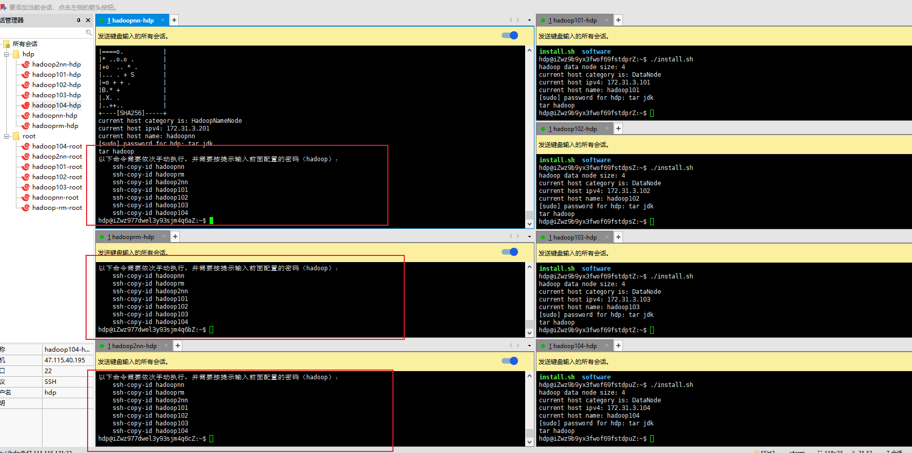
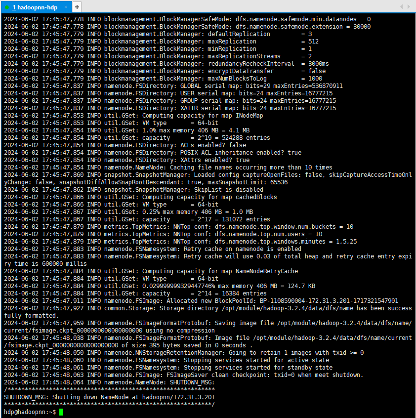
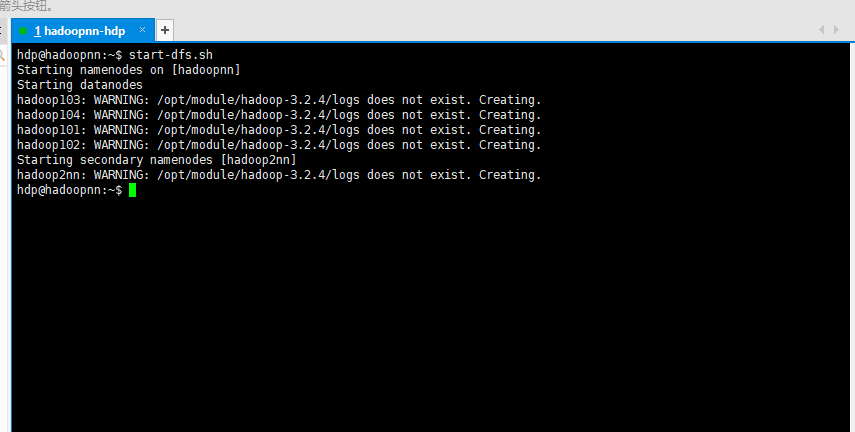
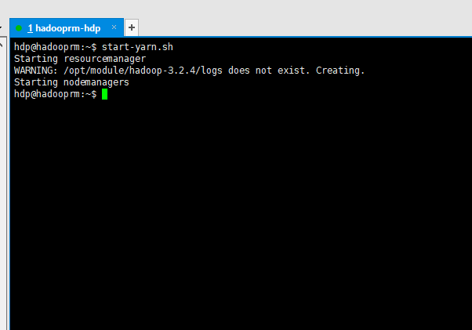
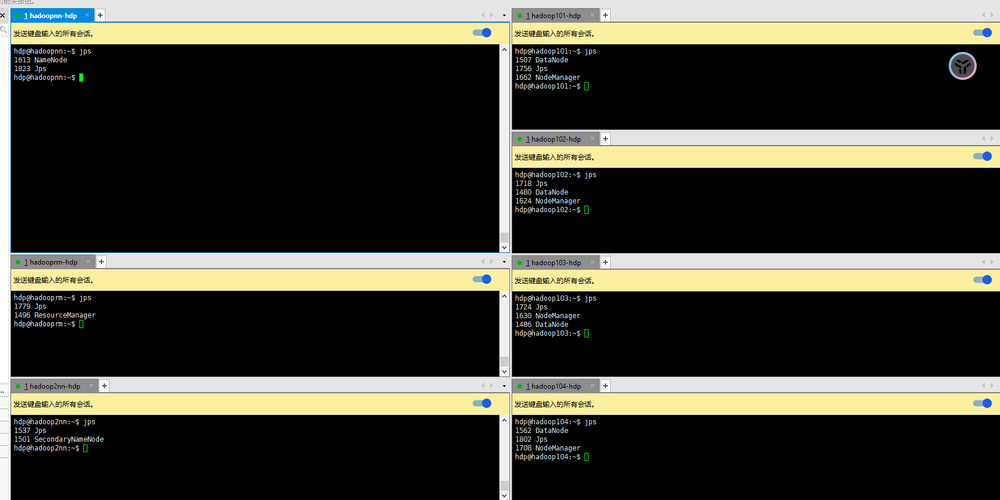
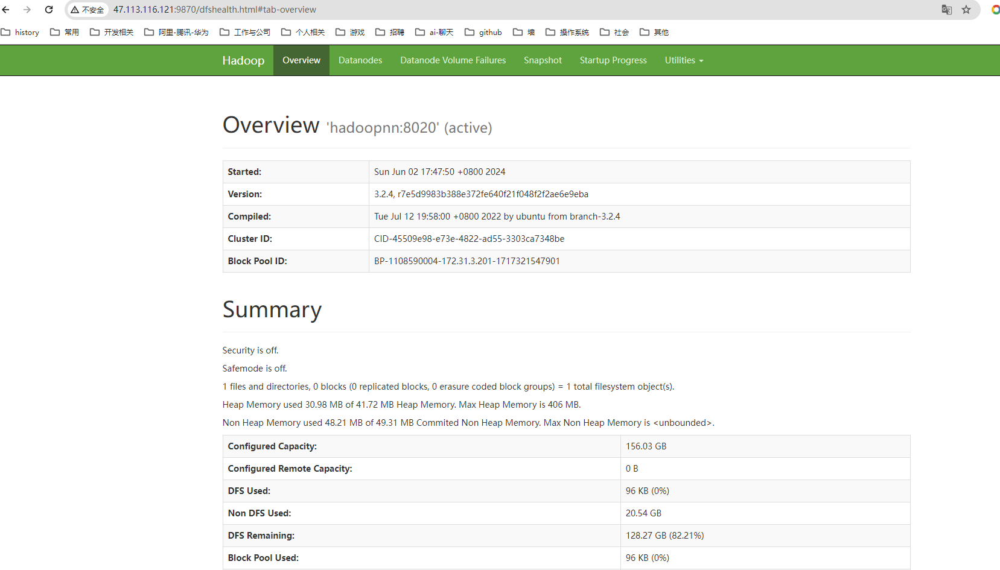
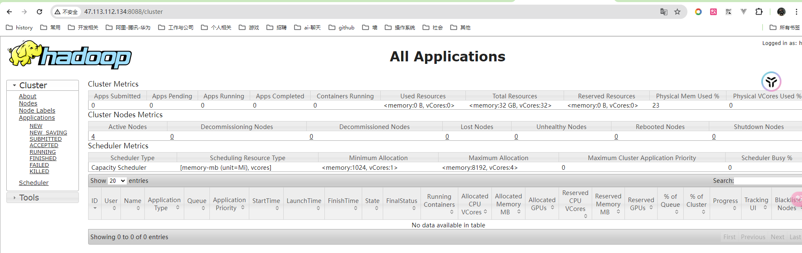

## 操作系统：ubuntu-2204


## 主机规划


| 主机名 | hadoopnn     | hadooprm        | hadoop2nn         |
| ------ | ------------ | --------------- | ----------------- |
| IP     | 172.31.3.201 | 172.31.3.202    | 172.31.3.203      |
| HDFS   | NameNode     |                 | SecondaryNameNode |
| YARN   |              | ResourceManager |                   |
|        |              |                 |                   |


| 主机名 | hadoop101    | hadoop102    | hadoop103    | ...         | hadoopxxx    |
| ------ | ------------ | ------------ | ------------ | ----------- | ------------ |
| IP     | 172.31.3.101 | 172.31.3.102 | 172.31.3.103 | ...         | 172.31.3.xxx |
| HDFS   | DataNode     | DataNode     | DataNode     | DataNode    | DataNode     |
| YARN   | NodeManager  | NodeManager  | NodeManager  | NodeManager | NodeManager  |


## 创建一个普通用户(假如用户名为：`hdp`)

> 为每一台节点实例，都创建一个相同的用户，密码也相同
>
> ```shell
> # 添加用户命令，并按提示输入密码，后面的就全部默认直接回车即可
> adduser hdp
> ```
>
> ```txt
> root@iZwz9882fglpfm76m117psZ:~# adduser hdp
> Adding user `hdp' ...
> Adding new group `hdp' (1000) ...
> Adding new user `hdp' (1000) with group `hdp' ...
> Creating home directory `/home/hdp' ...
> Copying files from `/etc/skel' ...
> New password: 
> Retype new password: 
> passwd: password updated successfully
> Changing the user information for hdp
> Enter the new value, or press ENTER for the default
> 	Full Name []: 
> 	Room Number []: 
> 	Work Phone []: 
> 	Home Phone []: 
> 	Other []: 
> Is the information correct? [Y/n] 
> root@iZwz9882fglpfm76m117psZ:~# 
> ```
>
> > 添加sudo 权限
>
> ```shell
> echo "hdp ALL=(ALL:ALL) ALL" > /etc/sudoers.d/hdp
> ```
>
> 


## 切换到用户hdp

> 后续的所有操作都只用hdp 即可。
>
> 在这之后所有的操作都换成用户：`hdp`


## 准备安装包

> 将JDK、HADOOP、FLINK 的安装包放到 `~/software` 目录 
>
> ```shell
> mkdir ~/software
> # 将对应的包放到对应的目录下面
> ```
>
> 


## 修改shell 脚本文件所需参数

> 修改脚本文件，按对应的注释修改，需要修改的地方大概有：用户名、密码、还有IP地址。如果DataNode 的数量有不同，则需要做对应的增删
>
> ```shell
> #!/bin/bash
> 
> # 所有主机统一的用户名和密码
> # TODO: suyh - 用户名和密码修改成对应的值
> HADOOP_USER="hdp"
> HADOOP_PWD="hadoop"
> 
> # Hadoop NameNode 节点的IP
> # TODO: suyh - IP 需要修改成对应的值，主机名建议不动。
> HADOOP_NN_IP="172.31.3.201"
> HADOOP_NN_HOST="hadoopnn"
> HADOOP_RM_IP="172.31.3.202"
> HADOOP_RM_HOST="hadooprm"
> HADOOP_2NN_IP="172.31.3.203"
> HADOOP_2NN_HOST="hadoop2nn"
> 
> # 以ip host 格式填充
> # TODO: suyh - IP 需要修改成对应的值，主机名也要唯一。如果有多个则可以继续添加。
> HADOOP_DN_SOURCE=()
> HADOOP_DN_SOURCE+=("172.31.3.101 hadoop101")
> HADOOP_DN_SOURCE+=("172.31.3.102 hadoop102")
> HADOOP_DN_SOURCE+=("172.31.3.103 hadoop103")
> HADOOP_DN_SOURCE+=("172.31.3.104 hadoop104")
> 
> ...
> ```
>
> 
>
> > 脚本改好后，同步到每一台主机实例上面，要注意在windows 上修改之后的，换行问题
>
> ```shell
> # 为脚本文件添加执行权限
> chmod +x install.sh
> # 执行该脚本
> ./install.sh
> ```
>
> 

## 免密登录

> 脚本执行完成之后，有三台节点会有提示，按照提示，配置ssh 免密登录
>
> 只需要在有提示的机器上面执行即可
>
> 


## 重启系统

> 重启所有节点主机


### 首次运行需要格式化 NameNode

> 注意：只需要格式化NameNode 所在的那台机器实例，也就是 hadoopnn 对应的主机节点
>
> ```shell
> hdfs namenode -format
> ```
>
> 初始化完成会多出一个data 目录(存数据的目录) 以及log 目录
>
> 如果要重新格式化，则需要将 data 和log 目录删除之后再执行，否则会报错
>
> 

## 启动

### 启动HDFS

> 注意：只需要在hadoopnn 上面启动即可
>
> ```shell
>start-dfs.sh
> ```
>
> 

### 停止HDFS

> ```shell
> stop-dfs.sh
> ```

### 启动(YARN)

>  ResourceManager

> 规划在hadooprm 上面，那么就需要到对应的机器 实例去运行启动脚本
>
> ```shell
> start-yarn.sh
> ```
>
> 

### 停止YARN

> ```shell
> stop-yarn.sh
> ```

## 查看进程情况

> 通过jps 命令可以查看当前运行的进程情况
>
> 

### web 页面

- HDFS 提供的NameNode页面

  > http://${hadoopnn}:9870
  >
  > 查看在HDFS 上存储的数据信息
  >
  > 

- YARN 提供的ResourceManager页面

  > http://${hadooprm}:8088
  >
  > 查看YARN 上运行的Job 信息
  >
  > 