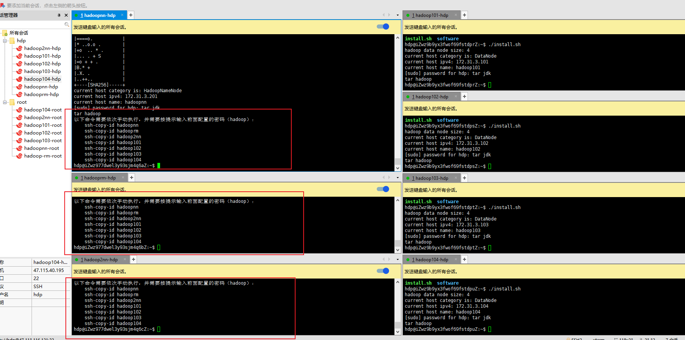
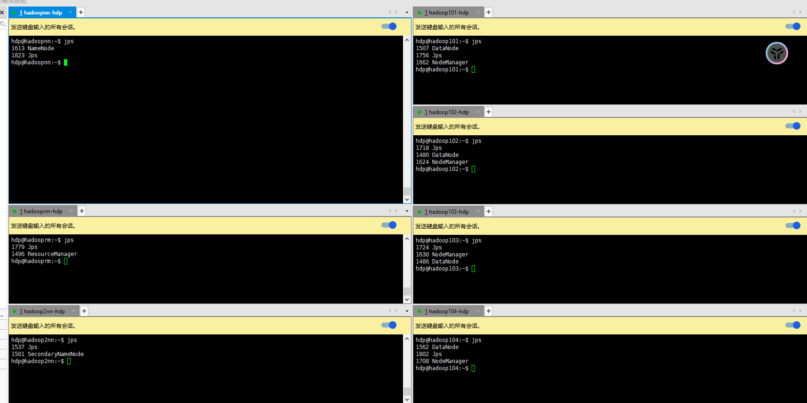

## 操作系统：ubuntu-2204


## 主机规划


| 主机名  | hadoop-name-node | hadoop-resource-manager | hadoop-secondary-name-node   |
|------|----------------|-----------------------|-------------------|
| IP   | 172.31.3.201   | 172.31.3.202          | 172.31.3.203      |
| HDFS | NameNode       |                       | SecondaryNameNode |
| YARN |                | ResourceManager       |                   |
|      |                |                       |                   |


| 主机名  | hadoop101    | hadoop102    | hadoop103    | ...         | hadoopxxx    |
|------|--------------|--------------|--------------|-------------|--------------|
| IP   | 172.31.3.101 | 172.31.3.102 | 172.31.3.103 | ...         | 172.31.3.xxx |
| HDFS | DataNode     | DataNode     | DataNode     | DataNode    | DataNode     |
| YARN | NodeManager  | NodeManager  | NodeManager  | NodeManager | NodeManager  |


## 准备一个专门用于hadoop 且拥有sudo 权限的用户

> 为每一台节点实例，都创建一个叫`hdp` 的用户，且密码也为 `hdp` 后续可以自由变更 密码。
>
> ```shell
> # 添加用户命令，并按提示输入密码，后面的就全部默认直接回车即可
> adduser hdp
> ```
>
> 
> 
> > 添加sudo 权限
> 
> ```shell
> echo "hdp ALL=(ALL:ALL) ALL" > /etc/sudoers.d/hdp
> ```
> 
> 


## 使用hdp 用户登录并连接到服务器

> 后续的所有操作都只用hdp 即可。
>
> 在这之后所有的操作都换成用户：`hdp`


## 准备安装包

> ==必须使用对应的版本，因为后面的shell 脚本是基于对应的版本写的==

### 下载JDK

链接：https://www.oracle.com/sg/java/technologies/javase/javase8-archive-downloads.html

下载对应版本：jdk-8u202-linux-x64.tar.gz


### 下载hadoop

链接：[Index of /dist/hadoop/common/hadoop-3.2.4 (apache.org)](https://archive.apache.org/dist/hadoop/common/hadoop-3.2.4/)

下载对应版本：hadoop-3.2.4.tar.gz


### ~~下载flink~~

~~链接：[Index of /flink/flink-1.18.1 (apache.org)](https://downloads.apache.org/flink/flink-1.18.1/)~~

~~找不到 1.18.0 版本的下载地址了，1.18.1 基本也没什么问题。之前也提供过 1.18.0 版本的包，这个也不需要重新下载。~~


### 上传存放

> 将JDK、HADOOP、FLINK 的安装包放到 `${HOME}/software` 目录(==每一台主机节点都要放==) 
>
> ==FLINK 在脚本中并没有安装，所以可以忽略FLINK 的安装包==
>
> ```shell
> # 将对应的包放到如下目录
> mkdir ${HOME}/software
> ```
>
> 


## 修改shell 脚本文件所需参数并执行脚本

> 修改脚本文件，按对应的注释修改，需要修改的地方大概有：用户名、密码、还有IP地址。如果DataNode 的数量有不同，则需要做对应的增删
>
> ```shell
> #!/bin/bash
> 
> # 所有主机统一的用户名和密码
> # TODO: suyh - 用户名和密码修改成对应的值
> HADOOP_USER="hdp"
> HADOOP_PWD="hdp"
> 
> # TODO: suyh - IP 需要修改成对应的值，主机名也可修改，但要符合规范。
> # Hadoop NameNode 节点的IP
> HADOOP_NN_IP="172.31.3.201"
> HADOOP_NN_HOST="hadoop-name-node"
> # Hadoop ResourceManager 节点的IP
> HADOOP_RM_IP="172.31.3.202"
> HADOOP_RM_HOST="hadoop-resource-manager"
> # Hadoop SecondaryNameNode 节点的IP
> HADOOP_2NN_IP="172.31.3.203"
> HADOOP_2NN_HOST="hadoop-secondary-name-node"
> 
> 
> # 以ip host 格式填充
> # TODO: suyh - IP 需要修改成对应的值，主机名也要唯一。如果有多个则可以继续添加。
> HADOOP_DN_SOURCE=()
> HADOOP_DN_SOURCE+=("172.31.3.101 hadoop101")
> HADOOP_DN_SOURCE+=("172.31.3.102 hadoop102")
> HADOOP_DN_SOURCE+=("172.31.3.103 hadoop103")
> HADOOP_DN_SOURCE+=("172.31.3.104 hadoop104")
> 
> ...
> ```
>
> 
>
> > 脚本改好后，同步到==每一台==主机实例上面，要注意在windows 上修改之后的，==换行问题==
>
> ```shell
> # 为脚本文件添加执行权限
> chmod +x install.sh
> # 执行该脚本
> ./install.sh
> ```
>
> 

## 免密登录

> 脚本执行完成之后，有三台节点会有提示，按照提示，配置ssh 免密登录
>
> 只需要在有提示的机器上面执行即可
>
> 


## 重启系统

> 重启所有节点主机

## 启动与停止

### 启动HDFS

> 注意：==只能在`hadoop-name-node` 上面启动==
>
> ```shell
> start-dfs.sh
> ```
>
> 

### 停止HDFS

> ```shell
> stop-dfs.sh
> ```

### 启动(YARN)

>  ResourceManager

> 注意：==只能在`hadoop-resource-manager` 上面启动==
>
> ```shell
> start-yarn.sh
> ```
>
> 

### 停止YARN

> ```shell
> stop-yarn.sh
> ```

## 查看进程情况

> 通过jps 命令可以查看当前运行的进程情况
>
> 

### web 页面

- ==网络主机域名==

  > 在上面的安装脚本里面，我们配置的IP 都是内网IP 地址。所以如果 我们想要访问相关的WEB 页面，那么就需要网络连通环境。
  >
  > 一般情况下是访问不了内网IP 地址的。所以需要额外处理一下，将每一个主机名对应的公网IP 配置在本地的 `hosts` 文件中才能访问。
  >
  > 

- HDFS 提供的NameNode页面

  > http://${hadoop-name-node}:9870
  >
  > 查看在HDFS 上存储的数据信息
  >
  > 
  >
  > 节点信息
  >
  > 

- YARN 提供的ResourceManager页面

  > http://${hadoop-resource-manager}:8088
  >
  > 查看YARN 上运行的Job 信息
  >
  > 