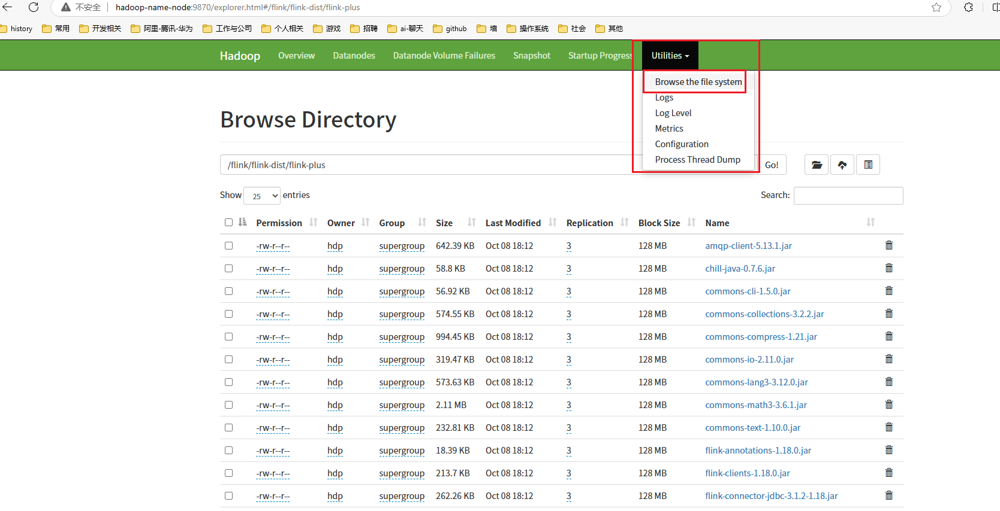

## 说明

只需要在 ==hadoop-name-node== 主机做如下操作即可。

为了避免不必要的麻烦，请使用安装hadoop 时提供的用户(`hdp`)


## flink 在hdfs 上的目录树


1. 执行如下命令创建目录树结构

   ```shell
   hadoop fs -mkdir -p /flink
   hadoop fs -mkdir -p /flink/flink-history/logs
   hadoop fs -mkdir -p /flink/flink-dist
   hadoop fs -mkdir -p /flink/flink-dist/flink-lib
   hadoop fs -mkdir -p /flink/flink-dist/flink-plus
   hadoop fs -mkdir -p /flink/flink-dist/flink-plugins
   hadoop fs -mkdir -p /flink/flink-dist/flink-3rd
   hadoop fs -mkdir -p /flink/flink-projects
   hadoop fs -mkdir -p /flink/flink-projects/cdap-flink-repetition
   hadoop fs -mkdir -p /flink/flink-projects/cdap-flink-repetition/userlibs
   hadoop fs -mkdir -p /flink/flink-projects/cdap-flink-repetition/userlibs/flink-2nd
   hadoop fs -mkdir -p /flink/flink-projects/cdap-flink-repetition/job-jar
   hadoop fs -mkdir -p /flink/flink-projects/cdap-flink-repetition/conf
   hadoop fs -mkdir -p /flink/flink-projects/cdap-flink-repetition/checkpoints
   hadoop fs -mkdir -p /flink/flink-projects/flink-realtime-trend
   hadoop fs -mkdir -p /flink/flink-projects/flink-realtime-trend/userlibs
   hadoop fs -mkdir -p /flink/flink-projects/flink-realtime-trend/userlibs/flink-2nd
   hadoop fs -mkdir -p /flink/flink-projects/flink-realtime-trend/job-jar
   hadoop fs -mkdir -p /flink/flink-projects/flink-realtime-trend/conf
   hadoop fs -mkdir -p /flink/flink-projects/flink-realtime-trend/checkpoints
   hadoop fs -mkdir -p /flink/flink-projects/flink-cohort-job
   hadoop fs -mkdir -p /flink/flink-projects/flink-cohort-job/userlibs
   hadoop fs -mkdir -p /flink/flink-projects/flink-cohort-job/userlibs/flink-2nd
   hadoop fs -mkdir -p /flink/flink-projects/flink-cohort-job/job-jar
   hadoop fs -mkdir -p /flink/flink-projects/flink-cohort-job/conf
   hadoop fs -mkdir -p /flink/flink-projects/flink-cohort-job/checkpoints
   
   ```

   

2. 目录树结构

   ```txt
   /flink
       |
       |-- flink-history
           |
           |-- logs(历史服务日志)
       |
       |-- flink-dist(flink项目共用的jar 依赖组件)
           |
           |-- flink-lib(flink 自带的jar 包)
           |-- flink-plus(在项目中引入的flink 的jar 包)
           |-- flink-plugins(flink 自带的 plugins)
           |-- flink-3rd(在项目中引入的非flink 相关的 jar 包)
       |
       |-- flink-projects
           |
           |-- cdap-flink-repetition(重复率项目)
               |
               |-- userlibs
                   |
                   |-- flink-2nd
               |-- job-jar
               |-- conf(业务配置)
                   |
                   |-- application-batch.yaml
                   |-- application-stream.yaml
               |-- checkpoints
           |-- flink-realtime-trend(实时曲线项目)
               | 
               |-- userlibs
                   |
                   |-- flink-2nd
               |-- job-jar
               |-- conf(业务配置)
                   |
                   |-- application-batch.yaml
                   |-- application-stream.yaml
               |-- checkpoints
           |-- flink-cohort-job(同期群项目)
               | 
               |-- userlibs
                   |
                   |-- flink-2nd
               |-- job-jar
               |-- conf(业务配置)
                   |
                   |-- application-batch.yaml
                   |-- application-stream.yaml
               |-- checkpoints
   
   ```

   


## flink 安装

```shell
# 将flink-1.18.0-bin-scala_2.12.tgz 解压，其中-C 参数可以指定要解压的目录(如：/opt/module/)，如果不指定默认为当前目录
tar -zxvf flink-1.18.0-bin-scala_2.12.tgz -C /opt/module/
```


## flink 部署

### 基础依赖

1. 上传flink 自带的基础jar 依赖

   ```shell
   hadoop fs -put /opt/module/flink-1.18.0/lib/* /flink/flink-dist/flink-lib
   ```

2. 上传flink 自带的plugins 

   ```shell
   hadoop fs -put /opt/module/flink-1.18.0/plugins/* /flink/flink-dist/flink-plugins
   ```

### 业务作业公共依赖

以同期群作业最新版本(`流批一体`)的jar 包为基准。==flink-cohort-job-v1.0.0==

这里可以借助hadoop 的web ui 进行上传文件

```txt
在前面的文档一直没有提及使用web ui 操作hadoop ，主要的原因是：在我使用web ui 操作文件的过程中会有一些奇怪 的现象。
整体的感觉就是，hadoop web ui 似乎会记住一些我删除过的文件或者目录。在某次进行删除操作时，除了会正常删除该文件的同时可能就会删除它记住的额外的文件。
在清理浏览器缓存之后的确会临时解决这个问题。但是并没有找到永久解决这个问题的方案。
上传文件与查看是没有问题的。
```

通过访问 http://hadoop-name-node:9870 可以进入到 hadoop web ui 界面，前提是配置了hosts(或者能直接访问内网IP)



1. 上传 flink-plus 

   将同期群的 `flink-plus` 目录中的 jar 包上传到hadoop  的`/flink/flink-dist/flink-plus` 目录中

   如果使用web ui 则进入到对应目录，使用上传按钮上传即可。

   如果使用命令行上传，则需要先将对应的jar 包准备好，放到 `hadoop-name-node` 主机，命令行示例如下：

   ```shell
   hadoop fs -put /xxx/xxx/lib/flink-plus/* /flink/flink-dist/flink-plus
   ```

2. 上传 flink-3rd

   将同期群的 `usrlib/flink-3rd` 目录中的jar 包上传到 hadoop 的 `/flink/flink-dist/flink-3rd` 目录中

   同上，使用命令行示例如下：

   ```shell
   hadoop fs -put /xxx/xxx/lib/usrlib/flink-3rd/*   /flink/flink-dist/flink-3rd
   ```


## flink 作业配置

flink on yarn 模式下，所有的作业提交都只需要在hadoop-name-node 主机上操作即可。

所以需要将每个作业的配置分开，flink 每次会判断环境变量`FLINK_CONF_DIR` 是否存在，来判断是否需要读取指定目录下面的配置文件。如果不存在则取默认目录`conf` 下的配置文件。

### 删除默认的配置目录

以防止忘记或者遗漏环境变量`FLINK_CONF_DIR` 时，flink 错误的运行起来，删除默认的配置文件目录。

每次运行flink 都必须要设置环境变量 `FLINK_CONF_DIR` 的值。

```shell
rm -rf /opt/module/flink-1.18.0/conf
```

### 同期群作业配置

#### 同期群批

#### 同期群流

### 实时曲线作业配置

### 重复率作业配置


## 启动运行

1. 启动flink

   ```shell
   # 先停止
   bin/stop-cluster.sh
   # 再启动
   bin/start-cluster.sh
   ```

2. 提交作业

   ```shell
   # 如果要在指定并行度，使用 -p 参数。
   # 在standalone 模式，并行度的数量应该与槽的数量一致，所以并行度与槽直接在conf/flink-conf.yaml 中配置最为合适。
   bin/flink run -d  ${job-name}-${version}.jar
   ```

3. 如果要从保存点提交作业使用如下命令

   > 当前这个项目，并没有提供批算，忽略。

   ```shell
   # -s 参数指定保存点的目录，其中：`87a3850020b5e1f74659a1169c737ed2` 是jobid。
   bin/flink run -d -s file:///home/suyunhong/module/flink-1.18.0/cds/checkpoints/87a3850020b5e1f74659a1169c737ed2/chk-17/ ${job-name}-${version}.jar
   ```

4. 停止作业

   ```shell
   # 指定停止哪一个作业需要提供JobID
   ./bin/flink cancel <JobID>
   # 要停止jobID 87a3850020b5e1f74659a1169c737ed2 应使用如下命令
   ./bin/flink cancel 87a3850020b5e1f74659a1169c737ed2
   ```

5. 其他


