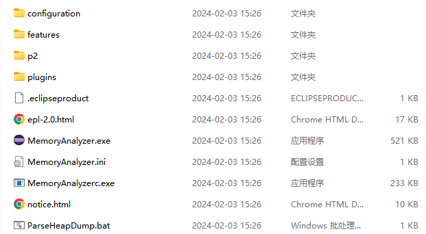
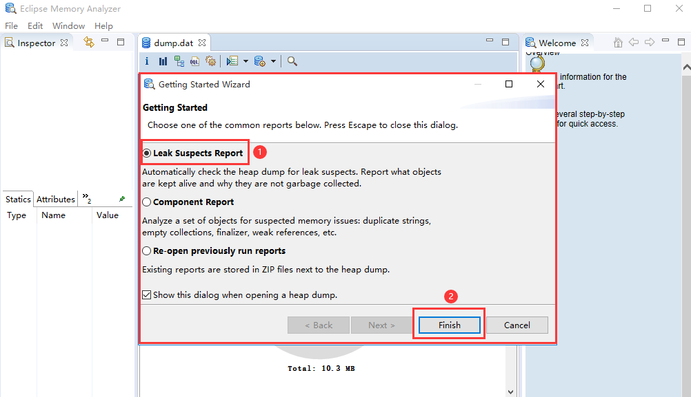
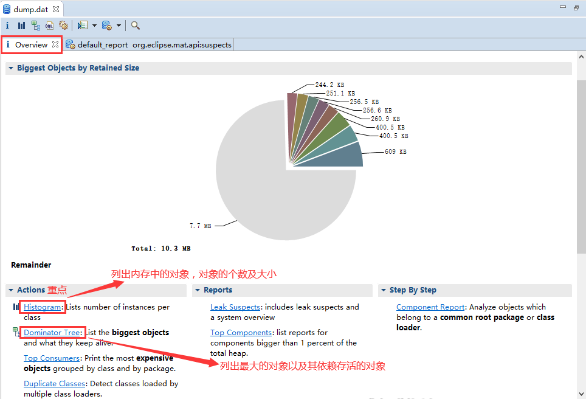
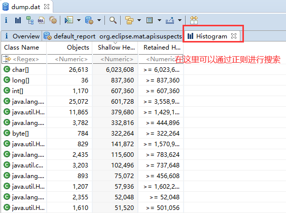
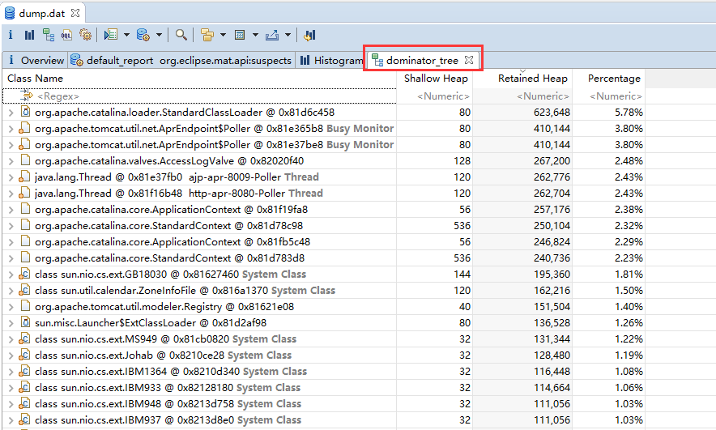

## dump 文件生成

### 运行中的程序

>  将内存使用情况dump 到文件中

> 用法

```shell
jmap -dump:format=b,file=<dumpFileName> <pid>
```

> 示例

```shell
jmap -dump:format=b,file=dump.hprof 823339
```

### 添加启动参数

```shell
nohup java -jar -Xms32M -Xmx32M -XX:+HeapDumpOnOutOfMemoryError -XX:HeapDumpPath=/usr/local user-0.0.1-SNAPSHOT.jar  > log.file  2>&1 &
```


## mat 工具

### 下载

> https://eclipse.dev/mat/downloads.php

### 解压后得到的文件列表



### 使用

1. 配置JDK

   > 打开配置文件：`MemoryAnalyzer.ini`
   >
   > 在首两行添加如下配置即可，添加到文件后面不行

   ```txt
   -vm 
   D:\Java\jdk-17\bin\javaw.exe
   ```

2. 双击应用程序: `MemoryAnalyzer.exe`

3. 打开一个dump 文件

   

4. 继续

   

5. overview

   

6. Histogram

   

7. 查看对象以及它的依赖

   

8. 查看可能内存泄漏的分析

   

9. 其他

