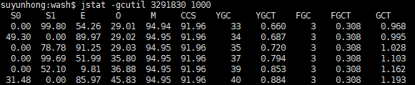

### GC

#### 每秒查看进程的gc 情况

```shell
# jstat -gcutil <PID> <间隔时间，单位：毫秒>
jstat -gcutil 3253061 1000
```


```txt
  S0     S1     E      O      M     CCS    YGC     YGCT    FGC    FGCT     GCT   
  0.00  99.80  54.26  29.01  94.94  91.96     33    0.660     3    0.308    0.968
 49.30   0.00  89.97  29.02  94.95  91.96     34    0.687     3    0.308    0.995
  0.00  78.78  91.25  29.03  94.95  91.96     35    0.720     3    0.308    1.028
  0.00  99.69  51.99  35.80  94.95  91.96     37    0.794     3    0.308    1.103
  0.00  52.10   9.81  36.88  94.95  91.96     39    0.853     3    0.308    1.162
 31.48   0.00  85.97  45.83  94.95  91.96     40    0.884     3    0.308    1.193
```



- S0

  Survivor 0 区的使用百分比。Survivor 区是新生代的一部分，用于存放经过一次 Minor GC 后仍然存活的对象。

- S1

  Survivor 1 区的使用百分比。Survivor 区有两个，S0 和 S1 会在 Minor GC 时交替使用。

- E

  Eden 区的使用百分比。Eden 区也是新生代的一部分，新创建的对象通常首先会被分配到 Eden 区。

- O

  老年代（Old Generation）的使用百分比。当对象在新生代经过多次 GC 仍然存活时，会被晋升到老年代。

- M

  元空间（Metaspace）的使用百分比。在 Java 8 及以后，元空间取代了永久代，用于存储类的元数据。

- CSS

  压缩类空间（Compressed Class Space）的使用百分比，它是元空间的一部分，用于存储类指针。

- YGC

  Minor GC（也称为 Young GC）的次数。Minor GC 主要发生在新生代，用于回收 Eden 区和 Survivor 区不再使用的对象。

- YGCT

  Minor GC 的总耗时（秒）。

- FGC

  Full GC 的次数。Full GC 会对整个堆（包括新生代、老年代和元空间）进行垃圾回收，通常会导致应用程序出现较长时间的停顿。

- FGCT

  Full GC 的总耗时（秒）。

- GCT

  所有 GC（包括 Minor GC 和 Full GC）的总耗时（秒）。


#### 运行时写gc 日志文件

```shell
jvm_params=(
    # JVM 进程挂掉时自动生成dump 文件
    "-XX:+HeapDumpOnOutOfMemoryError"
    "-XX:HeapDumpPath=${base_dir}/wash_dump.hprof"
    
    # JVM 内存限制
    "-Xms256m"
    "-Xmx512m"
    
    # JVM 额外的依赖包目录
    "-Dloader.path=lib"
    
    # 运行时，每次发生GC 时都将信息写到gc.log 文件中
    "-XX:+PrintGCDetails"
    "-XX:+PrintGCTimeStamps"
    "-XX:+PrintGCDateStamps"
    "-Xloggc:${base_dir}/gc.log"
)

springboot_params=(
    "--server.port=${port}"
    "--spring.profiles.active=${profile}"
    "--spring.main.web-application-type=servlet"
)

nohup java ${jvm_params[@]} -cp ${app}-${version}.jar  org.springframework.boot.loader.PropertiesLauncher ${springboot_params[@]} > /dev/null 2>&1 &


```


参考：==gc.log== 文件