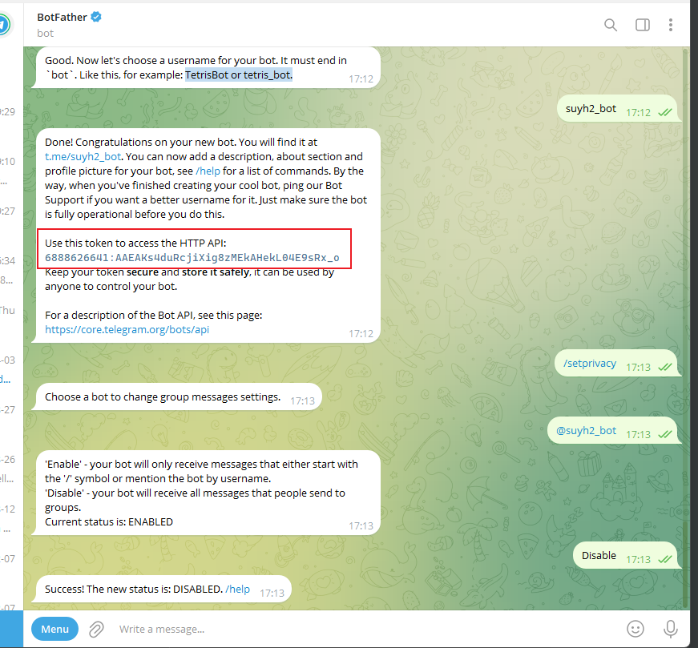

## 在Telegram 中如何添加一个机器人(bot)，并通过http 请求通过该机器发送消息到Telegram 


## 在Telegram 中创建一个机器人

1. 在Telegram 中找到 `BotFather`

2. 创建一个`bot`

   - 向`BotFather` 发送消息命令`/newbot`

   - 按提示创建机器人名称和用户名

     > 这里要注意的就是机器人的username 必须是以bot 结尾的，比如：TetrisBot or tetris_bot.

     

3. 得到该机器人的token 令牌，同时允许机器人接收任何消息

   > 如下中的token 就是：`6888626641:AAEAKs4duRcjiXig8zMEkAHekL04E9sRx_o`
   >
   > 通过命令 `/setprivacy` 命令配置`Disable` 来允许机器人接收任何消息。

   

4. 其他

## 创建群组，并获取chat-id

1. 创建一个群组

2. 将刚刚创建的机器人添加到群组中

3. 将机器人设置为管理员

   - Manage group

     

   - Administrators

     

   - Add Administrator

     

   - 选择机器人

     

   - save

     

   - 完成

4. 将机器人`@get_id_bot` 添加到群组中来.

   

5. ~~询问机器人，当前群聊的chat_id~~   

   >  **这样拿到的chat id 并不能发送消息，但是原来又使用这个ID 发送成功过消息**

   > /my_id@get_id_bot

   

6. 通过接口获取 chat id

   > 先在群组里面给机器人说一句话 @xx_bot

   ```http
   https://api.telegram.org/bot{{token}}/getUpdates
   ```

   > 如: https://api.telegram.org/bot7109132055:AAHt2e0l5sBhZXnfwzKB6JRPyyuSrCcF2MM/getUpdates
   >
   > 在结果中找出chat id

   

7. 其他

## 使用机器人给群组发消息

> 使用http 接口就可以了

```http
https://api.telegram.org/bot{{token}}/sendMessage?chat_id=-4148900268&text=1234
```

