## 命令

```shell
psql -U postgres -d postgres -p 5432

# 使用-D 来指定数据目录，默认找环境变量：PGDATA
pg_ctl start -D /usr/local/pg12.2/data

# 添加用户组以及用户
groupadd postgres
useradd -g postgres postgres
passwd postgres # 给用户设置密码


# 将目录的属主改为postgress
chown postgres:postgres /usr/local/postgres12.2/
```


## 环境准备

> 环境准备
>
> 配置文件：`.bash_profile`

```shell
export PGPORT=5432
export PG_HOME=/usr/local/pg12.2
export PATH=$PA_HOME/bin:$PATH
export PGDATA=$PG_HOME/data
export LD_LIBRARY_PATH=$PG_HOME/lib
export LANG=en_US.utf8
```

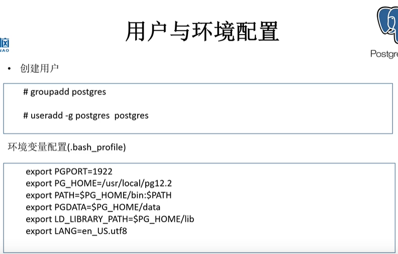


## 内核参数配置


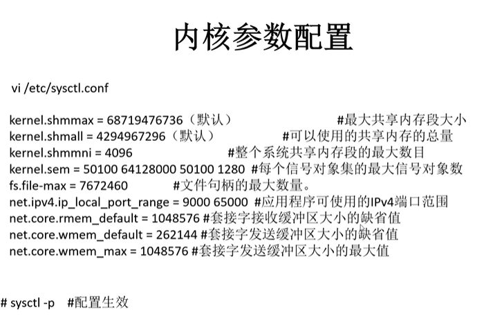

## 安装方式

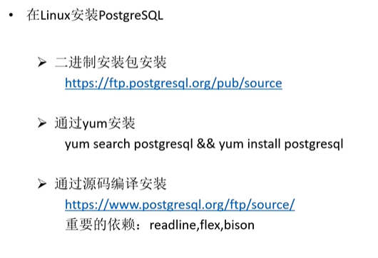

## 源码安装依赖包

```shell
# 检查某个软件是否安装了
rpm -qa gcc
```


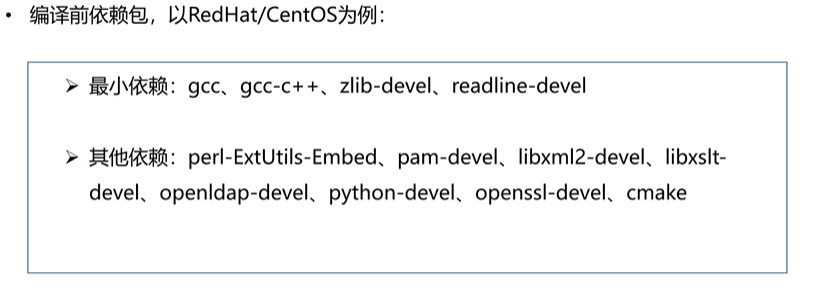

## 源代码安装

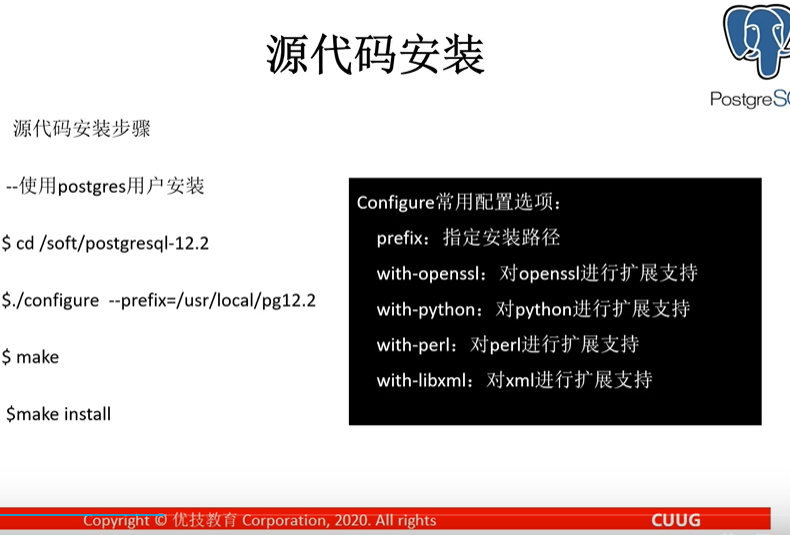

配置可选项

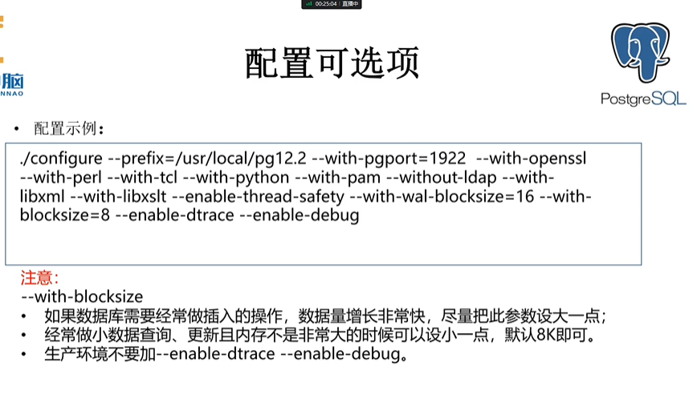

编译可选项

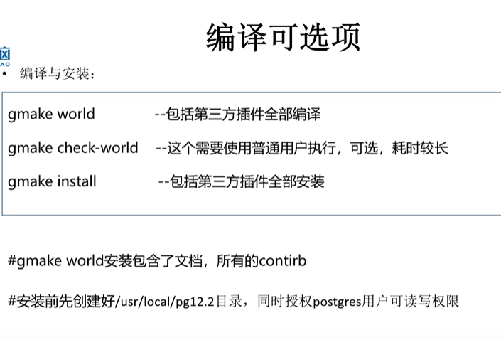


## 创建数据库集簇

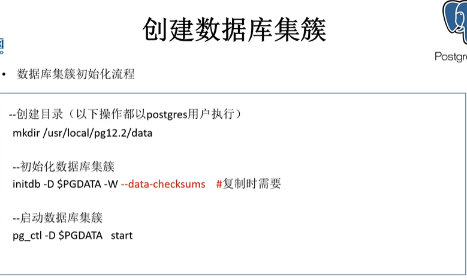

```txt
参数 -W                 可以为 postgres 超级管理员指定密码
参数 --data-checksums   主要是做主从复制时需要
```


## 数据库结构

```txt
数据库集簇
一个数据库集簇里面有多个数据库
表空间
```

```sql
\d pg_database
select datname, oid from pg_database;
```


## 用户与角色管理

### 创建用户

> 数据库用户用来访问、管理数据库中的对象（表、索引、...）

- 超级用户(postgres)
- 普通用户

方式一：在系统命令行使用createusser 命令  -- 不常用

```shell
createuser username
createuser -U postgres -p 7788 user1 (--for windows)
```

方式二：在pgsql 命令行使用 create user(role) 指令    -- 比较常用

```sql
CREATE user[ROLE] rolename;
```

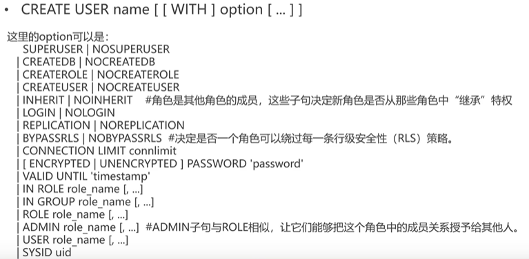

示例

```sql
CREATE USER u1 SUPERUSER PASSWORD 'u1';
CREATE USER u2 CREATEDB PASSWORD 'u2';
CREATE USER U3 LOGIN;
-- 查看当前创建用户的情况
\du
```


### 创建角色 

> 数据库角色用来管理数据库访问权限，简化权限的管理

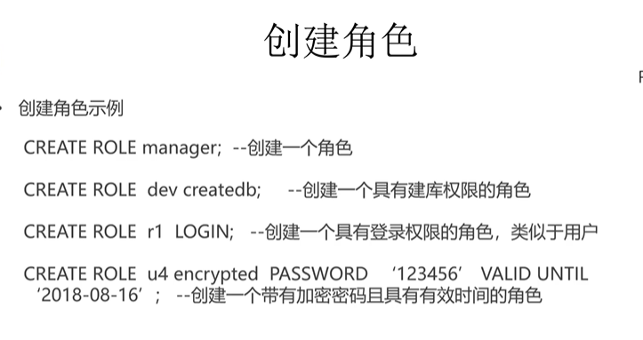

示例

```sql
CREATE ROLE manager;
CREATE ROLE dev createddb;
CREATE ROLE r1 LOGIN;
\du
```

#### 启用角色赋予的权限

> 对于oracle 数据库：默认角色（角色里面包含的权限登录时就生效），非默认角色（set role 使之生效）
> 对于pg 数据库：所有角色都要使用（set role $roleName） 使角色生效。否则角色是不生效的。

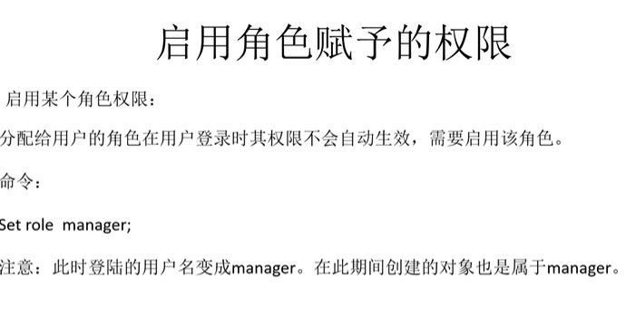

### 权限介绍

> 用户和角色在整个数据库集簇中是全局性的，不是针对某一单一数据库，只要有足够权限，用户可以访问所有数据库对象。\

```sql
-- 查看用户管理表相关的结构
\d pguser
-- 查看对应用户的相关信息
select * from pg_user where usename = 'u1';
-- 查看角色管理表相关的结构
\d pg_roles
-- 查看对应角色的相关信息
select * from pg_roles where rolname = 'u1';
```


#### 权限管理

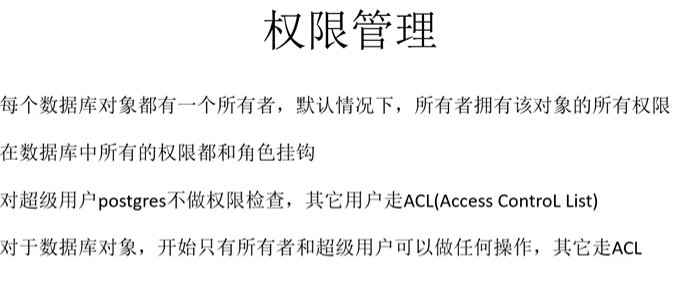

### 修改用户

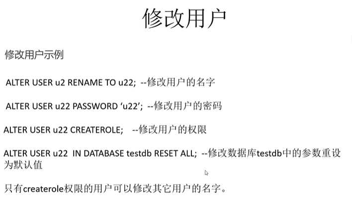

### 删除用户

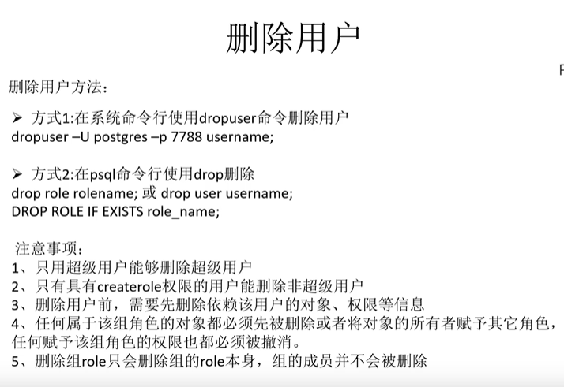

### 给用户授权


### 给角色授权

```sql
-- 将dev 角色授权给u3 用户
grant dev to u3;
```


## schemas(模式)


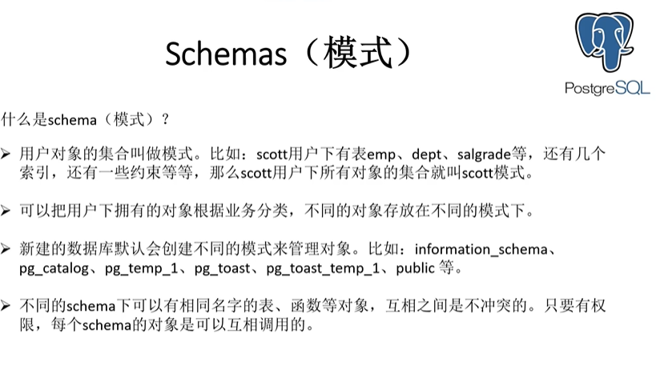