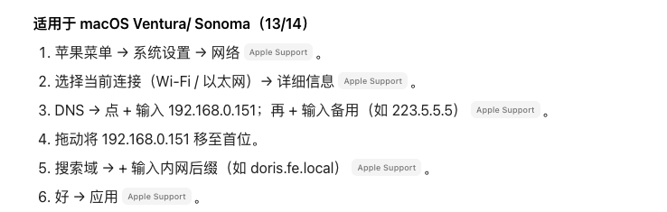

## 前置准备（非必须）

配置当前DNS 服务器主机的IP 为静态ip


## 安装 

```shell
# ubuntu 安装 
sudo apt update
sudo apt install dnsmasq
```

## ubuntu 系统默认占用53 端口

1. #### **停止并禁用 系统自带的`systemd-resolved` 服务**

   ```shell
   sudo systemctl stop systemd-resolved
   sudo systemctl disable systemd-resolved
   ```

2. #### **删除 `/etc/resolv.conf` 符号链接，重新创建**

   ```shell
   sudo rm /etc/resolv.conf
   # 创建新的resolv.conf（指向dnsmasq）
sudo echo "nameserver 127.0.0.1" > /etc/resolv.conf
   ```
   

## 配置dnsmasq（核心步骤）

1. 备份

   ```shell
   sudo mv /etc/dnsmasq.conf /etc/dnsmasq.conf.bak
   ```

2. 添加如下配置

   有几个地方要注意：要修改成自己的网卡名：==interface=ens33==

   查看本机网卡（ubuntu）：`ip addr`

   ```conf
   # 文件：/etc/dnsmasq.conf
   # 1. 基础配置：监听本机内网IP（仅允许内网访问，避免暴露）
   listen-address=127.0.0.1,192.168.0.151  # 本机回环+内网静态IP
   interface=ens33  # 你的网卡名（和Netplan里一致）
   bind-interfaces  # 仅绑定指定网卡，提高安全性
   
   # 2. 内网域名映射（核心：自定义域名→内网IP）
   # 示例1：nas.local → 192.168.0.100
   address=/nas.local/192.168.0.100
   # 示例2：web.local → 192.168.0.200（可添加多条，格式：address=/域名/内网IP）
   address=/web.local/192.168.0.200
   
   # 3. 上游DNS（解析外网域名用，优先走网关DNS，备用谷歌/阿里）
   server=192.168.0.1    # 内网网关DNS
   server=8.8.8.8        # 谷歌DNS（备用）
   server=223.5.5.5      # 阿里DNS（备用）
   
   # 4. 其他优化配置
   cache-size=1000       # DNS缓存大小（提升解析速度）
   no-hosts              # 不读取/etc/hosts（避免冲突，可选）
   domain-needed         # 拒绝解析非完全限定域名
   bogus-priv            # 拒绝解析内网IP的反向解析（防污染）
   ```

   

## 启动dnsmasq 服务

```shell

sudo systemctl start dnsmasq
sudo systemctl stop dnsmasq
sudo systemctl restart dnsmasq

sudo systemctl status dnsmasq
```


## 测试dnsmasq 服务

使用命令：`nslookup`

```shell
suyh@suyh:~$ nslookup vmware.doris.fe.local 192.168.0.151
Server:		192.168.0.151
Address:	192.168.0.151#53

Name:	vmware.doris.fe.local
Address: 192.168.0.201

suyh@suyh:~$ 
```


---

==**在其他主机上配置DNS 服务首选为内网服务器**==


##  配置内网DNS 服务

### 【ubuntu系统】

修改配置文件：`/etc/systemd/resolved.conf`

> 修改为以下内容（确保 Domains 配置为 ~.，表示所有域名都转发）：

```ini
[Resolve]
DNS=192.168.0.151 223.5.5.5 114.114.114.114 8.8.8.8
FallbackDNS=8.8.8.8
Domains=~.  # 关键：所有域名都使用上面的 DNS 解析，不过滤
DNSSEC=no  # 禁用 DNSSEC（避免自定义 DNS 因无签名被拒绝）
DNSOverTLS=no
MulticastDNS=no  # 禁用 mDNS（避免干扰）
LLMNR=no  # 禁用 LLMNR（避免干扰）
Cache=no-negative  # 禁用“负缓存”（避免解析失败被缓存）
DNSStubListener=yes  # 确保存根服务正常监听
```

重启

```shell
sudo systemctl restart systemd-resolved
```

验证

```shell
ping vmware.doris.fe.local -c 2
```

### 【windows系统】

1. 右键任务栏网络图标 → 打开 “网络和 Internet 设置”。

2. 选择 “更改适配器选项” → 右键当前连接（以太网 / Wi‑Fi）→ 属性。

3. 选中 “Internet 协议版本 4 (TCP/IPv4)” → 属性。

4. 选择 “使用下面的 DNS 服务器地址”：

   - 首选 DNS 服务器：192.168.0.151
   - 备用 DNS 服务器：223.5.5.5 或 114.114.114.114（可选）。

5. 确定 → 关闭所有窗口。

6. 以管理员打开命令提示符，执行：

   ```cmd
   ipconfig /flushdns
   ```

7. 测试：

   ```cmd
   nslookup vmware.doris.fe.local 192.168.0.151
   ping vmware.doris.fe.local -n 2
   ```

【mac系统】

