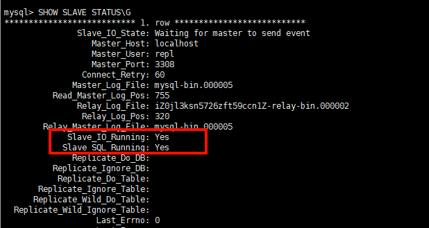

在程序运行一段时间后，添加从库配置


## 主库配置

### 修改主库配置文件

```ini
[mysqld]
# 开启二进制日志
log_bin = /var/log/mysql/mysql-bin.log
# 服务器唯一ID
server-id = 1
# 需要同步的数据库（可多个）
# binlog_do_db = target_db
# 二进制日志格式
binlog_format = ROW
# 设置binlog保留时间（避免过早清理）
expire_logs_days = 7
# 忽略系统数据库
binlog_ignore_db = mysql
```

==重启主库==

## 用户复制授权

==需要在主库找到一个用户用于同步，同时为它添加复制的权限==

```sql
-- 登录主库 root 账号
CREATE USER 'repl'@'localhost' IDENTIFIED BY 'repl';
GRANT REPLICATION SLAVE ON *.* TO 'repl'@'localhost';
FLUSH PRIVILEGES;
```


## 备份主库

### 主库锁表并记录binlog 位置

```sql
-- 锁定所有表（只读不写）
FLUSH TABLES WITH READ LOCK;

-- 记录当前binlog位置（重要！后续需使用）
SHOW MASTER STATUS;
```

示例：

```plaintext
+------------------+----------+--------------+------------------+
| File             | Position | Binlog_Do_DB | Binlog_Ignore_DB |
+------------------+----------+--------------+------------------+
| mysql-bin.000008 | 154      | target_db    |                  |
+------------------+----------+--------------+------------------+
```

> 注意：保持此 MySQL 会话打开，不要关闭，直到备份完成


### 创建主库全量备份

在另一个终端执行备份命令：

```shell
# 备份指定数据库（推荐）
mysqldump -u root -p --databases target_db > /tmp/master_backup.sql

# 或备份所有数据库
# mysqldump -u root -p --all-databases > /tmp/master_backup.sql
```

### 解锁主库

```sql
-- 解锁表，允许写入操作
UNLOCK TABLES;
```


---


## 从库配置

**==接下来是从库的配置==**


### 从库数据初始化

```shell
# 在从库执行恢复
mysql -u root -p < /tmp/master_backup.sql
```


### 修改从库配置文件

```ini
[mysqld]
# 服务器唯一ID（与主库不同）
server-id = 2
# 中继日志
relay_log = /var/log/mysql/mysql-relay-bin.log
# 从库只读（可选）
read_only = 1
# 主库中的数据库名和从库的数据库名不一致时需要指定
# replicate-rewrite-db = suyh_cem_master -> suyh_cem_slave
```

==重启服务器==

执行如下sql

```sql
-- 停止从服务器复制线程
STOP SLAVE;

-- 重置从库同步配置（清除旧信息）
RESET SLAVE ALL;

-- 配置主服务器信息，这里要指定主库提供的用于复制用户的账号和密码
CHANGE MASTER TO
-- 主库的IP
MASTER_HOST = 'localhost',
-- 主库的端口
MASTER_PORT = 3307,
-- 在主库创建的用于同步的账号与密码
MASTER_USER = 'repl',
MASTER_PASSWORD = 'repl',
-- 前面记录下来的主库的binlog 文件以及位置
MASTER_LOG_FILE = ' mysql-bin.000008',
MASTER_LOG_POS = 154;

-- 启动从服务器复制线程
START SLAVE;

-- 查看从服务器状态
SHOW SLAVE STATUS\G
```

检查结果中以下两个值是否为`Yes`，如果是则表示配置成功：

- Slave_IO_Running: Yes
- Slave_SQL_Running: Yes




## 验证主从复制功能是否正常生效

在主库执行如下sql

```sql
CREATE DATABASE suyh_tmp;
USE suyh_tmp;
CREATE TABLE test_sync (id INT);
INSERT INTO test_sync VALUES (1);
```

