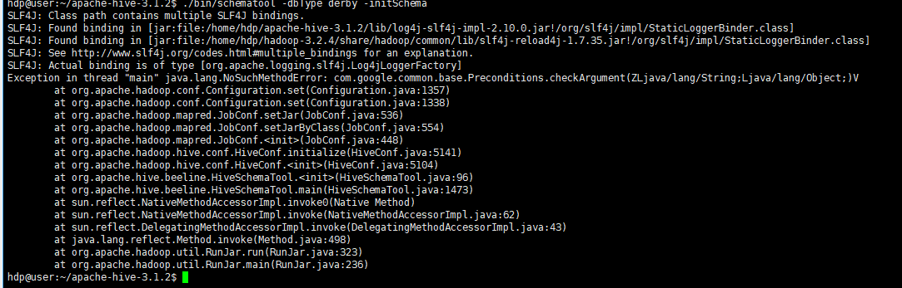

```shell
# 解压 
tar -zxvf installer/apache-hive-3.1.2-bin.tar.gz -C /opt/module
mv /opt/module/apache-hive-3.1.2-bin /opt/module/apache-hive-3.1.2
# 添加环境变量

```


```shell
# 添加环境变量
# hadoop 环境配置
export HIVE_HOME=/opt/module/apache-hive-3.1.2
export PATH=$PATH:$HADOOP_HOME/bin:$HIVE_HOME/bin
```


```shell
# 初始化元数据库（默认是derby 数据库）
cd ${HIVE_HOME}
./bin/schematool -dbType derby -initSchema

# 如果成功，会创建一个新的目录：metastore_db
```


在进行初始化时由于版本之间依赖的第三方包的版本不一致导致的问题，需要处理。



```txt
hdp@user:~/apache-hive-3.1.2$ ./bin/schematool -dbType derby -initSchema
SLF4J: Class path contains multiple SLF4J bindings.
SLF4J: Found binding in [jar:file:/home/hdp/apache-hive-3.1.2/lib/log4j-slf4j-impl-2.10.0.jar!/org/slf4j/impl/StaticLoggerBinder.class]
SLF4J: Found binding in [jar:file:/home/hdp/hadoop-3.2.4/share/hadoop/common/lib/slf4j-reload4j-1.7.35.jar!/org/slf4j/impl/StaticLoggerBinder.class]
SLF4J: See http://www.slf4j.org/codes.html#multiple_bindings for an explanation.
SLF4J: Actual binding is of type [org.apache.logging.slf4j.Log4jLoggerFactory]
Exception in thread "main" java.lang.NoSuchMethodError: com.google.common.base.Preconditions.checkArgument(ZLjava/lang/String;Ljava/lang/Object;)V
	at org.apache.hadoop.conf.Configuration.set(Configuration.java:1357)
	at org.apache.hadoop.conf.Configuration.set(Configuration.java:1338)
	at org.apache.hadoop.mapred.JobConf.setJar(JobConf.java:536)
	at org.apache.hadoop.mapred.JobConf.setJarByClass(JobConf.java:554)
	at org.apache.hadoop.mapred.JobConf.<init>(JobConf.java:448)
	at org.apache.hadoop.hive.conf.HiveConf.initialize(HiveConf.java:5141)
	at org.apache.hadoop.hive.conf.HiveConf.<init>(HiveConf.java:5104)
	at org.apache.hive.beeline.HiveSchemaTool.<init>(HiveSchemaTool.java:96)
	at org.apache.hive.beeline.HiveSchemaTool.main(HiveSchemaTool.java:1473)
	at sun.reflect.NativeMethodAccessorImpl.invoke0(Native Method)
	at sun.reflect.NativeMethodAccessorImpl.invoke(NativeMethodAccessorImpl.java:62)
	at sun.reflect.DelegatingMethodAccessorImpl.invoke(DelegatingMethodAccessorImpl.java:43)
	at java.lang.reflect.Method.invoke(Method.java:498)
	at org.apache.hadoop.util.RunJar.run(RunJar.java:323)
	at org.apache.hadoop.util.RunJar.main(RunJar.java:236)

```


```shell
# 查看 Hadoop 的 Guava 版本
ls $HADOOP_HOME/share/hadoop/common/lib/guava-*.jar

# 查看 Hive 的 Guava 版本
ls $HIVE_HOME/lib/guava-*.jar

# 通常 Hadoop 3.2.4 使用的是较高版本的 Guava（如 guava-27.0-jre.jar），而 Hive 可能使用较低版本，需要删除 Hive 中的低版本 Guava，并用 Hadoop 的高版本替换：
# 进入 Hive 的 lib 目录
cd $HIVE_HOME/lib

# 删除 Hive 自带的 Guava
rm -f guava-*.jar

# 复制 Hadoop 的 Guava 到 Hive 的 lib 目录
cp $HADOOP_HOME/share/hadoop/common/lib/guava-*.jar .

# 另外，你还需要处理 SLF4J 的多重绑定警告（虽然不影响功能，但可以清理）：
# 删除 Hive 中的 log4j-slf4j-impl
rm -f $HIVE_HOME/lib/log4j-slf4j-impl-*.jar
```


进入hive 命令行：`./bin/hive`

```shell
hdp@user:~/apache-hive-3.1.2$ ./bin/hive
Hive Session ID = aa598c65-52ed-4f58-8584-b01ea8a31bda

Logging initialized using configuration in jar:file:/home/hdp/apache-hive-3.1.2/lib/hive-common-3.1.2.jar!/hive-log4j2.properties Async: true
Hive-on-MR is deprecated in Hive 2 and may not be available in the future versions. Consider using a different execution engine (i.e. spark, tez) or using Hive 1.X releases.
Hive Session ID = d3a5fb5b-0f3c-4e44-83b8-2f52f01ad31b
hive> 
```


测试：

```shell
hive> show databases;
hive> show tables;
hive> create table stu(id int, name string);
hive> insert into stu values(1, "ss");
hive> select * from stu;
```


