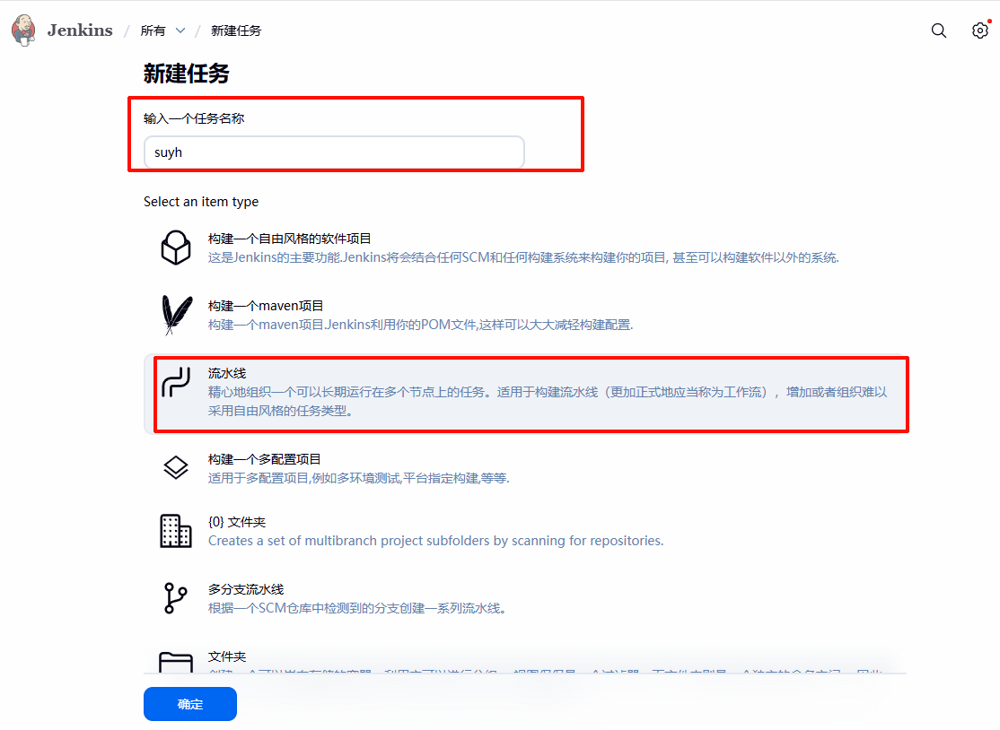
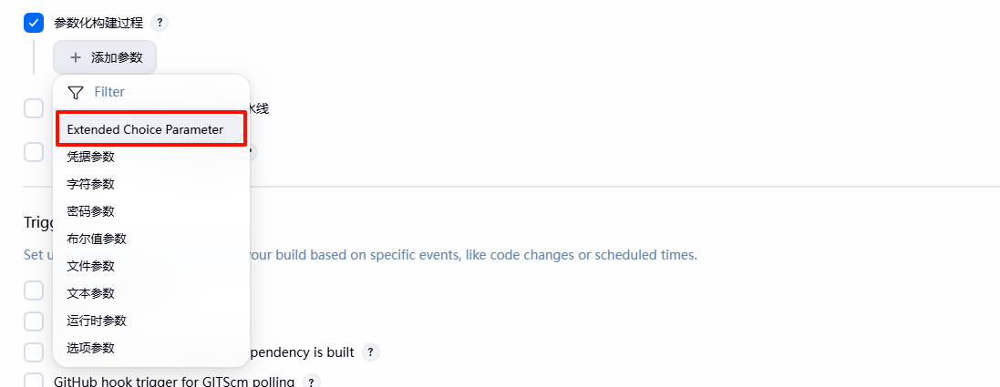
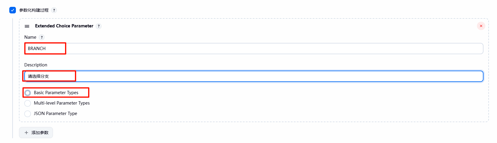
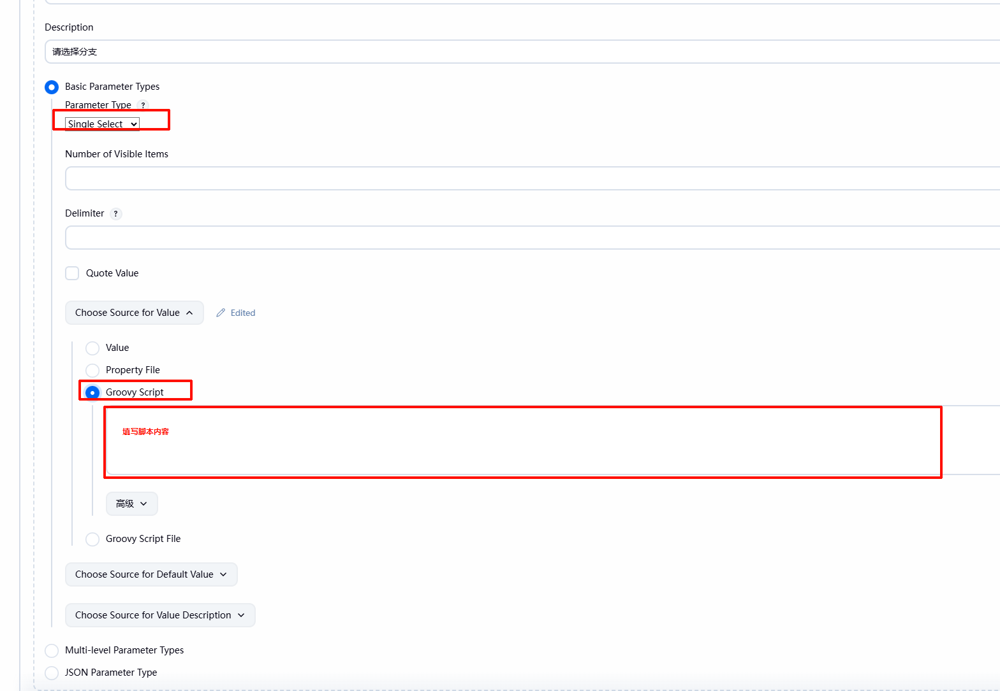
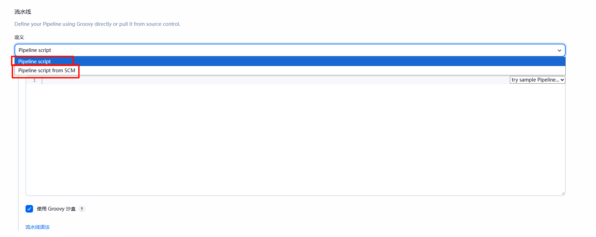
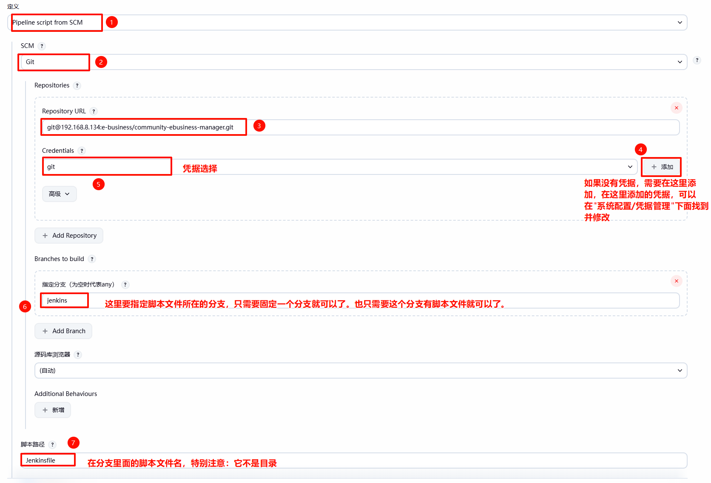
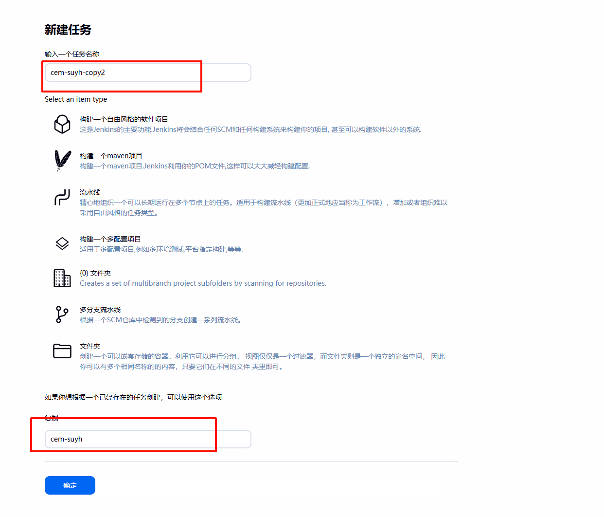

## 记录

1. 脚本文件分支

    专门创建一个jenkins 分支，分支里面只有一个名为Jenkinsfile 的脚本文件

2. JDK/MAVEN 配置

    需要在  "系统管理/全局工具配置"  里面配置 JDK 以及 MAVEN ，可以配置多个，然后在脚本里面指定使用哪一个

3. ssh 密钥（添加）

    它实际的添加是在配置的时候，只是最终存在了这里。

4. ssh 密钥（修改）

    配置的ssh 的私钥，可以在  "系统管理/凭据管理"  中修改和调整，但是在这个页面没有找到添加的地方。

5. 下拉框

    要使用下拉选择，需要安装插件："Extended Choice Parameter Plugin" 但是这个插件一直提示安全漏洞问题，目前我一直忽略它的

6. 调试 Groovy 脚本

    要调试 Groovy 脚本，可以到 "系统管理/脚本命令行" 里面去。

7. 


## 特别注意

1. ssh 生效问题

    ssh 配置了之后，需要在jenkins 用户下面，去连一下，就是去先执行一下：git clone xxx  按提示保存对应主机信息之后才可以使用。

2. 参数覆盖问题

    ```Jenkins
        // 这个造成不能添加，或者不能与页面上配置相同的参数名，因为它会覆盖掉，使得下一次执行时，这个参数就会被以下配置修改掉。
        parameters {
            string(
                name: 'BRANCH',
                description: '下拉选择的分支/标签名称（与 Extended Choice Parameter 配置一致）',
                defaultValue: 'main'
            )
        }
    ```

    如果在 `Jenkinsfile` 文件中添加了如上配置，则会覆盖掉页面上的配置

3. 其他


## 新建流水线

1. 在首页，点击”新建任务“

    输入任务名称，同时选中流水线

    

2. 参数配置

    前提：需要安装插件  "Extended Choice Parameter Plugin"

    - 选择："Extended Choice Parameter"

        

    - 填写名称与描述

    - "Basic Parameter Types"

        

    - 填写脚本内容，这里是拉取git 创建的所有分支与标签

        ```groovy
        def gitPath = "/usr/bin/git"
        // 这里使用的是ssh 方式，所以需要配置好ssh 的私钥
        def gitUrl = "git@192.168.8.134:e-business/community-ebusiness-manager.git"
        
        def allList = []
        
        try {
            // 1. 获取分支并提取简短名称
            def branchOutput = "${gitPath} ls-remote --heads ${gitUrl}".execute().text
            branchOutput.eachLine { line ->
                if (line) {
                    // 提取 refs/heads/ 之后的部分
                    def branchName = line.split('refs/heads/')[-1].trim()
                    allList.add(branchName)
                }
            }
        
            // 2. 获取标签并提取简短名称
            def tagOutput = "${gitPath} ls-remote --tags ${gitUrl}".execute().text
            tagOutput.eachLine { line ->
                // 过滤掉带 ^{} 的临时引用
                if (line =~ /refs\/tags\// && !(line =~ /\^\{\}/)) {
                    def tagName = line.split('refs/tags/')[-1].trim()
                    allList.add(tagName)
                }
            }
        } catch (Exception e) {
            return ["Error: ${e.message}"]
        }
        
        // 3. 去重，删除掉main 后面单独处理
        allList = allList.unique()
        if (allList.contains("main")) {
            allList.remove("main")
        }
        
        // 以v 开头的分支和其他分支
        def vList = []
        def otherList = []
        allList.each { item ->
            if (item =~ /^v\d/) {
                vList.add(item) // 满足条件，放入vList
            } else {
                otherList.add(item) // 不满足条件，放入otherList
            }
        }
        
        def resultList = []
        // 单独处理main 分支，放在第一位
        resultList.add("main")
        if (vList != null && !vList.isEmpty()) {
            resultList.addAll(vList.sort().reverse())
        }
        if (otherList != null && !otherList.isEmpty()) {
            resultList.addAll(otherList.sort().reverse())
        }
        
        return resultList
        ```

    - 流水线脚本

        这里分了两种，一种是直接将脚本文件写在这里，一种是放在git 仓库。

        

        - Pipeline script （不推荐，因为修改了就没了。）

        - Pipeline script from SCM （推荐）

            

    - 其他

    ## 拷贝流水线

    

