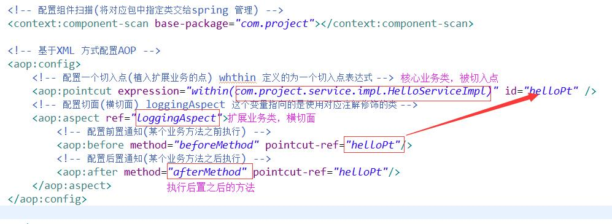

## 记录要点
- 只要添加了spring aop aspect ，那么只需要通过 `getBean`的方式就可以直接拿到代理对象。
- 相关类之间的关系: 
    > 目标对象需要给到spring 来管理，也就是说如果通过注解的方式的话，需要添加`@Service` 类似的注解 
    > 横切面对象也需要给到spring 来管理，同时还需要标识它是一个横切面对象(通过注解`@Aspect`) 

## spring aop 依赖jar 包
> 在Maven 项目中需要添加依赖，有三个

    <dependency>
        <groupId>org.springframework</groupId>
        <artifactId>spring-context</artifactId>
        <version>4.3.9.RELEASE</version>
    </dependency>
    <dependency>
        <groupId>org.aspectj</groupId>
        <artifactId>aspectjweaver</artifactId>
        <version>1.8.9</version>
    </dependency>
    <dependency>
        <groupId>org.aspectj</groupId>
        <artifactId>aspectjrt</artifactId>
        <version>1.8.9</version>
    </dependency>

## spring aop 的XML 配置

    <?xml version="1.0" encoding="UTF-8"?>
    <beans xmlns="http://www.springframework.org/schema/beans"
        xmlns:p="http://www.springframework.org/schema/p" xmlns:xsi="http://www.w3.org/2001/XMLSchema-instance"
        xmlns:context="http://www.springframework.org/schema/context" xmlns:tx="http://www.springframework.org/schema/tx"
        xmlns:aop="http://www.springframework.org/schema/aop" xmlns:mvc="http://www.springframework.org/schema/mvc"
        xmlns:util="http://www.springframework.org/schema/util" xmlns:jpa="http://www.springframework.org/schema/data/jpa"
        xsi:schemaLocation="  
        http://www.springframework.org/schema/beans   
        http://www.springframework.org/schema/beans/spring-beans-4.3.xsd  
        http://www.springframework.org/schema/mvc   
        http://www.springframework.org/schema/mvc/spring-mvc-4.3.xsd   
        http://www.springframework.org/schema/tx   
        http://www.springframework.org/schema/tx/spring-tx-4.3.xsd   
        http://www.springframework.org/schema/aop 
        http://www.springframework.org/schema/aop/spring-aop-4.3.xsd
        http://www.springframework.org/schema/util 
        http://www.springframework.org/schema/util/spring-util-4.3.xsd
        http://www.springframework.org/schema/data/jpa 
        http://www.springframework.org/schema/data/jpa/spring-jpa-1.3.xsd
        http://www.springframework.org/schema/context
        http://www.springframework.org/schema/context/spring-context-4.3.xsd">

        <!-- 配置组件扫描(将对应包中指定类交给spring 管理) -->
        <context:component-scan base-package="com.project"></context:component-scan>
        
        <!-- 基于XML 方式配置AOP -->
        <aop:config>
            <!-- 配置一个切入点(植入扩展业务的点) whthin 定义的为一个切入点表达式	-->
            <aop:pointcut expression="within(com.project.service.impl.HelloServiceImpl)" id="helloPt" />
            <!-- 配置切面(横切面) loggingAspect 这个变量指向的是使用对应注解修饰的类 -->
            <aop:aspect ref="loggingAspect">
                <!-- 配置前置通知(某个业务方法之前执行) -->
                <aop:before method="beforeMethod" pointcut-ref="helloPt"/>
                <!-- 配置后置通知(某个业务方法之后执行) -->
                <aop:after method="afterMethod" pointcut-ref="helloPt"/>
            </aop:aspect>
        </aop:config>

    </beans>

> 详细说明: 

## spring aop 的注解配置

    <!-- 配置组件扫描(将对应包中指定类交给spring 管理) -->
	<context:component-scan base-package="com.suyh"></context:component-scan>
	
	<!-- 使aspectj注解生效，自动为目标对象生成代理对象 -->
    <aop:aspectj-autoproxy/>

> 核心业务类 
>> 通过`@Service` 添加到spring bean 中管理

    package com.suyh.service.impl;

    import org.springframework.stereotype.Service;
    import com.suyh.service.IMessageService;

    @Service
    public class MessageServiceImpl implements IMessageService {

        public void helloMsg(String msg) {
            System.out.println("MessageServiceImpl.helloMsg(): " + msg);
        }

    }

> 扩展业务类 
>> `@Component` 表示此组件由Spring对象管理  
>> `@Aspect` 用于定义切面（封装扩展功能）  
>> `@Pointcut` 用于定义切入点（用于织入扩展功能的点）  
>> `@Before` 用于定义前置通知（业务方法之前执行）  
>> `@After` 用于定义最终通知（业务方法执行完成以后执行）  
>>> `@Before` 还可以直接写成对应的切入点`@Before("within(com.suyh.service.impl.MessageServiceImpl)")`

    package com.suyh.aspect;

    import java.util.logging.Logger;
    import org.aspectj.lang.annotation.After;
    import org.aspectj.lang.annotation.Aspect;
    import org.aspectj.lang.annotation.Before;
    import org.aspectj.lang.annotation.Pointcut;
    import org.springframework.stereotype.Component;

    // 为核心业务添加扩展业务的类

    @Aspect
    @Component
    public class TxManager {
        Logger log = Logger.getLogger("TxManager");
        
        @Pointcut("within(com.suyh.service.impl.MessageServiceImpl)")
        public void pointCut() {}
        
        // 注意：这里面'()' 是不能少的，不然会报错
        @Before("pointCut()")
        public void beforeInfo() {
            log.info("TxManager.beforeInfo()");
        }
        
        @After("pointCut()")
        public void afterInfo() {
            log.info("TxManager.afterInfo()");
        }
    }

> 测试

    public class TestAspect {
        ClassPathXmlApplicationContext ctx;
        
        @Before
        public void init() {
            ctx = new ClassPathXmlApplicationContext("beans.xml");
        }
        
        @Test
        public void testAspect() {
            IMessageService msgService = ctx.getBean("messageServiceImpl", IMessageService.class);
            msgService.helloMsg("suyh");
        }
        
        @After
        public void destroy() {
            ctx.close();
        }
    }

> 测试结果：

    四月 02, 2019 4:58:09 下午 com.suyh.aspect.TxManager beforeInfo 信息: TxManager.beforeInfo()
    MessageServiceImpl.helloMsg(): suyh
    四月 02, 2019 4:58:09 下午 com.suyh.aspect.TxManager afterInfo 信息: TxManager.afterInfo()

