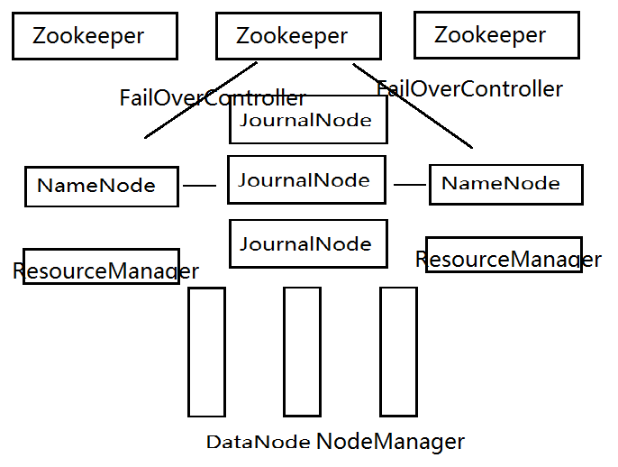
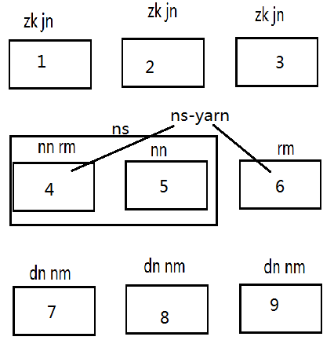
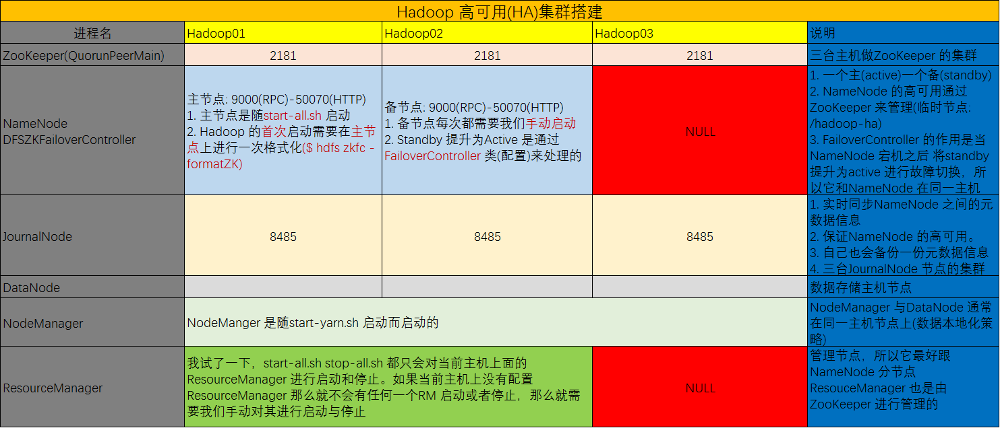

- ## 伪分布式与完全分面式两套配置之间的切换
    - > 如果同时配置了完全分布式与伪分布式，那么要切换的话，我们需要把 `/etc/profile` 文件中的配置文件的环境变量修改一下，然后再重启

- ## 搭建配置图示
    > 

    > 
<mark>多节点配置</mark>

    > 
    >> 
    > 

    >
    > 

    > 
<mark>九节点配置</mark>

    > 
    >> 
    > 

    > 
    > 

    > 
<mark>高可用集群</mark>

    > 
    >> 
    >
    >  

    >

- ## 准备工作
    - > JDK 环境安装

- ## 防火墙
    - > `service iptables stop`
    - > `chkconfig iptables off`      启动时默认关闭

- ## 主机名
    - > 每台主机的主机名设置
        > - `vim  /etc/sysconfig/network`
        > - 然后重启，使其生效

- ## 配置 hosts 文件
    - > 将每台主机的IP 与主机名做映射  `vim /etc/hosts`
        > 

        > 
<mark>示例</mark>

        > 
        >>      192.168.234.21 hadoop01
        >>      192.168.234.22 hadoop02
        >>      192.168.234.23 hadoop03
        >>      192.168.234.24 hadoop04
        >>      192.168.234.25 hadoop05
        >>      192.168.234.26 hadoop06
        > 

        >

- ## 免密登录
    - > 为每台机器配置ssh免秘钥登录
        > - `ssh-keygen`
        > - `ssh-copy-id root@hadoop01`  （分别发送到其他节点上）

- # ZooKeeper 配置
    - ## ZooKeeper 集群配置

- # Hadoop
    - <mark>hadoop 的配置各个节点的配置基本相同，可以配置一份，然后拷贝到其他几个节点主机上面。</mark>
    - ## Hadoop 配置
        - > 配置 hadoop-env.sh
            > - 编辑 hadoop-env.sh 主要有两个
            >> - `export JAVA_HOME=/usr/local/src/java/jdk1.8.0_51`
            >> - `export HADOOP_CONF_DIR=/root/software/hadoop-2.7.1/etc/hadoop`
            > - 使其生效
            >> - `source hadoop-env.sh`
        - > 配置core-site.xml
        - > 配置hdfs-site.xml
        - > 配置mapred-site.xml
        - > 配置yarn-site.xml
        - > 配置slaves文件
            > - DataNode 所在的主机名 04、05、06 三个节点配置的是datanode
            >>      hadoop04
            >>      hadoop05
            >>      hadoop06
    
    - ## 配置hadoop的环境变量
        - > `vim /etc/profile`
            > - 示例
            >
            >       JAVA_HOME=/home/software/jdk1.8
            >       HADOOP_HOME=/home/software/hadoop-2.7.1
            >       CLASSPATH=.:$JAVA_HOME/lib/dt.jar:$JAVA_HOME/lib/tools.jar
            >       PATH=$JAVA_HOME/bin:$HADOOP_HOME/bin:$HADOOP_HOME/sbin:$PATH
            >       export JAVA_HOME PATH CLASSPATH HADOOP_HOME

    - ## 创建相关目录
        - > 根据配置文件，创建相关的文件夹，用来存放对应数据
            > - `core-site.xml` -> `hadoop.tmp.dir` 对应目录
            > - `hdfs-site.xml` - > `dfs.journalnode.edits.dir`  journal目录
            > - `hdfs-site.xml` -> `dfs.namenode.name.dir`  namenode 数据存放目录
            >> - 如果不配置，默认用的是`core-site.xml` -> `hadoop.tmp.dir` 的路径
            > - `hdfs-site.xml` -> `dfs.datanode.data.dir` datanode 数据存放目录
            >> - 如果不配置，默认用的是 `core-site.xml` -> `hadoop.tmp.dir` 的路径

    - ## 可以将上面的这些配置文件拷贝到各节点主机上面
        > - `scp -r  hadoop-2.7.1/etc/hadoop  hadoop02:/home/software/hadoop-2.7.1/etc/hadoop`

    - ## <mark>**hadoop 首次启动**</mark>
        - > 在<mark>*主NameNode*</mark> 所在一个主节点上(hadoop04)
            > - `hdfs zkfc -formatZK` 执行一次
            > 

            > 
<mark>成功提示</mark>

            > 
            >>      ...
            >>      19/05/20 20:10:40 INFO zookeeper.ZooKeeper: Client environment:java.library.path=/root/software/hadoop-2.7.1/lib/native
            >>      19/05/20 20:10:40 INFO zookeeper.ZooKeeper: Client environment:java.io.tmpdir=/tmp
            >>      19/05/20 20:10:40 INFO zookeeper.ZooKeeper: Client environment:java.compiler=<NA>
            >>      19/05/20 20:10:40 INFO zookeeper.ZooKeeper: Client environment:os.name=Linux
            >>      19/05/20 20:10:40 INFO zookeeper.ZooKeeper: Client environment:os.arch=amd64
            >>      19/05/20 20:10:40 INFO zookeeper.ZooKeeper: Client environment:os.version=2.6.32-431.el6.x86_64
            >>      19/05/20 20:10:40 INFO zookeeper.ZooKeeper: Client environment:user.name=root
            >>      19/05/20 20:10:40 INFO zookeeper.ZooKeeper: Client environment:user.home=/root
            >>      19/05/20 20:10:40 INFO zookeeper.ZooKeeper: Client environment:user.dir=/root/software/hadoop-2.7.1/bin
            >>      19/05/20 20:10:40 INFO zookeeper.ZooKeeper: Initiating client connection, connectString=hadoop01:2181,hadoop02:2181,hadoop03:2181 sessionTimeout=5000            watcher=org.apache.hadoop.ha.ActiveStandbyElector$WatcherWithClientRef@36902638
            >>      19/05/20 20:10:40 INFO zookeeper.ClientCnxn: Opening socket connection to server hadoop02/192.168.220.137:2181. Will not attempt to authenticate using SASL (unknown error)
            >>      19/05/20 20:10:40 INFO zookeeper.ClientCnxn: Socket connection established to hadoop02/192.168.220.137:2181, initiating session
            >>      19/05/20 20:10:40 INFO zookeeper.ClientCnxn: Session establishment complete on server hadoop02/192.168.220.137:2181, sessionid = 0x26ad81700420000, negotiated timeout = 5000
            >>      19/05/20 20:10:40 INFO ha.ActiveStandbyElector: Successfully created /hadoop-ha/ns in ZK.
            >>      19/05/20 20:10:40 INFO ha.ActiveStandbyElector: Session connected.
            >>      19/05/20 20:10:40 INFO zookeeper.ZooKeeper: Session: 0x26ad81700420000 closed
            >>      19/05/20 20:10:40 INFO zookeeper.ClientCnxn: EventThread shut down
            > 

            >
        - > 启动 journalnode (在hadoop01、hadoop02、hadoop03节点上各执行一次)
            > - `hadoop-daemon.sh start journalnode`
            > - 使用 jps 查看是否启动成功
            >>      [root@Hadoop01 ~]# jps
            >>      27053 JournalNode

        - > 将hadoop04 节点格式化为主namenode，然后启动
            > - 在 hadoop04 节点主机上执行命令: `hadoop namenode -format`
            > 

            > 
<mark>成功提示</mark>

            > 
            >>      ...
            >>      19/05/20 20:18:43 INFO namenode.FSNamesystem: Retry cache on namenode is enabled
            >>      19/05/20 20:18:43 INFO namenode.FSNamesystem: Retry cache will use 0.03 of total heap and retry cache entry expiry time is 600000 millis
            >>      19/05/20 20:18:43 INFO util.GSet: Computing capacity for map NameNodeRetryCache
            >>      19/05/20 20:18:43 INFO util.GSet: VM type       = 64-bit
            >>      19/05/20 20:18:43 INFO util.GSet: 0.029999999329447746% max memory 966.7 MB = 297.0 KB
            >>      19/05/20 20:18:43 INFO util.GSet: capacity      = 2^15 = 32768 entries
            >>      19/05/20 20:18:46 INFO namenode.FSImage: Allocated new BlockPoolId: BP-1954914023-192.168.220.139-1558408726271
            >>      19/05/20 20:18:46 INFO common.Storage: Storage directory /root/software/hadoop-2.7.1/tmp/hdfs/namenode has been successfully formatted.
            >>      19/05/20 20:18:47 INFO namenode.NNStorageRetentionManager: Going to retain 1 images with txid >= 0
            >>      19/05/20 20:18:47 INFO util.ExitUtil: Exiting with status 0
            >>      19/05/20 20:18:47 INFO namenode.NameNode: SHUTDOWN_MSG: 
            >>      /************************************************************
            >>      SHUTDOWN_MSG: Shutting down NameNode at hadoop04/192.168.220.139
            > 

            > 
            > - 启动主namenode 节点
            >> - `hadoop-daemon.sh start namenode`
        - > 将hadoop05 节点指定为备份节点,先格式化，再启动
            > - 格式化时需要保证主NameNode 已运行，否则会报错
            > - 格式化: `hadoop namenode -bootstrapStandby`
            > 

            > 
<mark>成功提示</mark>

            > 
            >>      ...
            >>      19/05/20 20:23:29 INFO namenode.NameNode: registered UNIX signal handlers for [TERM, HUP, INT]
            >>      19/05/20 20:23:29 INFO namenode.NameNode: createNameNode [-bootstrapStandby]
            >>      19/05/20 20:23:31 WARN util.NativeCodeLoader: Unable to load native-hadoop library for your platform... using builtin-java classes where applicable
            >>      =====================================================
            >>      About to bootstrap Standby ID nn2 from:
            >>                 Nameservice ID: ns
            >>              Other Namenode ID: nn1
            >>        Other NN's HTTP address: http://hadoop04:50070
            >>        Other NN's IPC  address: hadoop04/192.168.220.139:9000
            >>                   Namespace ID: 1655959710
            >>                  Block pool ID: BP-1954914023-192.168.220.139-1558408726271
            >>                     Cluster ID: CID-b58903bd-67c0-4212-b0e5-6c62cf747467
            >>                 Layout version: -63
            >>             isUpgradeFinalized: true
            >>      =====================================================
            >>      19/05/20 20:23:32 INFO common.Storage: Storage directory /root/software/hadoop-2.7.1/tmp/hdfs/namenode has been successfully formatted.
            >>      19/05/20 20:23:34 INFO namenode.TransferFsImage: Opening connection to http://hadoop04:50070/imagetransfer?getimage=1&txid=0&storageInfo=-63:1655959710:0:CID-b58903bd-67c0-4212-b0e5-6c62cf747467
            >>      19/05/20 20:23:34 INFO namenode.TransferFsImage: Image Transfer timeout configured to 60000 milliseconds
            >>      19/05/20 20:23:34 INFO namenode.TransferFsImage: Transfer took 0.01s at 0.00 KB/s
            >>      19/05/20 20:23:34 INFO namenode.TransferFsImage: Downloaded file fsimage.ckpt_0000000000000000000 size 351 bytes.
            >>      19/05/20 20:23:34 INFO util.ExitUtil: Exiting with status 0
            >>      19/05/20 20:23:34 INFO namenode.NameNode: SHUTDOWN_MSG: 
            >>      /************************************************************
            >>      SHUTDOWN_MSG: Shutting down NameNode at hadoop05/192.168.220.140
            >>      ************************************************************/
            > 

            >
            > - 启动命令: `hadoop-daemon.sh start namenode`
            >> - 使用jps 查看是否启动成功
        
        - > 在 hadoop04 hadoop05 (两个<mark>**NameNode**</mark> 所对应的节点)上来启动 FailOverController
            > - 用于NameNode 的故障切换
            > - `hadoop-daemon.sh start zkfc`
            >> - 使用JPS 查看是否启动成功
            >>>     [root@Hadoop02 ~]# jps
            >>>     6691 DFSZKFailoverController

        - > DataNode 启动(在hadoop07、hadoop08、hadoop09节点上)
            > - `hadoop-daemon.sh start datanode`
            >> - 使用JPS 查看是否启动成功

        - > 启动yarn 在hadoop06 节点上
            > - yarn 用来管理resourcemanager 和nodemanager ，但是这里只启动了一个resourcemanager 这是主节点，另外一个副节点需要单独手动启动
            > - `start-yarn.sh`
            > 

            > 
<mark>成功提示</mark>

            > 
            >>      starting yarn daemons
            >>      starting resourcemanager, logging to /root/software/hadoop-2.7.1/logs/yarn-root-resourcemanager-hadoop06.out
            >>      hadoop07: starting nodemanager, logging to /root/software/hadoop-2.7.1/logs/yarn-root-nodemanager-hadoop07.out
            >>      hadoop08: starting nodemanager, logging to /root/software/hadoop-2.7.1/logs/yarn-root-nodemanager-hadoop08.out
            >>      hadoop09: starting nodemanager, logging to /root/software/hadoop-2.7.1/logs/yarn-root-nodemanager-hadoop09.out
            > 

            >
        - > 在04 节点上单独启动一个resourcemanager 的副节点 
            > - 命令：`yarn-daemon.sh start resourcemanager`
            >> - 使用命令jps 查看是否启动成功

    - ## hadoop 启动与停止
        - > 除了第一次启动比较麻烦之外，之后的启动直接使用`start-all.sh` 即可
        - > 停止: `stop-all.sh`

- ## 启动成功之后
    - > `hdfs-site.xml` - > `dfs.namenode.support.allow.format` 
        > - 这个属性是指是否允许格式化。<mark>我们只有在第一次启动的时候需要格式化。之后我们就不需要再格式化了。</mark>
        > - 所以我们在第一次启动成功之后都会将它的值置为false

- ## 通过浏览器查看
    - > namenode
        > - URL：http://192.168.234.21:50070，
        >> - 一个是 `active状态` 另一个是`standby状态`
    - > yarn的管理地址
        > - URL: http://192.168.234.21:8088

- ## 还原Hadoop 环境
    - ### 将Hadoop 高可用环境全部清理，还原为一个完新的Hadoop 环境
        - > `$ stop-all.sh`
        - > 删除ZooKeeper 中的相关节点
            > - `rmr /hadoop-ha`
            > - `rmr /yarn-leader-election`
        - > 删除相关目录，然后新建

