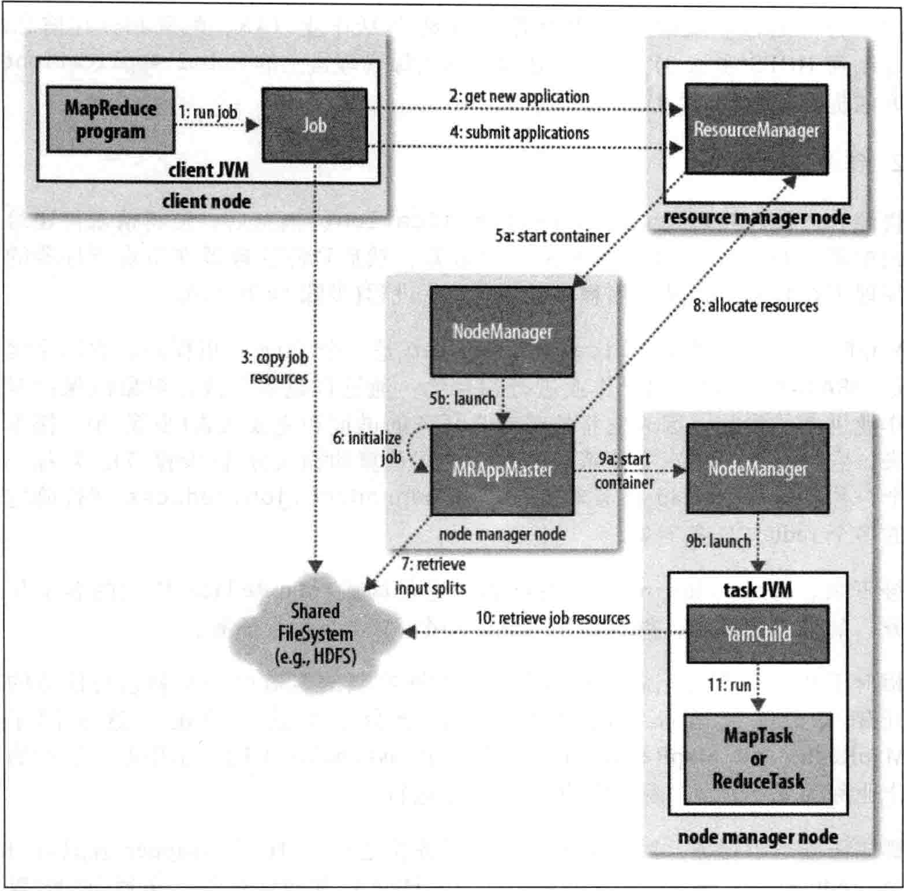

- ## Yarn 架构图
    > 

    > 
<mark>Yarn 架构图</mark>

    > 
    >> 
    > 

    > 

- ## 分布式集群的问题
    - > 经过试验，JobTracker 所能管理的节点数量最多不要超4000，一但超过4000 个节点，则整个集群的性能会成倍下降
    - > 为了解决性能下降的问题，引入了Yarn 来进行管理。Hadoop2.0 开始，MapReduce 就只负责计算。

- ## Yarn 
    - > ResourceManager 主要负责资源管理和调度
        - > ApplicationManager 管理监控各个系统的应用
            > - 包括启动 ApplicaitonMaster, 监控 ApplicaitonMaster 运行状态（为了容错）
            > - 跟踪分配给 ApplicationMaster 的进度和状态
            > - 它也会管理DataNode 的资源使用情况以此来为ApplicationMaster 来分配资源
        - > Schedular 任务调度器
            > - 主要负责分配 Container 给 ApplicaitonMaster
    - > NodeManager 节点管理器
        > - 主要负责维护本节点的资源情况和各个Container 的运行状态
        >> - NodeManager需要定期向ResourceManager汇报本节点资源使用情况，以便ResourceManager，根据资源使用情况，来分配资源给ApplicationMaster
        >> - 需要管理ApplicaitonMaster提交来的task
        >>> - 比如接收ApplicaitonMaster 启动或停止task的请求。
    - > ApplicaitonMaster 主要负责监控自己的Task，任务容错(重启失败的task)等
        > - 用户提交的每个job 都会对应一个ApplicationMaster
        > - 它同时会和ResourceManager和NodeManager有交互，向ResourceManager申请资源
        > - 与NameNode 通信以确定Task 具体被分配到哪一个DataNode 进行启动与停止
        > - 监控所有Task 运行状态，并在Task 运行失败时重新为Task 申请资源以重启。
    - > Containe 容器是资源调度的单位
        > - 它是内存、cpu、磁盘、和IO的集合。
        > - ApplicationMaster 会计算Task 的数量
        > - 通过计算得出来的Task 到ResourceManager(Schedular) 中为每一个Task 申请相对应的Container 资源。每个Task 都只能使用自己所对应的Container 资源执行任务。
        > - 分配流程为ResourceManager -> ApplicationMaster -> task

- ## Yarn 调度
    - > client 提交一个Job 到 ResouceManager
    - > ResouceManager 会为这个Job 选择一个NodeManager，然后在这个NodeManager 上启动一个Container 并运行ApplicationMaster；
    - > ApplicationMaster 为这个job 计算切片，然后向ResourceManager(ApplicationManager) 申请Container 资源
    - > ResourceManager(ApplicationManager) 会根据申请为其每一个Task 分配资源并封装到Container 中并添加到Scheduler 的Container 队列中。
    - > Scheduler 将队列中的Container 依次分配给ApplicationMaster 
    - > ApplicationMaster 拿到Container 会到对应的NodeManager 上去提一个Container, NodeManager 会启动这个Container 并执行Task

