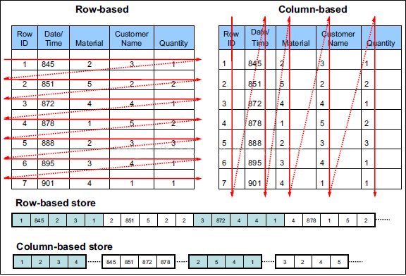

- # HBase 介绍
    - > HBase是一个**分布式的、面向列**的开源数据库
        > - 该技术来源于 Fay Chang 所撰写的Google论文《BigTable》一个结构化数据的分布式存储系统"。
        > - 就像BigTable利用了Google文件系统(File System)所提供的分布式数据存储一样，HBase在Hadoop之上提供了类似于BigTable的能力（**低延迟的数据查询能力**）。
    - > HBase是Apache的Hadoop项目的子项目。HBase不同于一般的关系数据库，Hbase同BigTable一样，都是NoSQL数据库，即非关系型数据库，
    - > 此外，HBase和BigTable一样，是基于列的而不是基于行的模式。

- ## 行存储 VS 列存储
    - ### 图解
        > 

        > 
<mark>行存储与列存储</mark>

        > 
        >> 
        > 

    - ### 行存储
        - > 数据连续
            > - Row-based storage stores atable in a sequence of rows.
            > - 往文件中写的时候一行接着一行。
        - > Mysql Oracle
        - > 弥补读取劣势：物化索引
            > - 物化索引也是需要耗费CPU和时间的，
            > - 所以针对MYSQL ORACLE 等表建索引时，一般是为读场景比较多的场景建索引。

    - ### 列存储
        - > 数据间断
            > - Column-based storage storesa table in a sequence of columns.
            > - 往文件中写的时候，每次存储一列。第二列与第一列之间不是连接的。
        - > BitTable HBase
        - > 弥补写入劣势：引入列族
            > - 列族不易过多，但是列族下的列可以多
            > - 将相关一起被查询的多个列放在一个列族

    - ### 行存储与列存储对比
        - > 存储写入时，行存储性能更高
            > - 因为行存储的写入是连续的，避免了碰头的多次调度和寻道时间
        - > 海量数据读取时，列存储性能更高
            > - 列存储在海量数据查询时不会产生冗余列
            > - 列存储的每一列数据都是同质(相同类型)的，所以避免和节省了数据类型转换的CPU消耗
            > - 可以采用更高效的压缩算法，比如增量压缩算法，二进制压缩算法
            > - 基于列存储，表数据可以很稀疏。即节省磁盘空间

- # HBase 与Hive 的区别
1. HBase 是非关系型数据库，Hive 是基于hadoop 的数仓工具
2. Hive 必须基于Hadoop;HBase 可以不基于Hadoop, HBase 可以脱离Hadoop 存在
3. HBase 只提供了基本的CURD 的能力；Hive 中提供了大量的函数允许对数据进行

- # 行键
    - > 行键唯一

- # HBase
    - > 特点
        > - 创建表时，需要指定表名，并且需要指定有几个列族，列族数不宜过多，一般2到3个
        > - 插入表数据时，需要指定表名，行键，列族:列名，值

