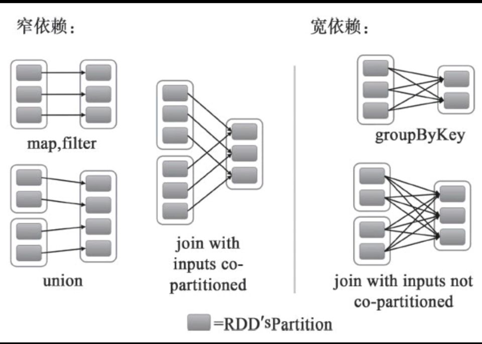
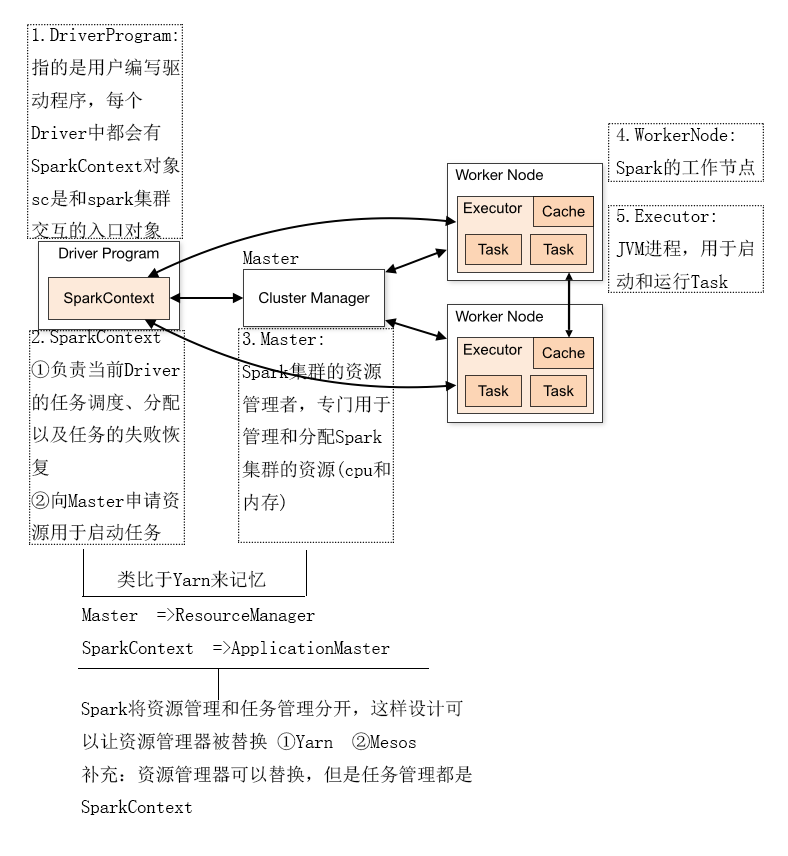
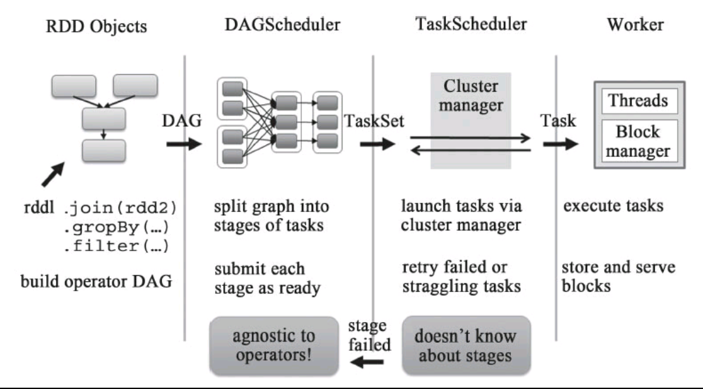
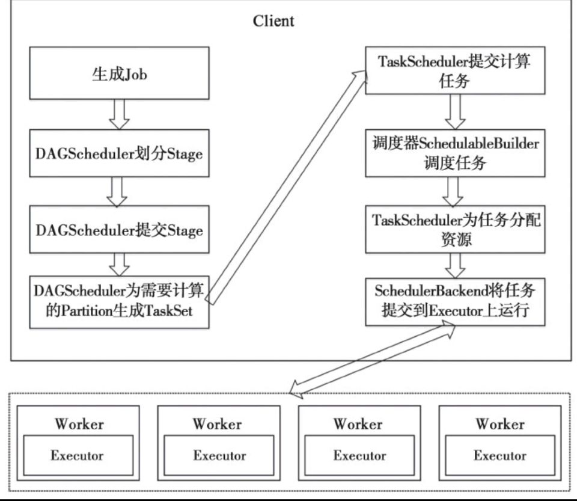

# 简介
- ## Spark 介绍
    - > 是一种快速、通用、可扩展的大数据分析引擎
        > - 轻型快速计算集群框架(基于内存)
    - > Spark集批处理、实时流处理、交互式查询、机器学习与图计算于一体。
        > - 为分布式数据集的处理提供了一个有效框架，并以高效的方式处理分布式数据集。
        > - 避免了多种运算场景下需要部署不同集群带来的资源浪费。
    - > Spark 既可以做离线批处理，也可以做实时批处理(SparkStreaming)

# RDD
- ### RDD 介绍
    - > RDD就是带有分区的集合类型
        > - 类比于 Array 和List
        > - 有分区机制以及容错机制
    - > Spark 最核心概念，Spark 处理的唯一数据类型
        > - Spark 框架处理任何数据都要先把数据封闭到RDD里面，然后再针对 RDD 来做计算。
    - > 弹性分布式数据集
        > - 特点就是可以并行操作，并且是容错的

- ### RDD 分区
    - > RDD 的特点就是带有分区的集合
        > - 查看一个RDD 的分区数量与元素
        >> - `scala> rdd.partitions.size`
        >> - `scala> rdd.glom.collect`

- ### RDD 操作
    - > 操作分类
        > - 变换操作 `Transformation`
        >> - 变换操作都是懒操作，即并不马上进行计算
        >> - <mark>每执行一次懒操作，都会产生一个新的RDD</mark>
        > - 执行操作 `Action`
        >> - 执行操作会触发计算
    - > 创建
        > - 将scala 类型封装为一个RDD
        >> - 封装一个RDD，并指定这个RDD 的分区为2 个分区
        >> - `scala> val rdd1 = sc.parallelize(Array(1, 2, 3, 4), 2)`
        >> - `scala> val rdd2 = sc.makeRDD(Array(1, 2, 3, 4), 2)`
        > - 从文件中读取数据并封装成一个RDD
        >> - `scala> val rdd3 = sc.textFile("file:///home/1.txt", 2)`
        >> - `scala> val rdd4 = sc.textFile("hdfs://HBaseAlone:9000/1.txt", 2)`
        >> - `val data = sc.textFile("D:/temp/spark/data/ssort.txt", 2)`
        >>> - Windows  操作本地文件

- ### RDD 的依赖关系
    - > 依赖关系
        >> 

        >> 
<mark>依赖关系</mark>

        >>
        >>> 
        >> 

        >>
    - > 窄依赖
        > - 对于窄依赖操作，它们只是将Partition的数据根据转换的规则进行转化，并不涉及其他的处理
        >> - 可以简单地认为只是将数据从一个形式转换到另一个形式。
        > - 父分区和子分区是一对一关系
        > - 一般懒方法都会产生窄依赖
        >> - 懒方法: map, flatMap, filter, union...
        > - 流水线优化
        >> - 将一个DAG 中连接的窄依赖放到一起执行，被称为流水线优化。
        >> - 窄依赖不会引入昂贵的shuffle, 所以执行效率很高。
        > - Spark 尽量避免磁盘I/O，就是通过窄依赖
    - > 宽依赖
        > - 父分区和子分区是一对多关系
        > - 产生宽依赖的懒方法: groupByKey, reduceByKey 等分组方法
        > - 宽依赖会产生Shuffle, 所谓的Shuffle，就是按照某种分组条件，将数据分发到对应的分区。
        >> - 所以这个过程会产生大量的数据，会发生多次的磁盘续写
        > - Spark 有磁盘I/O
        >> - 并不是完全基于内存的，只是极力避免这样的过程
        > - Shuffle 过程会将中间结果落地(临时文件),避免上述场景。

- ## **RDD 缓存机制(重点)**
    - ### 自动持久化
        - > Spark 的Shuffle 操作过程中产生的临时数据会被自动持久
            > - 避免某个数据丢失，需要重新计算带来的开销
    - ### cache (早期版本)
        - > 只能在内存在缓存
    - ### persist (新版本)
        - #### 在`StorageLevel` 对象中声明了各种缓存机制
            - > MEMORY_ONLY(默认)
                >> - 将RDD 以JAVA 对象的形式存储在JVM 中。
                >> - 如果内存空间不够，后续数据将不缓存，那么只能重新计算来获取
                >> - 就是早期版本的 cache
            - > MEMORY_AND_DISK
                >> - 将数据以JAVA 对象的形式缓存在内存中
                >> - 如果内存不够，那么将后面的数据缓存到磁盘
            - > MEMORY_ONLY_SER | MEMORY_AND_DISK_SER
                >> - 将JAVA 对象序列化之后缓存
            - > MEMORY_ONLY_2 | MEMORY_AND_DISK_2
                >> - 以两个复本的形式缓存，目的是容错
                >> - 意义不大，因为通过血缘关系已经可以容错了。
            - > DISK_ONLY
                >> - 只缓存在磁盘，根本不用
            - > OFF_HEAP
                >> - 堆外缓存
                >> - 堆外内存需要自己进行回收，GC 无法对其回收
        - #### 缓存数据的回收
            - > 自动回收
                >> - Spark 会自动监控每个节点上的缓存数据
                >> - 使用 least-recently-used (LRU) 机制来处理旧的缓存数据。
            - > 手动回收
                >> - `unpersist`

# DAG
- ### 有向无环图
    - > Spark 把计算链抽象成一个DAG, DAG 中记录了RDD 之间的依赖关系
        > - 借助依赖关系，RDD可以实现数据的容错(数据丢失后可以恢复)
        > - 当RDD某个分区数据丢失时，可以找到其父RDD重新计算一遍就可以恢复

- ## Stage
    - > 一个DAG会根据RDD之间的依赖关系进行Stage划分
        > - 以Action为基准，向前回溯，遇到宽依赖，就形成一个Stage。
        > - 遇到窄依赖，则执行流水线优化（将多个连续的窄依赖放到一起执行）
    - > Stage 本质上是一组Task 集合
        >> - 一个Stage 中的窄依赖，将会被做流水线优化，将多个Task 合并到一起处理
        >> - 一个分区对应一个Task 
        >> - Spark 处理任务其实就是处理分区数据

# Spark 与MapReduce 的比较
- ## MapReduce 存在的问题
    - > 一个 Hadoop job 会进行多次磁盘读写

- ## Spark 的优势
    - > 内存缓存

# Spark 的调度
- ## 调度
    - > 示例图
        >> 

        >> 
<mark>示例图</mark>

        >> 
        >>> 
        >> 

        >> 

- ## 调度流程
    - > 示例图
        >> 

        >> 
<mark>示例图1</mark>

        >> 
        >>> 
        >> 

        >> 
        >> 

        >>
        >> 
<mark>示例图2</mark>

        >> 
        >>> 
        >> 

        >> 
    - > 流程解析
        > - RDD Objects 可以理解为用户实际代码中创建的RDD，这些代码逻辑上组成了一个DAG
        >> - 也就是一个SparkContext 中的处理逻辑
        >> - 这些逻辑形成一个DAG(有向无环图)
        > - DAGScheduler 主要负责分析依赖关系，然后将DAG 划分为不同的Stage(阶段)
        >> - 其中每个Stage 由一组TaskSet 组成
        >> - 这些Task 执行逻辑完全相同，只是作用于不同的数据源
        >> - DAGScheduler 将TAG 划分完成之后，会将Stage 中的TaskSet 提交到TaskScheduler
        > - TaskScheduler 向ClusterManager 申请计算资源，并提交到对应的Worker 节点去执行相应的逻辑
        >> - 在Worker 中计算的结果会回传到Driver 或者保存到本地磁盘
        > - SchedulerBackend 这是一个类对象，它会分配当前的可用资源

- ## 调度模块
    - > Driver Program
        > - 每个Driver 都有一个SpackContext(sc)
        >> - sc 负责与Executor 交互，完成任务的分配的高度

# Spark 的参数配置
- ## HBase 示例
    export HBASE_OPTS="-XX:+UseConcMarkSweepGC -XX:MaxGCPauseMills=10"
- ## GC回收器
    - > -XX:+UseG1GC
    - > -XX:MaxGCPauseMills = n
        >> - 指定希望停顿时间(软性指标)
- ## Spark 示例
    - > `# spark.executor.extraJavaOptions  -XX:+PrintGCDetails -Dkey=value -Dnumbers="one two three"`

---

shuffle 按某种条件，汇聚到一个分区的过程

