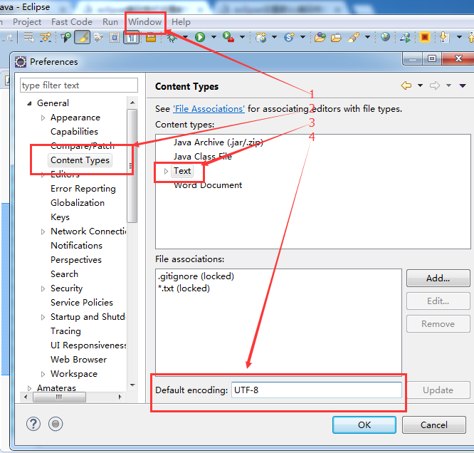

## eclipse 的一些使用及技巧

### eclipse 中的一些常用快捷键
- `alt + /`
	> API 类等的提示
- `ctrl + /`
	> 单行注释与取消
- `ctrl + shift + /`
	> 多行注释
- `ctrl + shift + \`
	> 取消多行注释
- `ctrl + shift + t`
	> 快速查找类对象
- `ctrl + t `
	> 查看类的详细信息，然后可以搜索这个类的所有属性和方法 
	> 查看类的方法及属性 
	> 查看此类的子类及父类 
	> 选中一个类然后使用 `ctrl + t ` 
- `ctrl+o`
	> 查看类中的方法，假如想看类中父类的方法也可以继续`ctrl+o`
- `ctrl+n`
	> 调出新建窗口
- `ctrl+shift+o`
	> 快速导入包
- `Alt + Shift + l`
	> 直接创建一个变量，通过方法的返回值类型
	
## 如何导入一个已存在的工程到eclipse
> `file --> import...` 
> 搜索出: `Existing Projects into Workspace`

## 工具的使用
- 修改eclipse 中项目的JDK 版本
	> `右键项目 -->  Build Path  -> Configure Build Path...`  --> `Libraries  -->  JRE System Library [xxx]  --> Edit...`  

- 编译器 需要与JDK 一致
	> `Java Compiler`  -- > `Compiler compliance level: `  指定与JDK 的版本一致

- 修改eclipse 中jsp 文件的默认编码格式
	> `Window --> Preferences --> JSP Files` 

- 设置统一编码格式
	> `右键项目 --> Preferences --> Resource` 设置为UTF-8 就好

- 设置工作空间的默认编码格式
	> `Window --> Preferences --> Workspace --> Text file encoding  --> other -->  'utf-8'`

- 项目有小红叉，但是找不到问题的时候。
	1. `Project --> Clean...`  强制清理，然后让其重新编译
	2. `右键项目  -->  Maven  -->  Update Project...  -->  Update dependencies  -->  Force project Of Snapshots/Release ` 强制更新依赖
	3. `右键项目  -->  Run As  -->  Maven clean`; 将编译的目标文件全部清理，然后eclipse 将会重新为我们生成

- 禁止验证
	> `Window --> Preferences --> Validation  -->  Enable project specific settings  -->  Disable All`

- 处理tab 为4 个空格
	> - 首先在 `window->preference`
	>> 1. `General->Editors->Text Editors`  勾选  `insert space for tabs`
	>> 2. `java（或C++）->code style ->formatter` --> `edit`  -->  tab policy  修改为 `spaces only` 若不能修改，则需要自己新建一个

## 新建eclipse 工作空间的准备工作
> - 1. 字体, 搜索(`Colors and fonts`):  `Basic  -->  Text Font  -->  Edit`
> - 2. 编码格式, 搜索(`Workspace`): 指定编码格式
	>> 

	>> 
<mark>图示</mark>

	>>
	>>> - 
	>> 

	>>
> - 3. 禁用一些不需要的校验，一般情况下不写前端的代码全部都禁用就可以了。(`Validation`)
> - 4. JDK，搜索(`Installed JREs`): `Add...  -->  Standard VM `  为JRE HOME 指定JDK 的根目录
> - 5. `maven -> installations`  -->  `Add...`   --> 找到maven 的根目录添加。 `最后不要忘记勾选`
>> - maven 添加好了之后，还需要添加一个maven 的用户设置
>> - `maven -> user settings`   -->  maven 的根目录下面的`conf/settings.xml`   然后`Update Settings`
> - 6. 修改tab 插入空格以及代码风格
>> - `General  -->  Editors  -->  Text Editors  -->  勾选"Insert spaces for tabs"`
>> - `Java  -->  Code Style  -->  Formater  -->  New.. `  然后跟着步骤做就好了。

## 常见项目错误处理

- 编码问题

	1)	工作区编码(utf-8)
	2)	项目编码(utf-8)
	3)	请求响应编码(utf-8)

- 编译问题

	1)	JRE 问题(`build path` 移除jre,然后重新添加)
	2)	Maven 问题
		1) `run as --> maven clean`
		2) `maven update`
		3) `project facets`
	3)	Clean
		1) `project --> clean`
		2) `tomcat --> clean`
		3) `tomcat --> publish `
	4)	…. 其他

